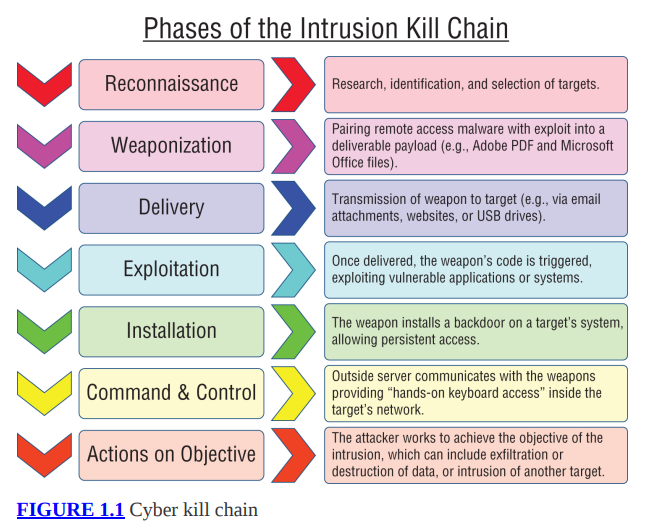

# Hacking ético

Bienvenido al apasionante mundo de la seguridad de la información y, en concreto, al importante mundo de lo que se conoce como hacking ético o pruebas de penetración. Estás aquí porque quieres realizar el examen que te permitirá obtener la certificación Certified Ethical Hacker (CEH). Quizás haya realizado la capacitación del EC-Council, la organización que gestiona la certificación CEH, y desee un recurso con una perspectiva diferente que lo ayude mientras se prepara para el examen. O ha decidido seguir la ruta del autoestudio y tiene suficiente experiencia para calificar para el examen. De una forma u otra, ya está aquí y este libro le ayudará a mejorar su comprensión del material para prepararse para el examen.

El examen cubre una amplia gama de temas, a menudo a un nivel profundamente técnico, por lo que realmente necesitas tener una comprensión sólida del material. Esto es especialmente cierto si elige pasar al examen práctico (un examen práctico en laboratorio) para obtener la certificación CEH Master. Este capítulo, sin embargo, será su punto de partida y no hay nada técnico aquí. En él, tendrás la oportunidad de comprender los fundamentos de todo el examen. Primero, aprenderá qué es el hacking ético y qué no es. La parte importante del término hacking ético es la parte ética. Cuando realice el examen, se espera que cumpla con un código. Es esencial comprender ese código para poder vivir según él durante toda su carrera.

Finalmente, aprenderás qué es EC-Council, así como el formato y otros detalles del examen que te serán de utilidad. Si bien algunos de ellos pueden parecer triviales, puede resultar útil obtener un contexto más amplio de por qué se creó el examen y conocer la organización que lo realiza. Personalmente, encuentro útil entender lo que hay debajo de algo en lugar de experimentarlo en un nivel superficial. Como resultado, obtendrá la explicación macro y podrá elegir usarla o no, dependiendo de si la encuentra útil. No será parte del examen, pero puede ayudarle a comprender lo que hay detrás del examen para comprender las intenciones generales.

### Descripción general de la ética
Antes de comenzar a hablar sobre hacking ético, cubriré el aspecto más importante, que es la ética. Notarás que no se lo conoce como "ética hacking". La parte importante está en el frente. La ética puede ser un tema desafiante porque descubrirá que no es universal. Diferentes personas tienen diferentes puntos de vista sobre lo que es ético y lo que no lo es. Sin embargo, es esencial que comprenda qué es la ética y qué se considera ético y no ético desde la perspectiva de la certificación Certified Ethical Hacker. Esta es una parte fundamental del examen y la certificación. Después de todo, se le está confiando el acceso a información confidencial y sistemas críticos. Para mantenerse viable como profesional, debe comportarse y realizar su trabajo de manera ética. No sólo se espera que usted se comporte éticamente, sino que también se espera que cumpla con un código de ética.

Como parte del código de ética, usted jurará mantener privada la información que obtenga como parte de su trabajo, prestando especial atención a proteger la información y la propiedad intelectual de empleadores y clientes. Cuando ataca sistemas que pertenecen a otras personas, es posible que se le proporcione información interna que es confidencial. También podría encontrar información crítica vital para la organización para la que trabaja. No proteger ninguno de esos datos viola el código de ética al comprometer la confidencialidad de esa información.

Se espera que usted revele información que debe ser revelada a las personas que han contratado sus servicios. Esto incluye cualquier problema que haya identificado. También se espera que usted revele los posibles conflictos de intereses que pueda tener. Es importante ser transparente en sus tratos y también hacer lo correcto cuando se trata de proteger a sus clientes, empleadores y sus intereses comerciales. Además, si encuentra algo que podría tener un impacto en un gran número de personas en Internet, se espera que lo revele de manera responsable. Esto no significa revelarlo en un foro público. Significa trabajar con su empleador, cualquier proveedor que pueda estar involucrado y cualquier equipo de respuesta a emergencias informáticas (CERT) que pueda tener jurisdicción sobre sus hallazgos.

La primera divulgación responsable fue identificada y documentada en la década de 1990. El investigador de seguridad Rain Forest Puppy desarrolló una política de divulgación completa, a veces denominada Política de Rain Forest Puppy (RFP o RFPolicy). Abogó por trabajar estrechamente con los proveedores para garantizar que tuvieran tiempo de solucionar los problemas antes de anunciarlos. En ese momento, los llamados investigadores tendían a publicar sus hallazgos para hacerse un nombre, sin tener en cuenta la posibilidad de exponer a personas inocentes cuando los atacantes aprovechaban las vulnerabilidades que encontraban.

Por otro lado, las empresas que desarrollaban software no se habían dado cuenta de la idea de que necesitaban estar al tanto de las vulnerabilidades, y el lento ritmo de desarrollo de software que llevaba meses o años ya no era posible con la noticia de las vulnerabilidades. saliendo en cuestión de minutos alrededor del mundo. Es posible que los piratas informáticos hayan intentado notificar a una empresa solo para que ésta ignore el contacto. Es posible que otras empresas hayan reconocido el error, pero luego se han demorado en conseguir soluciones para sus clientes. La RFPolicy fue un intento de garantizar que quienes encontraran vulnerabilidades no solo las anunciaran indiscriminadamente, sino que también tuvieran la capacidad de hacer el anuncio si la empresa comenzaba a demorarse. La amplia aceptación de esta política dentro de la comunidad de seguridad aumentó dramáticamente la colaboración entre quienes buscaban vulnerabilidades y aquellas empresas que tenían que ser conscientes de que sus consumidores podrían estar expuestos a ataques si se anunciaban vulnerabilidades.

Para ver ejemplos de divulgación responsable, consulte el trabajo de Dan Kaminsky. A mediados de la década de 2000, encontró graves fallas en las implementaciones del Sistema de Nombres de Dominio (DNS), que afecta a todos en Internet. Trabajó responsablemente con los proveedores para garantizar que tuvieran tiempo para arreglar sus implementaciones y remediar las vulnerabilidades antes de revelarlas.

Al final, reveló las vulnerabilidades de manera muy pública, pero sólo después de que los proveedores tuvieron tiempo de solucionar el problema. Esto significaba que no estaba poniendo a la gente en el camino de compromisos y posibles revelaciones de información. Aunque estaba usando el software de una manera para la que no estaba previsto, estaba utilizando un enfoque ético al intentar abordar un problema antes de que alguien pudiera utilizarlo de forma maliciosa.

A medida que realiza el trabajo, se le dará acceso a los recursos proporcionados por el cliente o la empresa. Según el código de ética del Consejo de la CE que deberá aceptar, no puede hacer mal uso de ningún equipo. No puede dañar nada a lo que tenga acceso como parte de su empleo o contrato. Habrá ocasiones en las que las pruebas que esté realizando puedan causar daños a un servicio proporcionado por la infraestructura de la empresa para la que trabaja o con la que trabaja. Siempre que esto no sea intencional o la empresa acuerde que es aceptable, está bien. Una forma de aliviar esta preocupación es mantener abiertas las líneas de comunicación en todo momento. Si sucede que se produce una interrupción inesperada, es esencial asegurarse de que las personas adecuadas lo sepan para poder solucionarlo.

Tal vez sea evidente, pero no se le permite participar en ninguna acción ilegal durante una campaña de pruebas de penetración. Asimismo, no puede haber sido condenado por ningún delito grave. Del mismo modo, aunque no es directamente ilegal, no puedes involucrarte con ningún grupo que pueda considerarse "de sombrero negro", lo que significa que están involucrados en actividades potencialmente ilegales, como atacar sistemas informáticos con fines maliciosos.

La comunicación también es importante cuando se embarca en un compromiso, independientemente de si trabaja por contrato o es un empleado de tiempo completo. Cuando asume un nuevo compromiso, es esencial tener claras las expectativas de sus servicios. Si tiene el alcance de sus servicios por escrito, todo estará claro y documentado. Siempre que lo que se le pide que haga no sea ilegal y el alcance de las actividades esté dentro de los sistemas administrados por la empresa para la que trabaja, su trabajo se considerará ético. Si se sale del alcance de los sistemas, redes y servicios, sus acciones se considerarán poco éticas.

Cuando mantiene sus interacciones profesionales y se asegura de que su empleador tenga completamente claro lo que está haciendo, siempre y cuando sus acciones vayan en contra de los sistemas que pertenecen a su empleador, debe estar en terreno seguro desde el punto de vista ético.

### Descripción general del hacking ético
Hoy en día, es difícil consultar cualquier fuente de noticias sin ver algo sobre robo de datos, delitos en Internet u otros ataques contra personas y empresas. Lo que vemos en las noticias, en realidad, son los grandes problemas, con grandes cantidades de registros comprometidos o grandes empresas vulneradas. Lo que no se ve es la cantidad de sistemas comprometidos en los que el objetivo del ataque es la computadora personal u otro dispositivo de alguien. Consideremos, por ejemplo, la botnet Mirai, que infectó dispositivos más pequeños con fines especiales que ejecutaban una implementación integrada de Linux. El número de dispositivos que se cree que han sido comprometidos y que han pasado a formar parte de esa botnet supera con creces los 100.000, con la posibilidad de que haya más de un millón.

Cada año, se crean millones de nuevos programas maliciosos, a menudo aprovechando nuevas vulnerabilidades descubiertas recientemente. Desde 2005, no ha habido un año sin que al menos 10 millones de registros de datos se hayan visto comprometidos. En el año 2017, casi 200 millones de registros se vieron comprometidos. Estos números son sólo de los Estados Unidos. Para poner esto en perspectiva, solo hay alrededor de 250 millones de adultos en los Estados Unidos, por lo que es seguro decir que la información de cada adulto ha sido comprometida en numerosas ocasiones. Para ser claros, los registros de datos de los que estamos hablando pertenecen a personas individuales y no a empresas. Existe una contabilidad mínima del valor total de la propiedad intelectual que pudo haber sido robada, pero está claro que el compromiso ha existido durante mucho tiempo.
Todo esto quiere decir que existe una necesidad urgente de mejorar la forma en que se maneja la seguridad de la información. Se cree que para protegerse contra los ataques, es necesario poder comprenderlos. Lo ideal es replicar los ataques. Si las empresas prueban ataques contra su propia infraestructura de manera temprana y frecuente, podrían estar en una mejor posición para mejorar sus defensas y mantener alejados a los verdaderos atacantes.

Este tipo de pruebas es lo que realmente es el hacking ético. Se trata de descubrir problemas con el objetivo de mejorar la postura de seguridad general del objetivo. Esto puede ser para una empresa en términos de su infraestructura o incluso de sistemas de escritorio. También puede realizar pruebas de software para identificar errores que puedan utilizarse para comprometer el software y, posteriormente, el sistema donde se ejecuta el software. El objetivo no es ser malicioso sino estar del lado “bueno” para mejorar la situación. Esto es algo para lo que podrían contratarlo o contratarlo para una empresa. Es posible que tengan un conjunto de sistemas o aplicaciones web que quieran probar. También podría tener software que deba probarse. Hay mucha gente que realiza pruebas de software, tanto comercial como de código abierto.

El hacking ético se puede realizar bajo muchos nombres diferentes. Es posible que no siempre veas el término hacking ético, especialmente cuando miras los títulos de trabajo. En su lugar, verá el término prueba de penetración. Es esencialmente lo mismo. La idea de una prueba de penetración es intentar penetrar las defensas de una organización. Ese también puede ser el objetivo de un hacker ético. También puede ver el término equipo rojo, que generalmente se considera un tipo específico de prueba de penetración en la que los evaluadores se oponen a la organización y la red bajo prueba. Un miembro del equipo rojo en realidad actuaría como un atacante, lo que significa que intentaría ser sigiloso para no ser detectado.

Uno de los aspectos desafiantes de este tipo de actividad es tener que pensar como un atacante. Las pruebas de esta naturaleza suelen ser desafiantes y requieren una forma diferente de pensar. Al realizar cualquier tipo de prueba, incluida la Ética Hacking, una metodología es importante, ya que ayuda a garantizar que sus acciones sean repetibles y verificables. Hay una serie de metodologías que puede encontrar. Es posible que los profesionales que llevan un tiempo realizando este tipo de trabajos hayan desarrollado su propio estilo. Sin embargo, a menudo seguirán pasos comunes, como los que voy a ilustrar a medida que avanzamos en el capítulo.

EC-Council ayuda a garantizar que este trabajo se realice de forma ética al exigir que cualquier persona que haya obtenido la certificación Certified Ethical Hacker acepte un código de conducta. Este código de conducta exige que quienes tienen su certificación CEH cumplan con un conjunto de estándares que garantizan un comportamiento ético al servicio de sus empleadores. Se espera que no causen daño y que trabajen para mejorar la postura de seguridad en lugar de dañarla.
### Modelado de ataques
Como ocurre con tantas cosas, utilizar una metodología es valioso cuando se trata de Ética Hacking o pruebas de seguridad. Las metodologías pueden ayudar con la coherencia, la repetibilidad y la mejora de los procesos. La coherencia es importante porque desea ejecutar los mismos conjuntos de pruebas o sondeos sin importar contra quién esté realizando las pruebas. Supongamos que está trabajando con una empresa que sigue pidiéndole que vuelva. Sin coherencia, es posible que se pierdan algunos hallazgos de una prueba a otra, lo que puede hacer que el cliente piense que mejoraron o que el hallazgo ya no existe. Sería una mala impresión dejar una empresa. De manera similar, la repetibilidad le brinda la posibilidad de realizar las mismas pruebas cada vez que ejecuta la evaluación. De hecho, si trabaja con un equipo, cada uno de ustedes debería poder ejecutar los conjuntos de pruebas. Nuevamente, usted quiere estar seguro de que cualquier organización que esté evaluando tendrá la misma perspectiva sobre su postura de seguridad, sin importar cuántas veces acudan a usted y sin importar quién sea la organización.

Existen algunas metodologías de prueba o evaluación que se utilizan en toda la industria, incluido el Estándar de ejecución de pruebas de penetración (PTES) y el Manual de metodología de pruebas de seguridad de código abierto (OSSTMM). Estas metodologías generalmente se basan en expectativas sobre lo que haría un atacante o cómo operan los atacantes. Es posible que estos no se correspondan perfectamente con la forma en que operan los atacantes en el mundo real, pero ayudan a garantizar la coherencia y la amplitud del enfoque de las pruebas de seguridad, lo que los hace valiosos. Además, muchas metodologías comunes de prueba de seguridad son modelos de cómo operan los atacantes. El primero es la cadena de ciberataque, otro es el ciclo de vida del ataque y el tercero es el marco MITRE ATT&CK. Cuando analicemos las metodologías del hacking ético, veremos las similitudes en estos modelos con las fases del hacking ético utilizadas por el Consejo de la CE.
### Cadena de muerte cibernética
Un marco comúnmente mencionado en el espacio de la seguridad de la información es la cadena de muerte cibernética. Una cadena de muerte es un concepto militar de la estructura de un ataque. La idea de una cadena de destrucción es que puedas identificar dónde se encuentra el atacante en su proceso para poder adaptar tus propias tácticas de respuesta. Lockheed Martin, un contratista de defensa, adaptó el concepto militar de cadena de destrucción al espacio de la seguridad de la información (o ciberseguridad). La Figura 1.1 muestra la cadena de ciberataque desarrollada por Lockheed Martin.

La primera etapa de la cadena de ciberataque es el reconocimiento. Aquí es donde el atacante identifica su objetivo y los posibles puntos de ataque. Esto puede incluir la identificación de vulnerabilidades que podrían explotarse. Es posible que se recopile mucha información sobre el objetivo en esta fase, que será útil más adelante en el proceso de ataque.

Una vez que el atacante ha identificado un objetivo, debe determinar cómo atacarlo. Aquí es donde entra en juego la utilización de armas. El atacante puede crear un malware personalizado, por ejemplo, que sea específico para el objetivo. Es posible que simplemente utilicen una pieza de malware común y corriente (COTS), aunque esto tiene el potencial de ser descubierto por el software antivirus instalado en el entorno de la víctima. El atacante puede decidir que esto no importa, lo que provocará que envíe más software malicioso a más personas.

La entrega es la forma de introducir el arma (el malware o el enlace a un sitio web fraudulento) en el entorno de la víctima. Esto podría ser un ataque basado en la red, lo que significa que hay un servicio expuesto que puede ser vulnerable a una explotación remota. Esto podría ser enviar un archivo adjunto por correo electrónico, o podría ser que el software malicioso esté alojado en un servidor web que se espera que visite la víctima y se infecte cuando acceda al sitio web. La explotación podría ocurrir cuando el software malicioso infecta el sistema de la víctima.

La explotación conduce a la instalación. El atacante instalará software adicional para mantener el acceso al sistema y quizás obtener acceso remoto al sistema. Una vez que se completa la instalación, el atacante pasa a comando y control. A veces verá esto denominado C2 o C&C. La fase de comando y control brinda a los atacantes acceso remoto al sistema infectado. Esto puede implicar la instalación de software adicional o el envío de directivas al sistema infectado. El atacante puede estar intentando obtener información del sistema infectado o hacer que el sistema realice acciones como participar en un ataque de denegación de servicio a gran escala.

Estas acciones se denominan acciones sobre objetivos. Cada atacante puede tener diferentes objetivos que intenta alcanzar. Los atacantes con orientación criminal probablemente estén buscando formas de monetizar los sistemas infectados robando información que podría ser robada o vendiendo el acceso a otra organización. Los actores de los llamados Estados-nación pueden estar buscando obtener acceso a la propiedad intelectual. No importa cuál sea la organización, tienen objetivos que intentan alcanzar. Continuarán hasta lograr esos objetivos, por lo que ocurre mucha actividad en esta fase de la cadena de destrucción.
### Ciclo de vida del ataque
La empresa de consultoría y tecnología de seguridad Mandiant a menudo se refiere a una metodología diferente llamada ciclo de vida del ataque. Esto es diferente de la cadena de muerte cibernética, aunque existen algunas similitudes. En lugar de ser un ejercicio teórico o con un enfoque militar, el ciclo de vida del ataque describe exactamente cómo han operado los atacantes desde que hubo ataques contra la infraestructura informática. Si retrocedemos y observamos cómo operaba el Chaos Computer Club en la década de 1980 o cómo operaron Kevin Mitnick y sus contemporáneos desde finales de la década de 1970 hasta la década de 1980 y más allá, podemos mapear sus acciones directamente en el ciclo de vida del ataque. La Figura 1.2 muestra cómo se ve el ciclo de vida del ataque.

Una diferencia significativa entre el ciclo de vida del ataque y la cadena de destrucción cibernética es el reconocimiento de que a menudo un ataque no es una sola cosa. Hay un bucle que ocurre en el medio. Los atacantes no siguen lanzando ataques desde fuera de la red. Una vez que ingresan al entorno, utilizan los sistemas comprometidos como puntos de lanzamiento para compromisos adicionales dentro del entorno. Los atacantes obtendrán acceso a un sistema y utilizarán ese sistema y cualquier cosa que descubran allí, como credenciales, para pasar a otro sistema en la red. Sin embargo, antes de llegar allí, un atacante identifica una víctima y posibles posibilidades de ataque en la etapa de reconocimiento inicial. El atacante está realizando un reconocimiento, incluida la identificación de nombres y títulos utilizando inteligencia de fuente abierta, lo que significa que utiliza fuentes públicas como sitios de redes sociales para generar ataques. Para obtener acceso, lanzan ataques; normalmente, serían ataques de phishing. Ésta es la etapa inicial de compromiso.

Una vez que han comprometido un sistema, el atacante trabajará para establecer un punto de apoyo. Esto incluye asegurarse de que conserven el acceso al sistema para que puedan volver a ingresar cuando lo necesiten. Quizás sea importante reconocer que estos ataques no ocurren de manera explosiva. Puede llevar días o semanas pasar de una fase del ciclo de vida del ataque a otra. Esto depende de la organización que realiza los ataques. Estos no son individuos. Son organizaciones, por lo que puede haber diferentes empleados trabajando en diferentes etapas.

Para hacer mucho más, el atacante necesitará aumentar sus privilegios. Necesitan tener privilegios administrativos para entrar en el bucle que ocurre a medida que continúan moviéndose por el entorno, reuniendo sistemas adicionales a lo largo del camino. Probablemente estarán recopilando credenciales de la memoria o del disco aquí. También investigarán las conexiones que se sabe que tuvo el sistema con otros sistemas de la red. Esta es una forma de reconocimiento interno. También pueden estar intentando identificar otras credenciales que el sistema conoce.

El reconocimiento es necesario para poder desplazarse lateralmente. Esto a veces se conoce como movimiento este-oeste. Si piensas en el diagrama de red, la conexión con el mundo exterior suele estar en la parte superior. En un mapa, esto sería el norte, por lo que entrar y salir de la red se conoce como norte-sur. Cualquier movimiento dentro de la organización es de lado a lado o lateral. En un mapa, de lado a lado sería este-oeste. Para realizar esos movimientos laterales, los atacantes necesitan saber qué sistemas existen. Pueden ser servidores, ya que es probable que los sistemas individuales conozcan muchos servidores con los que se comunican, pero también pueden ser estaciones de trabajo individuales. En una red empresarial, es posible autenticarse utilizando credenciales capturadas en otras estaciones de trabajo, que pueden tener acceso a diferentes conjuntos de servidores.

Con cada sistema al que el atacante tiene acceso, necesita mantener presencia. Esto significa alguna forma de persistencia, por lo que cualquier malware que permita el acceso al atacante permanece ejecutándose. Puede utilizar el registro de Windows, tareas programadas u otros tipos de persistencia para mantener el malware en ejecución para que el atacante pueda volver a ingresar cuando lo desee.

La última fase del ciclo de vida del ataque, aunque dejarla hasta el final es engañoso, es la misión completa. Una vez más, los ataques no tienden a ser de una sola vez. Una vez que un atacante esté en su entorno, es probable que continúe visitándolo para ver si necesita algo más. Es posible que sigan obteniendo un alcance más amplio dentro de la organización. La fase completa de la misión es donde se pueden extraer datos del medio ambiente. Esto, nuevamente, puede que no sea algo que ocurra una sola vez. El atacante puede seguir encontrando objetivos adicionales en el entorno para explotar, lo que probablemente significaría una mayor exfiltración. Esto significa que habría retornos continuos a esta fase. Después de todo, si está planeando residir durante años, no querrá esperar años antes de obtener datos porque, como atacante, nunca puede saber cuándo algo puede cambiar y perder el acceso.

### Marco MITRE ATT&CK
Si bien el ciclo de vida del ataque describe bien el proceso por el que pasa un atacante, no describe los comportamientos específicos utilizados por el atacante, que se denominan técnicas, tácticas y procedimientos (TTP). El marco MITRE ATT&CK es una taxonomía de TTP, lo que significa que es una forma de organizar los TTP que se han visto en el mundo real en un conjunto de categorías. En su mayoría, las categorías siguen la misma trayectoria de ataque que se observa en el ciclo de vida del ataque y la cadena de muerte cibernética, aunque hay algunas categorías que se mencionan por separado porque es útil para comprender algunas de las categorías TTP específicas que se pueden realizar en una secuencia paralela. o ser parte de múltiples etapas del ciclo de vida del ataque o de la cadena de ciberataque. Los ejemplos incluyen el desarrollo y la ejecución de recursos. Las siguientes son las etapas que identifica el Marco ATT&CK.

**Reconocimiento** El atacante busca víctimas o formas de acceder a los sistemas de las víctimas que han sido identificadas.

**La infraestructura de desarrollo** Aquí se reúnen los de recursos para administrar hosts comprometidos, así como desarrollar exploits o recopilar credenciales de otras fuentes que podrían usarse.

**Los sistemas de acceso inicia**l o las cuentas de usuario se comprometen para proporcionar al atacante acceso a un recurso que pueda utilizar.

**Ejecución** Esta no es una etapa en sí, sino que describe una serie de acciones o comportamientos que un atacante podría utilizar para mantener el acceso al sistema. Esto podría incluir, por ejemplo, la ejecución de scripts de PowerShell.

**Persistencia** El atacante debe asegurarse de mantener el acceso más allá de los reinicios u otros cambios en el sistema, por lo que debe asegurarse de tener un programa que siempre se ejecute cuando se inicia el sistema, o al menos cuando un usuario inicia sesión.

**Escalada de privilegios** Como el comportamiento del usuario está restringido, los atacantes normalmente buscarían obtener privilegios administrativos. El proceso de obtener ese nivel de permisos se llama escalada de privilegios.

**Evasión de defensa** Las empresas trabajarán mucho para intentar proteger los sistemas, buscando malware e instancias de persistencia. Cuando los atacantes intentan obtener acceso y mantener el acceso independientemente de las medidas de protección implementadas, se trata de una evasión de defensa y puede incluir enmascaramiento o ejecución, secuestro o manipulación de las protecciones implementadas.

**Acceso a credenciales** Una práctica de ataque común es recopilar nombres de usuario y contraseñas. Esto puede deberse a ataques anteriores o directamente a sistemas o usuarios. Cualquier nombre de usuario y contraseña establecidos pueden resultar útiles en algún momento.

**Descubrimiento** Cualquier actividad que recopile información dentro del entorno de la víctima podría considerarse descubrimiento.

**Movimiento lateral** Los atacantes generalmente se moverán de un sistema a otro dentro del entorno de la víctima para recopilar más información o detalles sobre sistemas o usuarios que podrían usarse en otros lugares.

**Recopilación** Una vez que el atacante ha encontrado la información que desea utilizar o vender, debe reunirla. Esta es la colección a la que aquí se hace referencia. Puede ser algo simple como almacenar los datos en algún lugar de la red.

**Comando y control** El atacante necesita una forma de obtener acceso remoto a los sistemas o enviar comandos a esos sistemas. Por lo general, existe una infraestructura para realizar este trabajo de mando y control. Con firewalls instalados, normalmente no es posible el acceso directo a los sistemas de las víctimas, por lo que la conexión debe iniciarse desde el interior de la red.

**Exfiltración** Los datos que se han recopilado deben trasladarse a las ubicaciones del atacante para poder tratarlos. Mover los datos fuera del entorno de destino al lugar del atacante es una exfiltración.

**Impacto** Los atacantes no siempre buscan robar información. A veces, buscan ser destructivos o, en el caso de algunos tipos de ransomware, buscan modificar los datos cifrándolos para que las víctimas no puedan acceder, lo que requiere que le paguen al atacante. Estos son los tipos de actividades que están bajo impacto.

El marco MITRE ATT&CK continúa actualizándose con nuevos TTP a medida que se descubren. Sin embargo, estos TTP son diferentes de una colección de exploits. No encontrará nada parecido a instrucciones paso a paso para realizar un ataque. En su lugar, encontrará descripciones genéricas y de nivel razonablemente alto de actividades como el rastreo de redes o la fuga al host.
### Metodología del Hacking Ético
La metodología básica pretende reproducir lo que harían los atacantes en la vida real. Aquí verá similitudes tanto con la cadena de muerte cibernética como con el ciclo de vida del ataque. Las empresas pueden reforzar sus posturas de seguridad utilizando la información que proviene de cada etapa que se aborda aquí. Algo a tener en cuenta cuando se trata de seguridad de la información es que no todo es protección o prevención. Debe poder detectar todas estas actividades de los atacantes.
### Reconocimiento y Footprinting
El reconocimiento es donde recopilas información sobre tu objetivo. Por supuesto, desea comprender el alcance de su esfuerzo desde el principio. Esto le ayudará a limitar sus acciones para no participar en nada que pueda ser poco ético. Tendrá una idea de quién es su objetivo, pero es posible que no tenga todos los detalles. Reunir los detalles de su objetivo es una de las razones para realizar un reconocimiento. Otra razón es que, si bien hay mucha información que debe ser pública simplemente por la naturaleza de Internet y la necesidad de hacer negocios allí, es posible que se filtre al resto del mundo información que indique que la organización para la que trabaja Sería mejor bloquear.

El objetivo del reconocimiento y la huella es determinar el tamaño y el alcance de su prueba. La huella es simplemente tener una idea de la “huella” de la organización, es decir, el tamaño y la apariencia. Esto significa intentar identificar bloques de red, hosts, ubicaciones y personas. La información recopilada aquí se utilizará más adelante a medida que avance en etapas adicionales.

Tenga en cuenta que mientras busca detalles sobre su objetivo, encontrará no solo bloques de red, que pueden existir dentro de las redes empresariales, sino también hosts potencialmente únicos, que pueden pertenecer a sistemas alojados en un proveedor de servicios. Como estos sistemas ejecutarán servicios que pueden proporcionar puntos de entrada o simplemente almacenar datos confidenciales, es necesario realizar un seguimiento de todo lo que recopila y no limitarse a la información disponible sobre los bloques de red que pueda tener la empresa.

En el proceso de realizar este trabajo, también puede revelar información personal perteneciente a los empleados de su objetivo. Esto será útil cuando se trate de ataques de ingeniería social. Este tipo de ataques son comunes. De hecho, algunas estimaciones sugieren que entre el 80 y el 90 por ciento de las infiltraciones son resultado de estos ataques de ingeniería social. No son el único medio de acceder a las redes, pero suelen ser la forma más sencilla de hacerlo.
### Escaneo y enumeración
Una vez que haya identificado los bloques de red, querrá identificar los sistemas a los que se puede acceder dentro de esos bloques de red; esta es la etapa de escaneo y enumeración. Sin embargo, lo más importante es que querrás identificar los servicios que se ejecutan en cualquier host disponible. En última instancia, estos servicios se utilizarán como puntos de entrada. El objetivo es obtener acceso, y eso puede ser posible a través de servicios de red expuestos. Esto incluye no sólo una lista de todos los puertos abiertos, que será información útil, sino también la identidad del servicio y el software que se ejecuta detrás de cada puerto abierto.

Esto también puede resultar en la recopilación de información que brindan diferentes servicios. Esto incluye el software que proporciona el servicio, como NGINX, Apache o IIS para un servidor web. Además, existen servicios que pueden proporcionar muchos detalles no sólo sobre el software sino también sobre los aspectos internos de la organización. Estos pueden ser nombres de usuario, por ejemplo. Algunos servidores de Protocolo simple de transferencia de correo (SMTP) proporcionarán nombres de usuario válidos si se consultan correctamente. Se puede solicitar información a los servidores Windows que utilizan el protocolo Server Message Block (SMB) o el protocolo Common Internet File System (CIFS). Puede obtener detalles como los directorios que se comparten, los nombres de usuario e incluso información sobre políticas. El objetivo de esta fase es recopilar tanta información como sea posible para tener puntos de partida para cuando pase a la siguiente fase. Esta fase puede llevar mucho tiempo, especialmente a medida que crece el tamaño de la red y la empresa con la que está trabajando. Cuantos más detalles pueda recopilar aquí, más fácil le resultará la siguiente etapa.
### Ganando acceso
Obtener acceso es lo que muchas personas consideran la parte más importante de una prueba de penetración y, para muchos, la más interesante. Aquí es donde puedes demostrar que algunos servicios son potencialmente vulnerables. Lo haces explotando el servicio. No existen teóricos ni falsos positivos cuando has comprometido un sistema o has robado datos y puedes demostrarlo.

Esto resalta uno de los aspectos importantes de cualquier hacking ético:
documentación. Simplemente decir: "Oye, yo hice esto" no será suficiente. Deberá demostrar o probar de alguna manera que logró comprometer el sistema.

A veces se piensa que los ataques técnicos, como aquellos que explotan vulnerabilidades en los servicios de red de escucha, son la forma en que los sistemas se ven comprometidos, pero la realidad es que es mucho más probable que los ataques de ingeniería social sean la forma en que los atacantes obtienen acceso a los sistemas. Ésta es una de las razones por las que la enumeración es importante: porque se necesitan objetivos para los ataques de ingeniería social. Hay varias formas de realizar ataques de ingeniería social, incluido el uso del correo electrónico para infectar una máquina con malware o lograr que el usuario proporcione información que pueda usarse de otras maneras. Este puede ser el nombre de usuario y la contraseña, por ejemplo.

Otro mecanismo para recopilar información de los usuarios es hacer que visiten un sitio web. Este puede ser un sitio web que usted, como atacante, ha cargado con software malicioso que infectará sus sistemas. O, como antes, puede que les estés pidiendo información. Has visto malware mencionado dos veces aquí. Comprender cómo funciona el malware y dónde se puede utilizar puede ser una parte importante para obtener acceso.

No siempre se le pedirá que realice ataques de ingeniería social. Es posible que las empresas estén manejando la concienciación sobre la seguridad, que comúnmente incluye la concienciación sobre ataques de ingeniería social, de otras maneras y no quieran ni esperen que usted realice ataques de phishing o ataques basados ​​en la web. Por lo tanto, no debería confiar en el uso de estas técnicas, a pesar de la relativa facilidad de hacerlo, para acceder a los sistemas.
### Mantenimiento del acceso
Una vez que esté dentro, emular patrones de ataque comunes significa que debe mantener el acceso. Si ha logrado comprometer el sistema de un usuario, cuando el usuario apague el sistema, perderá el acceso. Esto puede significar que necesitará volver a comprometer el sistema. Dado que no siempre se garantiza que los exploits sean efectivos, es posible que no lo consigas la próxima vez que intentes comprometerlos. Más allá de eso, es posible que haya utilizado un compromiso que dependía de una vulnerabilidad que se solucionó. Su próximo intento puede fallar porque la vulnerabilidad ya no existe. Debe contar con otros medios para ingresar al sistema, de modo que pueda asegurarse de conservar la capacidad de ver lo que sucede en ese sistema y, potencialmente, en la red empresarial en general.

Esta es otra etapa en la que el malware puede resultar beneficioso. Es posible que necesites instalar un rootkit, por ejemplo, que pueda proporcionarte una puerta trasera, así como los medios para ocultar tus acciones y tu existencia en el sistema. Es posible que necesite instalar software adicional en el sistema para mantener el acceso. Esto puede requerir copiar el software en su sistema de destino una vez que haya realizado el compromiso inicial.

Por tanto, esta etapa no es tan sencilla como quizás parece. Puede haber una serie de factores que interfieran en garantizar el mantenimiento del acceso. Sin embargo, existen varias formas de mantener el acceso. Los diferentes sistemas operativos permiten diferentes técnicas, pero cada versión o actualización del sistema operativo puede dificultar las diferentes técnicas. El hacking ético depende de las circunstancias, lo cual es parte de lo que lo hace desafiante. No hay respuestas únicas ni enfoques sencillos. Un sistema Windows 10 puede verse comprometido fácilmente porque hay parches disponibles pero que faltan. Puede resultar difícil acceder a otro sistema Windows 10 porque está actualizado y ha sido bloqueado con permisos y otras configuraciones.

Mantener el acceso a menudo se denomina persistencia. Aquí es donde se instala cualquier mecanismo de acceso para persistir en un sistema. No importa si un usuario cierra sesión o reinicia un sistema, el atacante puede continuar ingresando. Esto comúnmente se hace instalando software que llega, o señala, a los sistemas en algún lugar de Internet. La razón de esto es que el acceso entrante suele estar bloqueado por un firewall. El acceso saliente a menudo se permite desde el interior de una red sin restricciones.
### Cubriendo pistas
Cubrir tus huellas es donde ocultas o eliminas cualquier evidencia a la que hayas logrado acceder. Además, debe ocultar su acceso continuo. Esto se puede lograr con malware que garantice que sus acciones no se registren o tal vez el malware informe erróneamente información del sistema, como las conexiones de red.

Una cosa que debes tener en cuenta cuando intentas cubrir tus huellas es que a veces tus acciones también pueden proporcionar evidencia de tu trabajo. Un ejemplo es que borrar registros en un sistema Windows dejará una entrada de registro que indica que los registros se han borrado. Esto puede ser una indicación para cualquiera que vea los registros de que alguien intentó borrar evidencia. No es una garantía de que el borrado del registro haya sido malicioso, pero puede ser suficiente para que alguien investigue más a fondo. Debido a esto, cubrir las huellas puede ser un desafío. Sin embargo, esto puede ser exactamente lo que le han pedido que haga: desafiar y probar las capacidades de respuesta del equipo de operaciones. Como resultado, siempre es importante tener en cuenta los objetivos de su compromiso.