# Fundamentos de networking

Si bien no hay nada en este capítulo que pueda incluirse directamente en el examen, sería un error suponer que no es necesario conocer este material para tener éxito en lo que se cubrirá en el resto de este libro, ya que así como en el examen. Es posible que pueda aprender a ejecutar herramientas, pero si tiene problemas con lo que está haciendo, no entenderá lo que está sucediendo sin tener una gran cantidad de material básico. Todo esto es material que solía estar en el examen y sigue siendo material que es importante comprender en profundidad para tener éxito como hacker ético.

Para comprender cómo funcionan las redes, puede resultar útil tener una comprensión conceptual de cómo encajan los protocolos. Existe un modelo conceptual utilizado para describir los protocolos de comunicación y sus funciones. Hay otra forma de describir estas funciones, a veces llamada modelo, pero es más un diseño arquitectónico construido. En este capítulo, cubriré tanto el modelo de interconexión de sistemas abiertos (OSI) como la arquitectura TCP/IP.

Se espera que comprenda las topologías de red. Las topologías son generalmente conceptuales y pueden usarse como una forma de organizar sistemas lógicamente para ver cómo están conectados. Esto nos iniciará en el camino de hablar sobre los elementos físicos de las redes, incluido cómo se abordan. En última instancia, cuando somos sistemas en red, queremos que puedan comunicarse entre sí. Para lograrlo, cada sistema debe tener una forma para que otros lo aborden. Como verá, cada sistema tendrá múltiples direcciones. Esto se refiere a los modelos mencionados anteriormente porque las diferentes direcciones son formas de comunicarse con las diferentes funciones en diferentes capas.

A medida que avancemos en las pilas de red desde los componentes físicos, comenzaremos a hablar sobre los protocolos con los que quizás esté más familiarizado: Protocolo de Internet (IP), Protocolo de control de transmisión (TCP) y Protocolo de datagramas de usuario (UDP). Estos serán los protocolos fundamentales de los que necesitará una comprensión sólida no solo para probar los sistemas, sino también para brindar orientación sobre cómo las empresas para las que trabaja pueden remediar las diferentes vulnerabilidades.

Un enfoque común para brindar servicios de tecnología de la información en las empresas, especialmente si los servicios están dirigidos a usuarios o clientes externos, es utilizar proveedores de servicios. La computación en la nube se puede utilizar como una implementación de este tipo de subcontratación. Hacer uso de estos proveedores de servicios y trabajar con organizaciones que les han proporcionado sistemas y servicios presenta algunos desafíos específicos para alguien que realiza evaluaciones de seguridad o pruebas de penetración. Esto significa que comprender cómo funcionan estos proveedores de servicios externos puede ser esencial.
### Modelos de comunicación
Accedemos a los sistemas a través de sus direcciones. El problema es que cada sistema tendrá varias direcciones. Es mejor separar estas direcciones en depósitos relacionados con la funcionalidad proporcionada por el protocolo al que pertenece cada dirección. El primer modelo de comunicación, desde el punto de vista del que hablaremos pero también desde el punto de vista de la historia, es decir, que esencialmente fue el primero, es más conceptual que estrictamente práctico. Continuaré con un modelo práctico.

Estos modelos de comunicaciones se dividen en capas y las capas se apilan una encima de la otra. Debido a que se muestra como una pila de niveles, a menudo escuchará que se hace referencia a ellos como pilas de red o pilas de protocolos. Un aspecto importante a considerar cuando se trata de estas pilas de red es que todas las capas están separadas y la funcionalidad es distinta. Cuando dos sistemas están hablando, cada uno tiene estas capas nocionales, y la capa C en el primer sistema solo puede hablar con la capa C, no con las capas B, A o D, en el segundo sistema. Esto se debe a que los protocolos de la capa C en ambos sistemas coinciden. Lo mismo ocurre con los demás protocolos. Como ejemplo, puede ver un conjunto de encabezados de red en la Figura 2.1. La capa/función que generó este conjunto de encabezados en el lado emisor solo puede ser leída por la misma capa/función en el lado receptor.

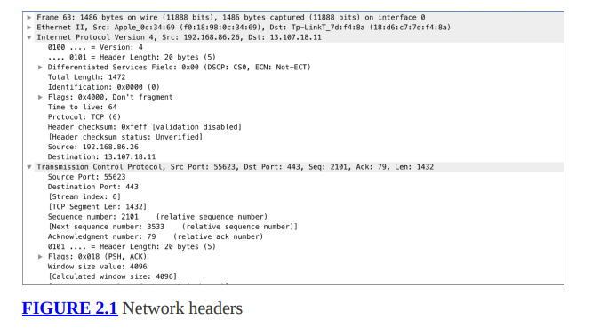

A medida que analicemos los dos modelos de comunicaciones, hablaré no solo de las funciones que existen en cada capa, sino también de los protocolos que existen en cada capa. Cuando hayamos terminado, tendrá dos formas diferentes, pero no diferentes, de comprender cómo se comunican los protocolos entre sistemas y cómo se combinan los mensajes entre sistemas/aplicaciones.

Dividir las funciones de las comunicaciones de red en capas significa que las funciones están modularizadas. Esto significa que puede resultar fácil extraer un protocolo de la cadena e insertar otro. A través de Ethernet funcionan, por ejemplo, los mismos protocolos que los que viajan a través de SONET o Frame Relay. Todos estos distintos protocolos proporcionan las mismas capacidades, aunque de diferentes maneras. Esto funciona porque la funcionalidad de cada capa se abstrae, lo que significa que las capas pueden comunicarse entre sí sin necesidad de conocer los detalles porque se conoce la funcionalidad. Los protocolos individuales no necesariamente importan. Existen muchos protocolos diferentes para cada una de las capas, sin importar de qué modelo estemos hablando.
### Sistemas abiertos de interconexión
Antes de finales de la década de 1970, los sistemas de comunicaciones utilizaban protocolos propietarios, lo que hacía más difícil conceptualizar lo que estaba sucediendo. Cada protocolo definió diferentes comunicaciones de diferentes maneras. A finales de la década de 1970, la Organización Internacional de Normalización (ISO) inició un proceso para definir un conjunto de estándares de comunicación. La idea detrás de esto era permitir una mejor interoperabilidad entre proveedores. Si todas las funciones se desglosan conceptualmente, los puntos de la interfaz son más claros y, como tales, más fáciles de interactuar.

En 1978 se anunció un modelo inicial. Después de refinamientos, se publicó como modelo OSI. Si bien hubo preocupaciones sobre la complejidad de este modelo y la posibilidad de que fuera poco probable que se implementara, sigue siendo un modelo sólido para ayudar a referirse a los límites entre funciones dentro de una pila de red. El modelo OSI incluye siete capas. Al indicar una funcionalidad particular, los profesionales de la red pueden hacer referencia a la función por el número de capa. Veremos cómo funciona esto en breve.

La Figura 2.2 muestra las siete capas del modelo OSI, que se describirán con más detalle en breve. La parte inferior de la pila es la capa física, que avanza hacia arriba hasta que hablamos de protocolos utilizados directamente por las aplicaciones.

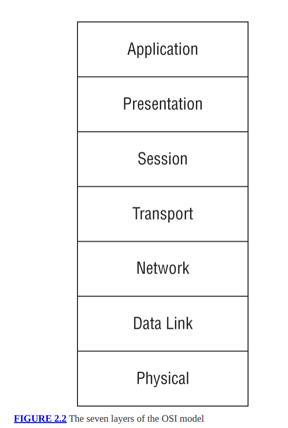

Debido a que los mensajes comienzan a crearse desde la capa de Aplicación hacia abajo, comenzaremos a analizar cada una de las capas y sus funciones allí y avanzaremos hacia abajo. Sin embargo, por si sirve de algo, los diversos mnemotécnicos que se utilizan a menudo para ayudar a las personas a recordar las diferentes capas comienzan en la parte inferior. Por ejemplo, uno de mis alumnos sugirió una vez "Por favor, no toques el caimán mascota de Steve" para ayudar a recordar el orden. Pero eso es de abajo hacia arriba. De todos modos, si recuerdas cualquiera de los dos ordenes y luego recuerdas qué hace cada una de las capas, estarás en buena forma.

**Aplicación (Capa 7)** La capa de Aplicación es la más cercana al usuario final. Sin embargo, esto no significa que sea la aplicación en sí. Estamos hablando de protocolos. Los protocolos de la capa de aplicación gestionan las necesidades de comunicación de la aplicación. Pueden identificar recursos y gestionar la interacción con esos recursos. Por ejemplo, el Protocolo de transferencia de hipertexto (HTTP) es un protocolo de capa de aplicación. Se encarga de negociar recursos (páginas, etc.) entre el cliente y el servidor.

**Presentación (Capa 6)** La capa de Presentación es responsable de preparar los datos para la capa de Aplicación. Se asegura de que los datos que se entrega a la aplicación está en el formato adecuado para su consumo. Cuando los sistemas se comunican, puede haber desconexiones en el formato entre los dos puntos finales, y la capa de presentación se asegura de que los datos tengan el formato correcto. Como tal, los formatos de codificación de caracteres como el Código Estándar Americano para Intercambio de información (ASCII), Unicode y binario extendido. Todos los códigos de intercambio decimal codificados (EBCDIC) pertenecen a la capa de presentación. Además, se considera que el formato JPEG (Joint Photographic Experts Group) está en la capa de presentación.

**Sesión (Capa 5)** La capa de Sesión gestiona la comunicación entre los puntos finales cuando se trata de mantener la comunicación de las aplicaciones (el cliente o servidor). Las llamadas a procedimientos remotos (RPC) son un ejemplo de una función en la capa de sesión. Hay componentes del intercambio de archivos que también se encuentran en la capa de sesión, ya que es necesario que se lleve a cabo la negociación de la comunicación entre los puntos finales. La capa de Aplicación se encarga de administrar los recursos, mientras que la capa de Sesión se encarga de garantizar que los archivos, por ejemplo, se transmitan correctamente y se completen.

**Transporte (Capa 4)** La capa de Transporte se encarga de segmentar los mensajes para su transmisión. La capa de Transporte también se encarga de la multiplexación de la comunicación. Tanto TCP como UDP son protocolos de transporte. Estos protocolos utilizan puertos para el direccionamiento, de modo que los sistemas receptores sepan a qué aplicación pasar el tráfico.

**Red (Capa 3)** La capa de Red recibe mensajes de un punto final a otro. Lo hace encargándose del direccionamiento y el enrutamiento. IP es un protocolo que existe u opera en esta capa.

**Enlace de datos (Capa 2)** Otra dirección con la que lidiar es la dirección de control de acceso a medios (MAC). Esta es una dirección de capa 2, que identifica la interfaz de red en la red para que las comunicaciones puedan pasar de un sistema a otro en la red local. La resolución de dirección
El protocolo (ARP), las redes de área local virtual (VLAN), Ethernet y Frame Relay son protocolos de capa de enlace de datos. Se encargan de formatear los datos que se enviarán en el medio de transmisión.

**Física (Capa 1)** Esta capa probablemente habla por sí sola. Se trata de todos los protocolos que gestionan las comunicaciones físicas. 10BaseT, 10Base2, 100BaseTX y 1000BaseT son ejemplos de protocolos de capa física. Ellos dictan cómo se manejan los pulsos en el cable.

Uno de los problemas con el modelo OSI es que no siempre hay buenos ajustes cuando se trata de asignar protocolos a las siete capas. El problema suele surgir en las áreas entre las capas de Sesión y Aplicación. Por ejemplo, ¿en qué capa se encuentra el protocolo Secure Shell (SSH)? ¿Es la capa de sesión porque en última instancia gestiona las sesiones, o es la capa de presentación porque incluye mecanismos de cifrado y los negocia? Parecen existir otros protocolos entre capas. Se dice que ARP, por ejemplo, opera en la capa de enlace de datos, pero necesita conocer la capa de red porque proporciona el puente entre el direccionamiento en esas dos capas.

Sin embargo, hay lugares donde tener el modelo facilita mucho la conceptualización de las cosas. Por ejemplo, probablemente tengas un dispositivo en tu casa que resulte muy confuso. Puede llamarlo enrutador o puede que conozca personas que lo llamen enrutador. El problema es que el enrutamiento es una función de capa 3, como se discutió anteriormente, y hay otras funciones en el dispositivo que son estrictamente de capa 2, lo que significa que tiene puertos de conmutador que transmiten mensajes en su red local donde no hay enrutamiento involucrado. Además, es muy posible que su dispositivo ni siquiera esté realizando ningún enrutamiento, sino que esté haciendo un puente con la red de su proveedor. Todo depende de cómo esté funcionando su dispositivo y de lo que su proveedor espera de su dispositivo. Aquí es donde resulta útil comprender las diferentes capas. Puede identificar mejor dónde puede tener problemas porque puede aislar la funcionalidad.
### Arquitectura TCP/IP
A finales de la década de 1960, se desarrolló e implementó por primera vez ARPANET. En los años siguientes, creció mucho más allá de los dos y luego tres nodos iniciales que se conectaron en 1968-1969. A medida que se conectaron más sistemas a la red, las personas responsables de gestionar la red y desarrollar los protocolos utilizados para intercambiar información aprendieron mucho. El protocolo inicial fue el protocolo 1822 que definía las comunicaciones con el Procesador de mensajes de interfaz (IMP), que era una computadora grande con interfaces especializadas que actuaba como puerta de enlace de mensajes (considérelo como un enrutador muy primitivo). Posteriormente, el protocolo 1822 fue reemplazado por el Programa de control de red (NCP).

En 1983, después de muchos años de desarrollo, el NCP fue reemplazado por completo por un conjunto de protocolos que ahora se denominan comúnmente Protocolo de control de transmisión (TCP)/Protocolo de Internet (IP). La forma en que se describe el conjunto de protocolos utilizados dentro de la pila TCP/IP es ligeramente diferente de la forma en que se describe el modelo OSI. Una vez implementado TCP/IP, se describió el diseño conceptual de los protocolos. Por esta razón, a veces se hace referencia a la suite como modelo, pero también se puede denominar arquitectura, ya que es una descripción de un diseño construido más que algo conceptual. OSI es completamente conceptual ya que no describe nada en particular.

La arquitectura TCP/IP es un diseño mucho más simple que el modelo OSI, lo cual es una diferencia inmediata y un reflejo de la naturaleza construida del diseño en comparación con el diseño conceptual de OSI. Dado que el modelo OSI tenía que ser abstracto y flexible para adaptarse a una amplia variedad de protocolos y diseños, se dividió en las siete categorías funcionales descritas anteriormente. TCP/IP, por otro lado, como definición tal como está construida, tiene solo cuatro capas.

Esto no quiere decir que no exista correlación entre el modelo OSI y la arquitectura TCP/IP. Como puede ver en la Figura 2.3, hay muchas similitudes entre los dos.

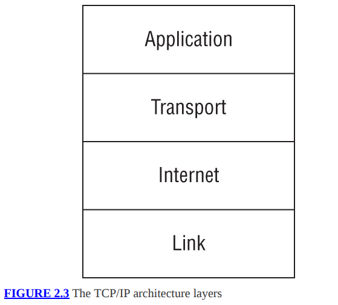

Notarás las similitudes. Para empezar, hay una capa de Aplicación en ambos. También hay una capa de Transporte. Las capas de Internet y Red reciben nombres muy similares. Básicamente, lo que sucede es que las capas de sesión, presentación y aplicación del modelo OSI se contraen en la capa de aplicación en el modelo TCP/IP. Además, las capas Física y de Enlace de Datos del modelo OSI se contraen en la capa de Enlace en el modelo TCP/IP. Las mismas funciones de las capas colapsadas existen en el modelo TCP/IP. Sin embargo, conceptualmente es más fácil de entender. Todo lo relacionado con la comunicación de la aplicación, incluida la gestión de sesiones y el formato de datos, se encuentra en la capa de Aplicación. De manera similar, en el modelo TCP/IP, la capa física y la capa de enlace de datos están juntas.

Independientemente del modelo en el que prefiera pensar en la creación de redes, encontrará que los protocolos generalmente no se extienden a lo largo de múltiples capas. Están diseñados para cumplir con los requisitos de una función específica, que aterrizará bastante directamente en una de las capas de cada modelo.

En el resto del capítulo, y según mi experiencia, es bastante común en el mundo real, cuando ve una referencia a capas, la referencia es al modelo OSI y no a la arquitectura TCP/IP.
### Topologías
La forma en que se diseñan las redes también utiliza modelos conceptuales, como una forma de tomar un laberinto de redes físicas y mapearlas en una representación lógica. No se trata sólo de obtener un mapa lógico de la red, sino que también ayuda a identificar cómo está conectado todo, ya que ayudará a aislar posibles problemas. Las diferentes topologías introducen diferentes problemas potenciales. También encontrará normalmente que algunas topologías solo se encuentran en determinadas situaciones. Algunos se encontrarán en redes de proveedores de servicios, mientras que otros se encuentran más comúnmente en redes de área local.

Incluso en los casos en los que trabaje con redes virtuales, estas formas conceptuales de pensar sobre cómo se interconectan los sistemas le resultarán útiles. Al final, ya sea que esté conectando máquinas virtuales, contenedores, sistemas físicos o una colección de todos ellos, trabajará con uno de estos modelos de topología. La topología le indica cómo fluye el tráfico de un sistema a otro y por qué dispositivos intermediarios pasa la comunicación, lo que le ayudará a determinar dónde puede interceptar o manipular el tráfico.
### Red de bus
Una red de bus, como se muestra en la Figura 2.4, consta de un único cable de red al que se conectan todos los dispositivos de la red. Un autobús es un canal de comunicación. Es posible que encuentre un bus dentro de su computadora para comunicarse entre canales. En nuestro caso, se trata de un canal de comunicación (un único cable de red) que permite la comunicación entre varios ordenadores. La forma en que funcionan algunas redes de bus es mediante el uso de un cable coaxial con conectores en T. El Tconnector proporciona una forma de extraer la señal del bus para proporcionar conectividad a los sistemas de la red. Este tipo de red de bus requiere algo en el extremo del cable para mantener la señal en el cable. Estos dispositivos eléctricos se llaman terminadores. Puedes ver los bloques al final del autobús. Evitan que la señal se refleje en el cable, provocando la cancelación de la señal.

Lo que notará en la red de autobuses es que no hay ningún dispositivo mediador. Todos los ordenadores están conectados directamente entre sí mediante ese único cable de red.

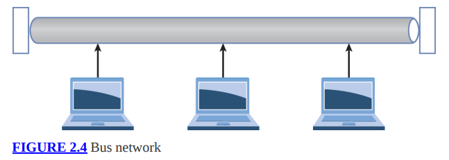

### Red estrella
Cuando vea un diagrama de una red en estrella, a menudo se verá similar a la red de autobuses. Sin embargo, la diferencia entre la red bus y la red en estrella es que existe un dispositivo mediador entre todos los dispositivos. Este puede ser un concentrador, si tiene una red muy antigua, que es un repetidor eléctrico tonto, o puede tener un interruptor. Puedes ver un diagrama tradicional en la Figura 2.5. En el caso de este diagrama, la línea central que ves, que parece un autobús, es en realidad un interruptor o un concentrador. Estos dispositivos luego enviarán las señales que ingresan a los otros dispositivos. En el caso de un hub, todos los dispositivos de la red lo recibirán. Si su red utiliza un conmutador, la señal se enviará al puerto correcto.

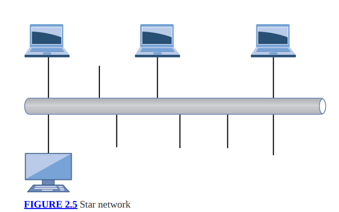

Y aquí es donde las diferentes capas resultan útiles. Un conmutador, que es el dispositivo más común en una topología de red en estrella, actúa en la capa 2 del modelo OSI. Utiliza la dirección MAC para tomar decisiones sobre hacia dónde va el tráfico. En el caso de una red en estrella con un concentrador, existen los mismos problemas que habría con una red de bus: muchas colisiones en las que los mensajes enviados por cable chocan con otros mensajes enviados por otra persona. Un conmutador alivia esos problemas porque sólo el tráfico dirigido a un sistema se envía a ese sistema.
### Red de anillo
Una red en anillo es similar a una red de bus en el sentido de que todos los nodos de la red parecen estar conectados en un segmento de red contiguo. El tráfico pasa alrededor del anillo de un sistema a otro. Puede ver una representación lógica en la Figura 2.6. La razón por la que es una representación lógica es porque físicamente, no es así como están conectadas estas redes. Un tipo de red en anillo es un token ring. En una red Token Ring, los sistemas están cableados como si estuvieran en una estrella, utilizando unidades de acceso multiestación (MAU). Si bien están conectados de esa manera, no se comportan como una estrella. Aquí es donde debes recordar que se trata de modelos conceptuales. El comportamiento, independientemente del cableado, es como se nombran las topologías.

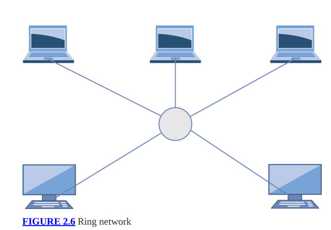

Al igual que en una red de bus, también existe el problema de las colisiones. Una red Token Ring evita este problema mediante el uso de un bastón parlante. Al igual que cuando estás sentado alrededor de una fogata en una tribu aborigen, donde solo la persona con el bastón puede hablar, una red token ring utiliza una representación digital del bastón parlante llamado token. Sólo el sistema que tiene el token puede hablar. Si no hay ningún sistema que necesite enviar un mensaje, el token se pasa de un sistema a otro. Cuando un sistema necesita hablar, tiene que esperar a que le pasen el token. En teoría, esto evitará el problema de las colisiones, excepto que a veces el token se pierde, lo que significa que se debe generar un nuevo token. Después de que se genera el nuevo token, es posible que el antiguo token se "encuentre" nuevamente de repente, lo que significa que hay dos tokens en la red.

A pesar de que una red en anillo se comporta como una red de bus, no se necesitan terminadores como en una red de bus. El hardware necesario para que la red funcione como si estuviera en una configuración de anillo soluciona el problema de los ecos que regresan al cable.
### Red de malla
En otra topología, los sistemas están conectados directamente entre sí. La figura 2.7 muestra un ejemplo. Esto parece un poco como si estuvieran conectados en un anillo, pero es más como peer to peer. Para pasar de un sistema a otro, si no están conectados directamente entre sí, un sistema tiene que pasar a través de otro sistema. Las redes en malla normalmente evitarán otro problema potencial con una red de autobuses. Si falla un sistema en medio de la red de autobuses, existe la posibilidad de que falle toda la red junto con él. Básicamente, el sistema actúa como un terminador al no permitir que la señal eléctrica lo atraviese. Si un sistema en una red en malla falla, probablemente exista otro camino para llegar entre un sistema y otro.

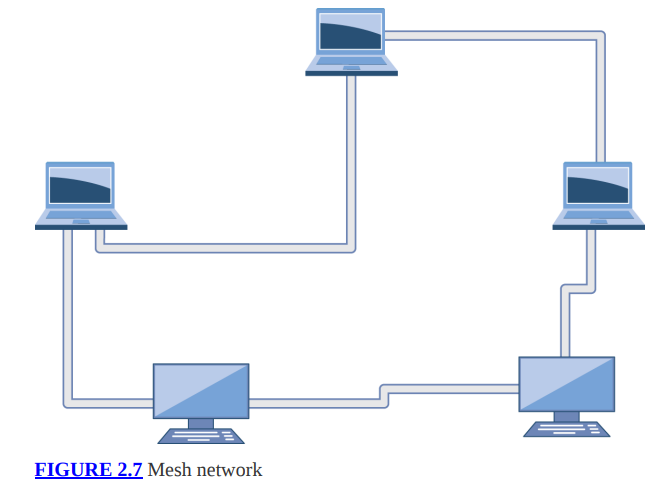

Si bien se pueden conectar sistemas entre sí de múltiples maneras en una red en malla, a pesar del orden que muestra el diseño circular de la red, un par de fallas pueden aislar potencialmente los nodos en una red en malla. La solución es agregar conexiones. Cuantas más vías haya para pasar de un sistema a otro, menos posibilidades habrá de que el fallo sea catastrófico, lo que significa que no se produce comunicación. Puede seguir agregando conexiones hasta que cada sistema tenga conexiones con todos los demás sistemas de la red. Puedes ver un ejemplo de este tipo de diseño en la Figura 2.8. Lo que ves en el diagrama es lo que se llama una red de malla completa. Cada sistema de la red tiene una conexión con todos los demás sistemas.

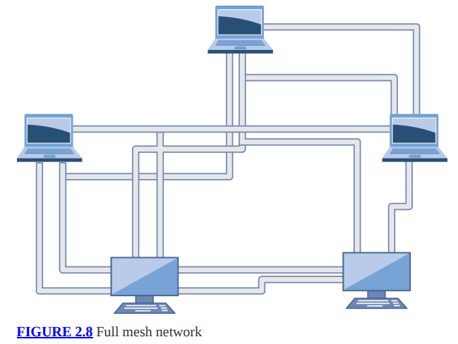

El problema de agregar más conexiones es la complejidad resultante. Puedes ver un poco de eso. Diagramarlo hace que sea difícil ver dónde están todas las conexiones. Cada vez que agrega un nodo a la red, no agrega simplemente una única conexión. Agrega la misma cantidad de conexiones que nodos existentes, por lo que sus conexiones aumentan casi exponencialmente. De hecho, para determinar la cantidad de conexiones que tienes, puedes usar la fórmula n(n – 1)/2. Cada sistema tiene una conexión con todos los demás sistemas excepto con él mismo, por eso multiplicamos el número de sistemas por uno menos que el número de sistemas. (Por ejemplo, si tuvieras 5 sistemas, la fórmula se vería así 5(5 – 1)/2. Eso sería 5 * 4, que es 20, dividido por 2, lo que te da 10 conexiones). Dividimos por 2 porque No vamos en ambas direcciones, de un sistema a otro. Sólo necesitamos una única conexión.
### Híbrido
Cada una de las topologías anteriores es buena, dadas las circunstancias adecuadas. Sin embargo, hay circunstancias en las que combinar múltiples topologías de red es la forma correcta de conectar su red. Un enfoque híbrido común es el autobús estrella. Si tiene conmutadores con capacidad para 64 conexiones de red pero tiene 200 usuarios que necesita conectar a su red local, necesitará agregar efectivamente un bus a su topología de red. El bus conectaría todos sus conmutadores y se convertiría en la columna vertebral de su red. Luego, de cada interruptor, tienes la estrella tradicional donde todas las conexiones regresan al interruptor al que están conectadas. Esta no es una configuración de bus literal, donde todos los conmutadores están conectados a través de un bus. Sin embargo, podría diagramarlo de modo que cada conmutador parezca estar conectado a un bus, ya que todos pueden aparecer conectados como pares.

De manera similar, puede resultar útil conectar su infraestructura de conmutación en una malla o en un anillo. Esto puede ser por motivos de redundancia, para garantizar múltiples vías para llegar a toda su red. Si todo estaba en un bus y el bus falló, es posible que algunos segmentos de la red estén aislados. Como resultado, configurar su red con múltiples vías puede tener mucho sentido. Una red en malla o en anillo puede ayudar con eso.

Las redes híbridas son más comunes en el mundo físico, donde estamos sujetos a cables y equipos de red físicos. Esto es un problema menor en las redes virtuales, donde puede tener tantas interconexiones como admita su direccionamiento porque no está limitado por la cantidad de puertos en un conmutador o la cantidad de interfaces en su enrutador. Las redes virtuales proporcionan mucha flexibilidad y eliminan muchas limitaciones. Sin embargo, no todo sucede en el mundo virtual, ya sea en la nube o dentro de un hipervisor. Aún se encontrará con todos estos cables, conmutadores y enrutadores físicos.
### Redes físicas
En algún momento, necesitarás conectarte a la red. Hay múltiples componentes en esa interacción. Necesita una interfaz de red de su parte. Necesitas un medio que lleve la comunicación. Necesita tener algo al otro lado de la comunicación. Debido a que probablemente no trabajaremos con proveedores de servicios o proveedores de telecomunicaciones mientras realizamos pruebas de seguridad, al menos no en el lado del proveedor de la red, no nos preocuparemos por protocolos como Frame Relay, Modo de transferencia asincrónica. , o interfaz de datos distribuidos por fibra. El protocolo con el que se encontrará casi exclusivamente cuando hablemos de redes físicas es Ethernet.

Cada capa de la pila de red tiene un término diferente para referirse al fragmento de datos encapsulado por esa capa. Estos fragmentos se denominan unidades de datos de protocolo (PDU). La PDU en la capa 2, que es parte de lo que estamos hablando aquí, es una trama. Cuando miras un fragmento de datos que contiene la dirección física, estás mirando un marco. Hablaremos de los nombres de las otras PDU cuando lleguemos a esas capas.
### Direccionamiento
Todas las interfaces Ethernet tienen direcciones. Estas direcciones son exclusivas de cada interfaz de red y se denominan direcciones MAC. Debido a que la dirección MAC está codificada en el hardware de la interfaz, a veces se la denomina dirección de hardware. Dado que también es la dirección que utiliza una pieza física de hardware, a veces se la denomina dirección física.

El formato común de una dirección MAC es de 6 octetos (bytes de 8 bits) generalmente separados por dos puntos. Un ejemplo de dirección MAC sería BA:00:4C:78:57:00. La dirección se divide en dos partes. El primero es el identificador único organizacional (OUI). También se denomina ID del proveedor porque identifica el nombre de la empresa que fabricó la interfaz. La segunda mitad de la dirección MAC es la dirección única dentro del ID del proveedor de esa interfaz. Entonces, la mitad es para el proveedor y la otra mitad es para la tarjeta misma.

La dirección MAC se utiliza exclusivamente en su red local. Cualquier sistema que quiera enviarle algo lo dirigirá a su dirección MAC. También puede enviar mensajes a todos los dispositivos de la red utilizando la dirección de transmisión. La dirección MAC de transmisión es ff:ff:ff:ff:ff:ff. Su interfaz de red sabe qué dirección tiene porque está en el hardware. Sin embargo, lo que esto significa es que el tráfico que de alguna manera se dirige a la interfaz, ya sea directamente a su dirección o a la dirección de transmisión, por ejemplo, se reenviará al sistema operativo desde la interfaz de red. Todo lo demás será ignorado, a menos que se le indique específicamente a la interfaz que no lo ignore. Este sería un caso inusual, aunque es necesario para las capturas de paquetes.
### Switching
Las direcciones MAC son la piedra angular para la conmutación. El cambio es lo que sucede cuando las decisiones sobre el reenvío de mensajes se toman en función de la dirección física. Un conmutador es en realidad un puente multipuerto. Un puente es un dispositivo que conecta dos redes y pasa el tráfico entre ellas según la dirección MAC de destino. El tráfico local permanece a un lado del puente; se pasa por alto el tráfico destinado al otro lado. Sin embargo, esto significa que el conmutador necesita saber qué dirección MAC se encuentra en qué puerto. Lo hace esperando hasta que llegue un mensaje a cada puerto y observe la dirección de origen.

Debido a que tener que realizar una búsqueda de a qué puerto reenviar un mensaje lleva tiempo, lo que ralentizará la transmisión del mensaje, es esencial que la búsqueda sea lo más rápida posible. Esto generalmente se logra mediante el uso de algo llamado memoria direccionable por contenido (CAM). Esto significa que para buscar un valor, lo busca en función de otro valor. En lugar de una matriz de datos indexados con valores numéricos, lo que significa que buscamos un valor usando algo como la matriz para obtener el valor en el índice 5 de la matriz, usamos una dirección MAC como valor de índice. Esto significa que debe buscar entre todos los datos o mantenerlos ordenados para encontrar algo. Esto lleva mucho tiempo. Es más fácil buscar el valor de un puerto simplemente indexando la dirección MAC.

Lo que hace un conmutador, que es el valor de la conmutación, es determinar qué tráfico va a qué puerto en función de la dirección MAC de destino. Esto reduce la cantidad de tráfico que sale del puerto del switch y baja por el cable. Esto mejora el rendimiento porque puede llenar la conexión de red con tráfico específico del sistema conectado al puerto del conmutador en lugar de inundarla con todo el resto del tráfico de la red. Sin embargo, esto causa algunos otros problemas cuando se trata de pruebas de seguridad. En un entorno conmutado, solo verá el tráfico destinado a ese sistema conectado al puerto del conmutador. Al realizar pruebas de seguridad, actuando como un atacante, es más conveniente poder ver más tráfico que eso.

Hay algunas formas de solucionar ese desafío. Una de ellas, si tiene cierto control sobre el conmutador, es decirle al conmutador que refleje el tráfico de un puerto a otro. Luego, debe tener el sistema desde el que está ejecutando los ataques conectado al puerto espejo. Otra forma es engañar al switch para que le envíe tráfico, lo que implica métodos de ataque que cubriremos en capítulos posteriores.
### IP
Pasando a la capa de Red, nos encontramos con IP. Ciertamente, existen otros protocolos en la capa de red, como el Intercambio de paquetes entre redes (IPX), pero como Internet funciona con IP y sus protocolos asociados, nos centraremos allí. A medida que se pasa por cada capa, se agrega un conjunto de datos al mensaje que es específico del protocolo que procesa el mensaje. Estos conjuntos de datos se denominan encabezados. Cada protocolo tiene su propio conjunto de encabezados que se adjuntan. Luego, los encabezados encapsulan el mensaje, creando una PDU completamente nueva. Para IP, la PDU se denomina paquete. Es posible que escuche que se hace referencia a cada conjunto de datos en la red como paquete, pero desde un punto de vista técnico, un mensaje desde el encabezado IP hacia abajo es un paquete.

El abordaje también es algo a considerar. Este es un aspecto con el que las personas que trabajan con networking suelen estar bastante familiarizadas, pero es útil para entender qué comprende una dirección. Asociada con la dirección está la máscara de subred. Esto puede ser difícil de entender, pero existen algunos trucos matemáticos que pueden ayudar, una vez que los conozcas. También hay un par de formas diferentes de representar la máscara de subred y, a menudo, encontrarás ambas.

Actualmente hay dos versiones de IP en uso. La más común es la versión 4, comúnmente denominada IPv4. Hemos estado en el proceso de cambiar a la versión 6 durante las últimas dos décadas. Aún no hemos realizado la transición por completo, pero todos los dispositivos y sistemas operativos modernos admiten IPv6, por lo que verá la dirección IPv6 en la mayoría de los sistemas con los que interactuará. IPv6 tiene algunas diferencias en comparación con IPv4, una de las cuales es el tamaño del espacio de direcciones.

El IP se considera un protocolo de mejor esfuerzo. Hace todo lo posible para llevar los paquetes desde el origen al destino. No hace nada para garantizar absolutamente que lleguen allí. Sin embargo, facilita la transmisión al proporcionar direccionamiento.
### Encabezados
El Internet Engineering Task Force (IETF) es responsable de mantener toda la documentación relacionada con los protocolos. Cuando alguien, o más comúnmente un grupo de personas, quiere proponer un nuevo protocolo o una extensión de un protocolo existente, escribe algo llamado documento de solicitud de comentarios (RFC). El IETF no sólo mantiene los RFC, sino que también gestiona el proceso para su aprobación. El primer RFC se escribió en 1969 y estaba relacionado con el software anfitrión del IMP que se utilizaba para interconectar un sistema informático con ARPANET. En ese momento, por supuesto, el IETF no existía, pero el uso de RFC seguía siendo el proceso para crear especificaciones y estándares.

El RFC para IPv4, que se publicó en 1981, es 791. Define cómo se supone que funciona IPv4 y también define los campos de encabezado utilizados por IPv4. La Figura 2.9 muestra un conjunto de encabezados IPv4 de un mensaje capturado fuera de la red. Este es el mismo conjunto de encabezados que se presentarían en forma de tabla en el RFC al que se hace referencia. La diferencia entre el formulario de tabla y simplemente mirar los encabezados de esta manera es que con la tabla, puedes ver claramente el tamaño de cada campo de encabezado.

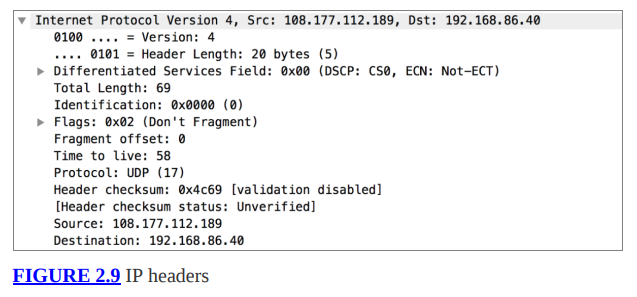

Los siguientes son los campos de encabezado con sus descripciones y tamaños:
Versión Este campo indica qué versión de IPv4 está en este paquete. Este es un campo de 4 bits.

**Longitud** del encabezado Este campo indica cuántas palabras hay en el encabezado IPv4. Debido a que el encabezado se basa en palabras de 32 bits, que son 4 bytes, puede obtener el número de bytes multiplicando este valor por 4. En el caso de este ejemplo, encontrará que los encabezados son 20 bytes (cinco palabras ), que es común para un encabezado IP.

**Tipo de servicio** El RFC llama a esto el campo de tipo de servicio (ToS), aunque también verá que se lo conoce como campo de servicios diferenciados. Este campo ayuda a los elementos de la red a tomar decisiones sobre la calidad del servicio (QoS) al priorizar algunos mensajes y restar prioridad a otros. Este es un campo de 8 bits (1 byte).

**Longitud total** Esta es la longitud total del mensaje, incluido el encabezado IPv4 y cualquier dato posterior. Esto no incluye ningún encabezado que se agregue después del hecho, como el encabezado de la capa 2. Este campo tiene una longitud de 2 bytes, lo que permite una longitud total de mensaje de 65.535 octetos (bytes).

**Identificación** A veces se envían demasiados datos para caber en la longitud máxima permitida según el tamaño del campo de longitud. Esto significa que a veces es necesario fragmentar los mensajes. Todos los mensajes enviados tienen este campo configurado, aunque solo significa algo si hay fragmentos. Todos los fragmentos tendrán el mismo valor de identificación.

**Banderas** Hay 3 bits asignados a un campo de banderas. Uno está reservado y el segundo indica si el mensaje se puede fragmentar. A esto a veces se le llama bit DF. Si está configurado, significa que no fragmente el mensaje. El último bit se utiliza para indicar si hay fragmentos adicionales. Si está configurado, hay más fragmentos. Si no está configurado (es decir, 0), es el último fragmento. Un mensaje que sea autónomo, es decir, que no requiera ninguna fragmentación, tendría este aspecto claro.

**Desplazamiento de fragmento** El campo de desplazamiento de fragmento, de 13 bits de longitud, indica dónde se alinean los datos del paquete. Esto le permite al sistema receptor saber cómo unir todos los fragmentos. El valor de este campo está en palabras dobles u 8 octetos (bytes).

**Tiempo de vida** El campo de tiempo de vida (TTL) indica cuánto tiempo puede vivir un mensaje en la red antes de que se considere caducado. Está destinado a medirse en segundos, aunque cada dispositivo de red que toque el mensaje debe disminuir este campo. Dado que el paquete puede pasar a través de múltiples dispositivos de red en un segundo, la definición inicial de este campo ya no es relevante y el TTL realmente indica la cantidad de dispositivos de red (dispositivos de enrutamiento, esencialmente) por los que puede pasar el mensaje. Una vez que el campo llega a 0, el mensaje se descarta y se devuelve un mensaje de error al remitente. Este campo tiene una longitud de 8 bits.

**Protocolo** Este es un valor numérico que indica cuál es el siguiente protocolo. Es un campo de 8 bits y le dice al sistema receptor qué encabezados buscar en el encabezado de transporte. En el caso del paquete de la Figura 2.9, el valor es 17, lo que significa que es un mensaje UDP.

**Suma de comprobación** Este es un valor de 16 bits que se utiliza para determinar si el encabezado está intacto. Se define como una suma en complemento a 1 de las palabras de 16 bits en el encabezado.

**Dirección de origen** Esta es la dirección IPv4 que envió el mensaje. Tiene una longitud de 4 octetos.

**Dirección de destino** Esta es la dirección IPv4 a la que se dirige el mensaje. También tiene una longitud de 4 octetos.
### Direccionamiento
Las direcciones IP versión 4 tienen 4 octetos de longitud. Normalmente se muestran separados por un punto (.). Debido a esto, a veces se les llama cuadritos con puntos o notación decimal con puntos. Dado que cada valor tiene 8 bits, existen valores potenciales de 0 a 255. Sin embargo, no se utilizan todos los valores, especialmente en los dos primeros octetos. Hay algunas direcciones que se mantienen en reserva por diversos motivos. Para empezar, el rango de direcciones 127.0.0.0–127.255.255.255 está reservado para direcciones de loopback. Son direcciones que hacen referencia al host al que están asignadas. La interfaz loopback garantiza que siempre haya una interfaz de red en el sistema y permite realizar pruebas.

a través de una red sin enviar ningún tráfico fuera del sistema. Normalmente, la dirección de bucle invertido en los sistemas es 127.0.0.1, aunque se puede utilizar cualquier dirección en ese rango.

RFC 1918 también establece rangos de direcciones IP que se utilizan para redes privadas. Por convención, estas direcciones no se pueden enrutar a través de Internet. La mayoría de las redes harán algo para bloquear las direcciones de origen de estos rangos que ingresan a su espacio, ya que nunca deberían originarse desde el exterior de una red. Los rangos para estas direcciones privadas, destinadas a ser utilizadas por cualquier red que no tenga direcciones IP públicas, son 10.0.0.0–10.255.255.255, 172.16.0.0–172.31.255.255 y 192.168.0.0–192.168.255.255.

Además, se mantienen en reserva otros rangos de direcciones. El rango 224.0.0.0– a 239.255.255.255 se utiliza para mensajes de multidifusión. Todo lo que esté por encima de 240.0.0.0 también está reservado y no está en uso actualmente.

Una de las razones para pasar a IPv6 es la limitación de direcciones con la versión 4. Hay aproximadamente 4 mil millones de direcciones disponibles con IPv4. Sin embargo, esto incluye todo el conjunto de direcciones. De eso, eliminamos 16 millones de inmediato solo por el bloque de direcciones privadas 10.0.0.0. Luego, quitamos más de 268 millones debido a las direcciones superiores a 240.0.0.0. Puede ver lo rápido que desaparece el espacio de direcciones en IPv4. También habrás notado que la cantidad de dispositivos que se conectan a Internet está aumentando a un ritmo casi exponencial. La solución provisional para esto es utilizar rangos de direcciones privadas en el interior de las redes, especialmente las redes domésticas.

En lugar de sólo 4 octetos que se utilizan en IPv4, IPv6 utiliza 16 bytes. Debido a que sería complicado escribir un IPv6 en forma de octeto de puntos como lo hacemos con IPv4, las direcciones en IPv6 se escriben en una forma diferente. Debido a que un octeto se puede representar con dos dígitos hexadecimales, verá las direcciones IPv6 representadas de esa manera. Ahorra espacio y escritura. Dado que hay 16 octetos en una dirección IPv6, la dirección más larga con la que se encontrará tendrá 32 caracteres. Sin embargo, la dirección completa generalmente se separa en pares de bytes con dos puntos (:) entre ellos. Como ejemplo, uno de mis sistemas tiene una dirección IPv6 de fe80::62e3:5ec3:3e06:daa2.

Además de que la dirección se divide en pares de bytes, como fe80, notarás que hay una parte de la dirección que tiene un par de dos puntos sin nada intermedio. Esto no es un error. Esta es una abreviatura para indicar que lo que está en el medio son todos ceros. La dirección completa sería fe80:0000:0000:0000:62e3:5ec3:3e06:daa2. Es más fácil eliminar los 0 adicionales.

IPv6 tiene tres tipos de direcciones diferentes. El primero es unidifusión, que se refiere a un único sistema. Las direcciones Anycast son grupos de sistemas que comparten una única dirección. Un mensaje enviado a la dirección anycast se entregará solo a uno de los hosts del grupo anycast. Esta será normalmente la dirección más cercana, según las reglas de enrutamiento. Cualquier dirección anycast tendrá el mismo formato que una dirección unicast. Las direcciones de multidifusión se verán como las otras direcciones, pero su formato se basa en el hecho de que son direcciones de multidifusión y en la aplicación que utiliza la dirección. Es posible que vea una dirección de multidifusión como 224.0.0.1, por ejemplo.
### Subredes
La división en subredes puede ser un desafío de entender, pero es un concepto importante. Una de las razones por las que es importante es que es posible que necesite saber qué direcciones pertenecen a su objetivo según una subred. Si no establece correctamente los límites de la subred, existe la posibilidad de que comience a realizar pruebas en sistemas que no pertenecen a su objetivo. Esto puede causarle muchos problemas. Por eso, dedicaremos un poco de tiempo a hablar sobre qué son las subredes y cómo determinar los límites de las subredes. Esto implicará algunos cálculos simples, pero idealmente será fácil una vez que se lo explique.

Las direcciones IP se agregan en redes utilizando direcciones contiguas. Esto es relevante sin importar si hablamos de IPv4 o IPv6. Esto facilita el enrutamiento a esas direcciones, ya que las tablas de enrutamiento no tienen que realizar un seguimiento de cada dirección IP. En cambio, se realiza un seguimiento de los bloques agregados. En parte debido a esto, una parte de la dirección IP pertenece al host y otra pertenece a la red. Esta segmentación de la dirección también ayuda a los sistemas a saber qué direcciones son locales, es decir, las comunicaciones permanecen en la red local. La forma en que se les dice a los sistemas qué son redes locales y qué no son redes locales es emparejando una máscara de subred con la dirección IP.

La máscara de subred también tiene una longitud de 32 bits y se representa como un cuadrante de puntos en una dirección IPv4. Para determinar qué parte de una dirección IP pertenece a la red, observe los bits configurados en 1 en la máscara de subred. Para comprender mejor este concepto, veamos una representación binaria de una máscara de subred.

11111111.11111111.11111111.10000000

Cualquier posición de bit que tenga un 1 es parte del segmento de red. Notarás que los 1 se completan desde la izquierda y no hay espacios. Como resultado, las máscaras de subred sólo pueden tener ciertos valores: 0, 128, 192, 224, 240, 248, 252, 254 y 255. Esto se debe a que cada posición es una potencia de dos y sumamos desde el bit más significativo. En el lado izquierdo. El binario 10000000 equivale a 128 en decimal. 11000000 es 192. Cada vez que configuramos un bit en 1, sumamos la siguiente potencia inferior de 2. Al observar la máscara de subred de arriba y aplicar la traducción de binario a decimal, podemos ver que la máscara de subred es 255.255.255.128. Esto significa que sólo los últimos 7 bits del último octeto se utilizan para los valores del host. La representación de bits en el último octeto sería 10000000. Aquí es donde debemos comenzar a aplicar la dirección IP a la máscara de subred para obtener el rango de direcciones.

Con una máscara de subred de 255.255.255.128, tengo la posibilidad de dos bloques de direcciones, independientemente de cuál sea la dirección IP. Sólo puedo variar el último octeto y estoy limitado porque no puedo cambiar el valor en la posición del bit más significativo. Esto me deja con los rangos de 0 a 127 y de 128 a 255. Una vez que sé cuál es mi dirección IP, sé en qué bloque estoy. Digamos que mi dirección IP es 172.20.30.42 y mi máscara de red es 255.255.255.128. Sé que mi bloque de direcciones tiene que ser 172.20.30.0–127 porque ese es el rango en el que aterriza .42.

Otra forma de designar bloques de red es utilizar la notación CIDR (Classless Inter-Domain Routing). Esto significa que en lugar de indicar una máscara de subred, solo obtiene el número de bits de prefijo. El prefijo le indica qué bits se utilizan para la red. La máscara de subred utilizada anteriormente se traduce como /25, y yo indicaría la subred con la dirección IP indicando 172.20.30.42/25. Usar esta notación en realidad hace la vida un poco más fácil si lo piensas en potencias de dos.

Digamos que quieres saber cuántas direcciones pertenecen a un bloque de red en particular y tienes la notación CIDR. Una forma de tomar esa determinación es comenzar con una cantidad conocida. A menudo, verá notaciones CIDR flotando alrededor del área /24, que es una máscara de subred 255.255.255.0 y es común. Si desea saber cuántos hosts, simplemente divida por 2 o multiplique por 2 por cada cambio de bit en el prefijo. Una red que es /24 tiene 256 valores posibles en la parte del host (el último octeto). Si vas a /25, eso significa que obtienes 128 valores posibles (divídelos por 2 porque agregaste un bit de prefijo, lo que significa que perdiste un bit de host). Si va en la otra dirección a /23, duplicará porque perdió un bit de prefijo, lo que significa que se agregó a la parte del host. En lugar de 256, ahora tiene 512 valores posibles en la parte del host.

También puede ver con bastante rapidez cómo obtener valores de prefijo aún más pequeños simplemente observando el número de bits en cada octeto. Si el primer octeto se usa para la designación de red y todos los demás se usan para los valores del host, tendría todas las posiciones de bits en ese primer byte llenas, lo que significa que está usando 8 bits, dejándolo con una designación CIDR de / 8. De manera similar, si usa los dos primeros octetos, estará usando 16 bits, por lo que tendrá un /16.

Sin embargo, una nota sobre las subredes es que hay dos valores que no se pueden usar para los sistemas. Para la red se utiliza la dirección más baja posible en cualquier segmento de red. Para la dirección de transmisión se utiliza la dirección más alta posible en cualquier segmento de red. En una red /24 común, .0 se convierte en la dirección de red y .255 se utiliza para la transmisión. Ninguno de estos puede asignarse a los anfitriones.

IPv6 facilita aún más todo el proceso. Ya no se utilizan máscaras de subred al indicar una dirección de red. En cambio, la designación CIDR se utiliza exclusivamente para indicar qué parte es la red y cuál es el host. Se aplican las mismas reglas. La parte de la red siempre comienza desde la izquierda y completamos bits de la máscara desde la izquierda. Una red /50 significa que los primeros 50 bits de la dirección son la designación de la red. Esto deja los 78 bits restantes (tenga en cuenta que las direcciones IPv6 tienen 128 bits de longitud) para el host. Por supuesto, esa sería una red increíblemente grande.
### TCP
Pasando a la capa de Transporte, primero cruzamos el TCP. Mientras que IP es un protocolo de mejor esfuerzo, lo que significa que se hace el mejor esfuerzo para enviar mensajes de un sistema a otro, se dice que TCP tiene entrega garantizada. Esto quizá sea menos impresionante de lo que parece. Obviamente, TCP por sí solo no puede garantizar la entrega en caso de una falla catastrófica en la red. En cambio, lo que significa es que hay mecanismos en el protocolo que realizan un seguimiento de todos los mensajes que se envían, y si algo no llega al otro extremo y no se reconoce allí, los mensajes se reenviarán.

Las capas que hemos visto hasta ahora tienen formas de abordarse. La capa de Transporte no es diferente. Mientras que las direcciones anteriores están relacionadas con los sistemas para garantizar que los mensajes lleguen de un sistema a otro, en la capa de Transporte, comenzamos a preocuparnos por hacer llegar los mensajes a la aplicación. Los protocolos de la capa de transporte proporcionan puertos como una forma de abordar las aplicaciones. También proporcionan multiplexación. Sin puertos, no podríamos tener múltiples aplicaciones escuchando en el mismo sistema. Con los puertos tenemos una gran capacidad para conversaciones con otros sistemas.

Tal como hicimos con IP, veremos los encabezados definidos para TCP. TCP se define en RFC 793 y también se escribió en 1981, lo que significa que TCP existe desde hace mucho tiempo. Los encabezados permanecen sin cambios durante todo ese tiempo y, dado que los encabezados habilitan la funcionalidad del protocolo, la funcionalidad tampoco ha cambiado. La Figura 2.10 muestra los encabezados TCP de una captura de paquetes.

Verá los siguientes campos en la captura:
**Puerto de origen** El puerto de origen es el puerto desde el que se originó el tráfico en el lado emisor. Esto es importante porque las conversaciones no son unidireccionales. Para que el destinatario pueda responder, necesita un puerto al que enviar. Cuando se responde a los mensajes, los puertos de origen y destino se invierten. El puerto de origen tiene una longitud de 16 bits.

**Puerto de destino** El puerto de destino es el que está asociado con una aplicación. Cada conversación tiene un lado del cliente y un lado del servidor. El lado del servidor vincula una aplicación a un puerto de escucha. El cliente envía a este puerto como puerto de destino. Si el servidor envía desde el servidor al cliente, el puerto de destino es el puerto efímero asignado a la aplicación que se comunica con el servidor. El puerto de destino, al igual que el puerto de origen, tiene una longitud de 16 bits.

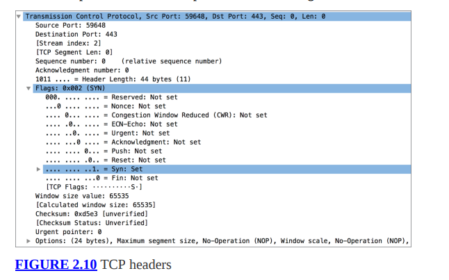

**Número de secuencia** El número de secuencia es parte de lo que contribuye a la entrega garantizada. Este es un número de 32 bits que se establece en un valor aleatorio cuando se inicia la conversación. Se incrementa con el número de bytes que se envían. Usando el número de secuencia, el remitente le dice al destinatario en qué parte de la conversación cae este mensaje. Verá en el ejemplo que el número de secuencia se muestra como 0. La razón de esto es que el software de captura de paquetes muestra un 0 y luego presenta números de secuencia relativos, que son más fáciles de seguir.

**Número de confirmación** El número de confirmación está en el lado opuesto de la conversación del número de secuencia. Cuando el número de secuencia lo establece el remitente, el número de acuse de recibo lo establece el destinatario. El número de acuse de recibo se establece en el siguiente número de byte que el destinatario espera recibir. Lo que esto significa en la práctica es que el recuento de bytes se incrementa en 1 y luego se envía. Esto le dice al remitente en qué parte del flujo de comunicación se encuentra el destinatario, lo que le permite saber si se ha perdido algo en la transmisión.

**Desplazamiento de datos** El desplazamiento de datos es un valor de 4 bits que indica el número de palabras de 32 bits en el encabezado TCP. Le permite al sistema saber dónde buscar los datos. Esto es necesario porque el encabezado TCP puede tener una longitud variable. Este campo no se muestra en la figura, pero es un encabezado TCP definido.

**Reservado** Hay 6 bits en el encabezado TCP que están reservados para uso futuro.

**Bits de control** Hay 6 bits de bandera que se utilizan para indicar la disposición del mensaje. El indicador SYN es el indicador de sincronización, que indica que el número de secuencia está configurado y debe registrarse. El indicador ACK es el mismo para el número de acuse de recibo. La bandera URG indica que el puntero urgente tiene datos significativos. El indicador PSH es una indicación de que los datos deben enviarse hacia arriba en lugar de almacenarse en el búfer. El indicador RST restablece la conexión, lo que puede ocurrir si se recibe un mensaje que parece ser erróneo. El indicador FIN indica que la conversación terminó y no hay más datos para enviar.

**Ventana** El valor en el campo de la ventana le dice al destinatario cuántos bytes está dispuesto a aceptar el remitente. Esto permite acelerar y ralentizar la comunicación. Un tamaño de ventana más pequeño significa que se necesitan más confirmaciones, lo que puede ser una indicación de que el canal de comunicación no es confiable. Un tamaño de ventana más grande significa que el canal es confiable, por lo que no es necesario seguir registrando. El campo de la ventana es de 16 bits.

**Suma de comprobación** Este es un campo de 16 bits que se utiliza para garantizar que la comunicación no se haya dañado. Este es un valor en complemento a 1 calculado sobre los encabezados y el texto.

**Puntero urgente** El puntero urgente de 16 bits indica el siguiente valor de byte después de los datos urgentes. Esto se alinea con los valores del número de secuencia. Esencialmente, el puntero urgente dice los datos desde el número de secuencia actual hasta que el valor en el puntero urgente es datos urgentes.

**Opciones** Estos son campos de encabezado de longitud variable. El encabezado debe estar alineado con palabras de 32 bits. Si las opciones dejan la longitud del encabezado por debajo de esa alineación, se necesitan bits de relleno para llenar el resto del encabezado.

TCP utiliza múltiples mecanismos para garantizar un servicio confiable. La primera es que TCP está orientado a la conexión. Las conexiones se establecen mediante lo que se denomina un protocolo de enlace de tres vías. La Figura 2.11 muestra un diagrama del proceso de apretón de manos. El apretón de manos garantiza que ambas partes de la conversación estén vivas y activas porque se espera que respondan. El primer mensaje en el protocolo de enlace de tres vías es el mensaje SYN. Se establece el indicador SYN, así como el número de secuencia inicial, que es un valor aleatorio. La respuesta al mensaje SYN es un mensaje de reconocimiento. Esto establece el indicador ACK e incrementa el número de secuencia inicial en uno, lo que indica que se recibió el primer mensaje. En el mismo segmento, también se configuran el indicador SYN y el número de secuencia. Tenga en cuenta que la conversación es bidireccional, por lo que ambas partes deben realizar un seguimiento de dónde se encuentran en la conversación. Cada lado realiza un seguimiento de un número de secuencia para su lado y un número de acuse de recibo para el otro lado. El mensaje final en el protocolo de enlace es uno que solo tiene configurado el indicador ACK, y el campo de reconocimiento incrementa el número de secuencia establecido en el mensaje SYN/ACK.

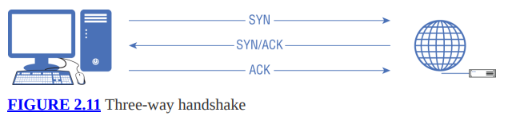

Dado que se espera que ambas partes respondan a los mensajes con información proporcionada por la otra, podemos estar seguros de que el mensaje fue recibido por la parte prevista y que ambas partes son quienes dicen ser, al menos en teoría. Si cualquiera de las partes intentara falsificar una conversación, no recibirían los mensajes y, como resultado, no responderían correctamente.

El siguiente mecanismo que ayuda a garantizar la confiabilidad es el número de secuencia. Dado que el número de secuencia mantiene la cantidad de bytes que se han enviado, el número de acuse de recibo le dice al remitente si falta algún dato durante la transmisión. Si es así, el remitente sabe que es necesario retransmitirlo. Cada lado de la conversación sabe dónde está y dónde está su interlocutor. TCP retransmite según sea necesario, hasta un máximo definido.

Además, los números de secuencia y acuse de recibo garantizan el orden correcto de los mensajes en el destinatario. Si los mensajes llegan desordenados, los números de secuencia indican si se deben retener los mensajes que se perdieron. Esto también es parte de la entrega garantizada: asegurarse de que los mensajes no solo lleguen como se esperaba, sino que también estén en el orden correcto cuando lleguen. Todo esto, sin embargo, conlleva gastos generales. No todas las aplicaciones necesitan el modelo de entrega garantizado que proporciona TCP.
### UDP
UDP ofrece otro modo de transporte que no tiene la misma sobrecarga que TCP. Es un protocolo mucho más liviano que no ofrece garantía de entrega. Los mensajes enviados mediante UDP simplemente se envían por cable con la esperanza de que lleguen al destino porque el protocolo de red, IP, se encargará de todo. Con el peso más liviano, se generan muy pocos gastos generales relacionados con cosas como establecer conexiones y asegurarse de que los mensajes lleguen a su destino. Tampoco importa mucho en qué orden se reciben los mensajes desde el punto de vista del protocolo. Si la aplicación está interesada en ese tipo de detalles, puede encargarse de la gestión.

El RFC para UDP es RFC 768. El RFC completo tiene poco más de dos páginas, lo que debería dejar claro lo simple que es el protocolo. Puede ver un ejemplo de un encabezado UDP en la Figura 2.12. Hay cuatro campos de encabezado. Todos ellos tienen 16 bits de longitud. Como era de esperar, la mitad de ellos son puertos de origen y de destino. Lo interesante de esto es que el puerto de origen se considera un campo opcional. La razón de esto es que, dado que no hay conexión, es posible que nunca haya una respuesta del servidor. Depende totalmente de la aplicación en uso, que es diferente de TCP. Se requiere un puerto de origen con TCP porque siempre habrá una respuesta, incluso si solo se usa para completar el protocolo de enlace de tres vías.

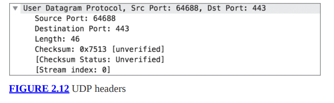

Quizás sea interesante que RFC 768 no defina una respuesta a un puerto UDP cerrado. De hecho, no se mencionan los puertos cerrados. El único lugar donde se mencionan las respuestas a puertos cerrados que es relevante es en el RFC para el Protocolo de mensajes de control de Internet (ICMP). Incluso entonces, sólo hay un código para puerto inalcanzable. No hay ninguna indicación sobre el protocolo donde se aplica. Por este motivo, trabajar con puertos UDP no es nada fiable. Si no recibe una respuesta, podría deberse a la pérdida o caída de un paquete. Podría ser que la aplicación haya ignorado el mensaje. Podría ser que no se requiriera respuesta. Cualquiera de esos son escenarios legítimos en los que no obtendría una respuesta a un mensaje en un puerto UDP.

UDP es bueno para aplicaciones que requieren una configuración y transmisión rápidas. Por ejemplo, la transmisión de vídeo y audio funciona bien con UDP. No funcionan bien con TCP. Una razón importante para esto es que con UDP, depende de la aplicación reordenar los mensajes, según sea necesario. Si un datagrama (la PDU para UDP) no funciona con la transmisión de video, la aplicación simplemente lo descartará. Lo mismo ocurre con la transmisión de audio. Imagínese por un segundo si estuviera hablando con alguien a través de Internet. Saludaste a la persona al otro lado de la línea. En realidad, esa palabra probablemente se transmitiría en un solo mensaje, pero digamos que cada sonido de letra se transmitiera en su propio mensaje.

Si recibieras mensajes con los sonidos l, h, l, o y luego e, ¿cómo te sonaría? Nuestros cerebros son muy buenos para juntar los datos que faltan y construir algo que parezca completo, pero podría ser que tu cerebro no fuera capaz de encontrarle sentido a la palabra tal como suena. Incluso si tu cerebro pudiera entenderlo, sonaría extraño y tu experiencia general sería mala. Lo mismo ocurre con el vídeo, por supuesto. Si se insertaran las llegadas tarde en la transmisión de video que estás viendo, parecería muy nervioso.

¿Por qué los mensajes llegarían desordenados? Después de todo, hoy en día contamos con un servicio de Internet muy confiable. Bueno, hay varias razones por las que los mensajes no funcionan. Digamos que estás enviando un flujo de datos a alguien que usa UDP. Estás enviando tus datos por la ruta A ➢ B ➢ C ➢ D, que es tu destino. Sin embargo, digamos que C cae justo cuando su mensaje está a punto de llegar. La red corrige y rodea C, tomando otro camino, tal vez A ➢ E ➢ F ➢ D. Sin embargo, la falla ocurrió mientras al menos uno de sus mensajes estaba en tránsito y no tiene forma de saber que el mensaje estaba en circulación. acaba de caer debido a una falla. Incluso si no es una falla y los mensajes se descartan, podría ser que un mensaje tome una ruta y un mensaje posterior tome otra ruta, que resulta ser más rápida. El mensaje posterior puede llegar antes que el mensaje anterior. Hay muchas razones por las que los mensajes pueden llegar desordenados o incluso desaparecer por completo. En la red suceden muchas cosas de las que los usuarios no son conscientes. Es por eso que la mayoría de las aplicaciones dependen de TCP. La mayoría de las aplicaciones dependen de mensajes que se presentan en el orden correcto. Los protocolos en tiempo real se preocupan menos por el orden correcto, por lo que utilizan UDP.

### Protocolo de mensajes de control de Internet
El ICMP es un caso especial cuando se trata de protocolos, ya que no transporta datos del usuario. En cambio, funciona con otros protocolos para proporcionar mensajes de error y control. Cuando sucede algo inesperado en la red, los dispositivos generarán mensajes ICMP para enviarlos al dispositivo de origen para informarles que hubo un problema. Se encuentra encima de IP, porque necesita el direccionamiento de IP, pero se considera parte de la capa de Internet al igual que IP. Esto también lo convierte en un protocolo un poco inusual, porque en cierto modo se encuentra por encima de la capa de red pero no es un protocolo de capa de transporte.

ICMP se define en RFC 792, que especifica un encabezado de 8 bytes. Consiste en los campos de tipo y código, que transmiten la información esencial para ICMP, un campo de suma de verificación y luego 4 bytes etiquetados como "resto del encabezado". El tipo y el código son cada uno de un byte y la suma de verificación es de 2 bytes. El resto del campo del encabezado contiene datos relacionados con el tipo y código. El tipo y el código definen lo que cabe en esos 4 bytes.

El tipo de mensaje indica el mensaje que se envía. Puede tener valores que se refieren a mensajes de respuesta de eco, solicitud de eco, destino inalcanzable, extinción de origen o marca de tiempo. Cada tipo puede tener múltiples subtipos. Los diferentes subtipos se especifican en el campo de código. Por ejemplo, el tipo de destino inalcanzable tiene códigos que indicarían exactamente cuál es el destino. Puede ser una red, un host o un puerto. Puede indicar que son inalcanzables o puede indicar que el mensaje que activó el mensaje ICMP estaba prohibido administrativamente.

Cualquiera que realice pruebas de seguridad o pruebas de penetración se encontrará con mayor frecuencia con mensajes ICMP mediante el uso de mensajes de solicitud de eco y respuesta de eco ICMP. Estos son utilizados por el programa ping. También puede utilizar el programa traceroute para obtener la ruta de la red a un destino. El programa traceroute se basa en dos mensajes ICMP. El primero es ICMP tipo 11, que es tiempo excedido en tránsito. Esto significa que el campo TTL del mensaje se redujo a cero. Cuando se completa el traceroute, el programa espera recibir un mensaje ICMP tipo 3, destino inalcanzable, probablemente con el código 3, que significa puerto de destino inalcanzable. Esto depende, en parte, de la implementación de traceroute. Esto supone el uso de mensajes TCP con un puerto de destino.
### Arquitecturas de red
Hemos hablado de topologías y son útiles para obtener representaciones conceptuales y lógicas de su red. Sin embargo, también existe un contexto más amplio para la red. Combinar la topología con los flujos de datos y otros elementos de la red le dará una arquitectura de red. Esto describe los protocolos que se utilizan y dónde se utilizan, y también puede obtener enclaves de seguridad como parte de una arquitectura de red. También tendrás que lidiar con la idea de múltiples ubicaciones.

Desde una perspectiva de seguridad, hay otros elementos a considerar, incluido el aislamiento. Esto puede significar categorizar los sistemas según su uso y riesgo. Algunos sistemas, especialmente aquellos que necesitan estar directamente frente a Internet (lo que significa que los usuarios externos realizarán conexiones de red a esos sistemas como parte normal de su operación) pueden mantenerse separados y protegidos de los sistemas donde se encuentran los usuarios o incluso donde se almacenan datos confidenciales. 
### Tipos de red
Para nuestros propósitos aquí, categorizaremos los tipos de redes según la geografía de la red. Los diagramas lógicos son buenos, pero no te dan una idea de dónde está ubicado todo. Usando un diagrama lógico, puede tener la sensación de que los sistemas están muy juntos cuando, en realidad, pueden estar a kilómetros de distancia. Debido a que la tecnología de red moderna puede cubrir todo tipo de pecados, por así decirlo, es posible tener sistemas que están a cientos de kilómetros de distancia y que parecen estar juntos en el mismo segmento físico de la red.

Por eso, podemos hablar de diferentes tipos de redes según su geografía.

Red de área local (LAN) Una LAN es exactamente lo que su nombre implica. Todos los sistemas son locales y probablemente estén en la misma habitación, edificio o en el mismo piso. Estos sistemas estarían en el mismo dominio de transmisión o dominio de colisión, frases que significan que los sistemas pueden comunicarse usando la capa 2 sin tener que enrutarse a otras redes. Sin embargo, es posible que no necesariamente se comuniquen mediante la capa 2. Aún podrían ser locales pero en un segmento de red separado, lo que significaría que el tráfico entre esos segmentos de red debería enrutarse.

Red de área local virtual (VLAN) Una VLAN es una LAN donde el aislamiento en la capa 2 se maneja mediante software/firmware en lugar de físicamente. Esto significa que algunos conmutadores se pueden segmentar en redes separadas con algunos sistemas en un segmento de red (VLAN) y algunos sistemas en otro segmento de red (VLAN). Para pasar de una VLAN a otra, el tráfico tendría que cruzar un límite de capa 3 (enrutador). Este tipo de segregación ayuda a mantener el rendimiento de la red. También ayuda con la organización lógica de la red para que se pueda aplicar el mismo conjunto de políticas de tráfico en toda la VLAN. Finalmente, hay algunas consideraciones de seguridad. Con una VLAN, puede colocar un firewall entre los segmentos de su red. Si bien se pueden ejecutar firewalls basados ​​en host, es mucho más fácil mantener un firewall de red único y restringir el tráfico según las necesidades de cada red para cruzar el límite de la capa 3.

Red de área amplia (WAN) Una WAN es una red cuyos nodos están separados por más de 10 millas aproximadamente. Cualquier proveedor de servicios de Internet tendría una WAN. Además, las empresas pueden tener WAN donde tienen conexiones de red que proporcionan enlaces entre las diferentes ubicaciones de sus oficinas. Hay varias formas de proporcionar ese tipo de conectividad entre ubicaciones geográficamente dispersas, incluidas redes privadas virtuales, circuitos de redes privadas o simplemente canalizar el tráfico sin cifrarlo como lo haría una red privada virtual.
Red de área metropolitana (MAN) Una MAN se encuentra entre una LAN y una WAN. Puede encontrar esto si una empresa tiene un campus con varios edificios. Cada edificio tendría una LAN (o tal vez varias LAN), pero la conexión de LAN entre todos los edificios sería una MAN. Lo mismo sería cierto si una ciudad tuviera conexiones entre todas sus diferentes oficinas y edificios, repartidos por la ciudad. Esas conexiones serían un HOMBRE. Básicamente, cualquier cosa más pequeña que una WAN pero distribuida en un área geográfica más grande que una LAN sería un MAN.
### Aislamiento
El aislamiento de la red es un concepto importante. De hecho, es un enfoque ampliamente reconocido para separar elementos de red con el fin de proteger datos confidenciales. Además, se utilizaría para separar los sistemas accesibles externamente de aquellos que son estrictamente internos. Hay varias formas de lograr este aislamiento.
Un enfoque común es utilizar una zona desmilitarizada (DMZ). Este es un segmento de red donde se ubicaría cualquier sistema que no sea de confianza. El acceso a este segmento de red podría controlarse estrictamente mediante un firewall o listas de control de acceso. En la Figura 2.13, puede ver un diagrama simple que muestra cómo se vería esto. La DMZ puede albergar sistemas como, por ejemplo, el servidor web. También puede tener una puerta de enlace de correo electrónico para filtrar los mensajes entrantes antes de enviarlos al servidor de correo electrónico interno. Hay muchos usos para una DMZ para aislar sistemas que no son de confianza del resto de la red. Un sistema que no es de confianza es aquel al que cualquiera puede acceder desde Internet, lo que significa que podría verse comprometido de alguna manera a través del servicio expuesto. Los cortafuegos y/o las listas de control de acceso impiden que personas externas accedan a los sistemas internos. También evita que cualquier sistema dentro de la DMZ se comunique con sistemas dentro de la empresa.

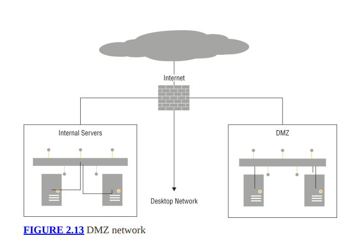

Si está utilizando una DMZ, eso sugiere aislamiento de la red junto con un estricto control de acceso y reglas restrictivas para el acceso a la red. La segmentación de la red también puede aislar otros sistemas, sin introducir necesariamente reglas de firewall o listas de control de acceso. Puede ver que también hay segmentos de red para servidores internos y redes de escritorio. También puede haber muchos otros segmentos de red. Cada uno de ellos tendría diferentes niveles de confianza. Por ejemplo, también puede haber una red de invitados para permitir que los proveedores y otros visitantes tengan acceso a la red sin ninguna posibilidad de acceder a ninguno de los sistemas internos.

Las DMZ no son la única forma de aislar redes. Proteger el resto de la red de los servicios conectados a Internet tampoco es la única razón para aislar la red. Una forma común de proteger información altamente confidencial es utilizar enclaves. Un enclave es un segmento de red aislado donde se pueden imponer controles estrictos. Si tenía datos de tarjetas de pago, como información de tarjetas de crédito, por ejemplo, los sistemas pueden requerir no solo protecciones adicionales sino también monitoreo adicional. Esto puede implicar cortafuegos y sistemas de detección de intrusos, tanto a nivel de red como de host.

Las organizaciones pueden tener varios enclaves creados para tipos de datos específicos. Los datos de tarjetas de crédito (a menudo llamados PCI por la organización Payment Card Industry, que gestiona los estándares de seguridad de los datos) son comunes, pero también puede ver un enclave para información de salud personal (PHI). Si una organización tiene PHI, existirían requisitos de la Ley de Responsabilidad y Portabilidad del Seguro Médico (HIPAA) en torno al manejo de datos que podrían implementarse más fácilmente en un enclave.

La segmentación es cada vez más común, especialmente porque el uso de datos está cada vez más regulado. Es posible que se encuentre con microsegmentación, donde los segmentos se definen en función de la carga de trabajo, que es la colección de sistemas y servicios necesarios para que una aplicación funcione. Esto se puede hacer fácilmente en un entorno virtual, donde se pueden contener sistemas dentro del hipervisor u otra plataforma de control que gestiona la infraestructura virtual. Sin embargo, además, se está utilizando software para proporcionar este nivel de segmentación. La microsegmentación permite aplicar controles de seguridad en un conjunto específico de sistemas relacionados con una aplicación o servicio.
### Acceso remoto
Saltando a la TARDIS por un momento para retroceder mucho en el tiempo, el acceso remoto solía manejarse con módems y acceso telefónico. Esos días ya quedaron atrás, aunque la necesidad de que los trabajadores remotos obtengan acceso a los recursos internos sea quizás incluso más necesaria que en el pasado. Hoy en día, sin embargo, el acceso remoto suele realizarse a través de Internet. Normalmente, esto no se manejaría a través de Internet abierto, sino mediante el uso de cifrado. Las redes privadas virtuales (VPN) son una forma de obtener acceso a la red interna desde ubicaciones remotas. Sin embargo, no todas las VPN son iguales. Hay diferentes formas de realizar este acceso remoto.

En algunos casos, el acceso remoto es una oficina satélite. En ese caso, puede que no tenga sentido tener una línea privada directa de un sitio a otro. En cambio, el proveedor de la red puede ofrecer algo dentro de su red para ir de un lugar a otro. Esto se puede hacer utilizando la conmutación de etiquetas multiprotocolo (MPLS), por ejemplo. MPLS proporciona lo que es esencialmente un túnel de un lugar a otro al encapsular el tráfico dentro de una etiqueta donde el tráfico se conmuta de un lugar a otro.

Más comúnmente, al menos en términos de volumen, existe la necesidad de conectividad entre el usuario y la red. Incluso aquí, existen múltiples formas de realizar la tarea. Una forma, que ya existe desde hace décadas, fue parte del trabajo sobre IPv6. La seguridad IP (IPSec) es un conjunto de extensiones que, en parte, proporcionan cifrado de una ubicación a otra. IPSec viene con una serie de protocolos que proporcionan no sólo cifrado sino también autenticación de mensajes, autenticación de usuarios e intercambio de claves. Debido a que IPSec no es una parte inherente de IPv4, requiere el uso de algún otro mecanismo para implementarse en redes IPv4. Generalmente, esto requiere insertar algo en la pila de red para capturar el tráfico que se envía y aplicar políticas IPSec apropiadas.
Otro tipo de conexión VPN utiliza una tecnología con la que la mayoría de la gente estará familiarizada. Las conexiones web suelen utilizar Transport Layer Security (TLS), que es la implementación actual de cifrado para el tráfico web, que reemplaza a Secure Sockets Layer (SSL). Como se trata de un método de cifrado bien conocido y utilizado habitualmente, las empresas suelen tener muchos de los requisitos de infraestructura, como autoridades de certificación, necesarios para implementar este tipo de VPN. Además, este tipo de VPN suele implementarse mediante un navegador web en lugar de una instalación de aplicación más pesada.
### Computación en la nube
El mundo de la informática ha tenido durante mucho tiempo la naturaleza de un péndulo, especialmente en lo que respecta a dónde existía la potencia informática. Hace décadas, en los años 1960 y 1970, había oficinas de servicios a las que acudían las empresas cuando tenían necesidades informáticas. Esto se debía a que los mainframes eran mucho más caros de lo que la mayoría de las empresas podían permitirse o justificar el gasto. Las empresas tenían que confiar su información a estas oficinas de servicios para realizar sus trabajos, ya fuera nómina o combinación de datos para listas de correo o cualquier necesidad que surgiera.

Cuando las computadoras personales (PC) se hicieron populares, las empresas pudieron comprar una y tener sus propios sistemas informáticos para realizar los trabajos que necesitaban. Esto significó que todo el procesamiento de datos, tal como se conocía en ese momento, podría realizarse internamente. Entonces, el péndulo pasó de la subcontratación a la internación. Con el tiempo, el costo de la PC bajó y la empresa pudo permitirse múltiples sistemas, por lo que los datos se almacenaron en los sistemas individuales, o al menos en disquetes en los escritorios de los usuarios.

Posteriormente hubo cambios para colocar más terminales de la computadora central en los escritorios de los usuarios, centralizando nuevamente el almacenamiento de datos. Cuando se creó la World Wide Web y las empresas comenzaron a darse cuenta del valor de tener conexiones de tiempo completo a Internet, utilizaron proveedores de alojamiento para subcontratar funciones como sitios web, donde puede haber al menos materiales de marketing, si no otros datos comerciales. Cuando el acceso a Internet se volvió realmente barato y omnipresente, las empresas volvieron a adoptar el hosting internamente.

Todo esto quiere decir que ahora estamos de regreso en un punto en el que la subcontratación es la forma en que funcionan muchas empresas. Después de todo, con tantos usuarios en línea, las empresas pueden ver mucho tráfico en sus sistemas. Además, la subcontratación mantiene los sistemas accesibles externamente fuera de la red corporativa. Esto significa que los atacantes no pueden violar un sistema disponible externamente y utilizarlo como punto de partida hacia otros sistemas en la red, incluidos escritorios donde se puede almacenar información personal o incluso datos comerciales confidenciales.

La versión actual de la subcontratación es la computación en la nube. Esto ha visto una evolución a lo largo del tiempo. Inicialmente había proveedores de hosting, donde las empresas asumían el costo del hardware y toda la infraestructura, ofreciendo ese hardware e infraestructura a empresas que no querían alojar sus propios sistemas. A veces, este hardware se dedicaba a la empresa que lo alquilaba para sus servicios, lo que hacía difícil recuperar los costos del hardware y aún así tener sentido el precio para optar por un proveedor de hosting.
Luego estaban empresas como Amazon y Google que tenían grandes conjuntos de sistemas que a veces estaban inactivos. Estas empresas desarrollaron servicios en los que las empresas podían utilizar esos sistemas inactivos para sus propios fines. Como todos estos servicios estaban disponibles a través de Internet y no en las instalaciones, se decía que estaban disponibles en la nube. Estos servicios de computación en la nube se presentan en diferentes formas. El primero, y que hoy en día utiliza un gran número de personas, es el almacenamiento como servicio (SaaS).

El almacenamiento como servicio es una funcionalidad básica de disco remoto que puede estar dirigida tanto a los usuarios como a las empresas. Es más probable que las empresas utilicen infraestructura como servicio (IaaS) o plataforma como servicio (PaaS). También pueden utilizar software como servicio, aunque también puede estar dirigido a usuarios domésticos.

La computación en la nube es un concepto importante y continúa evolucionando a medida que los proveedores de la nube se vuelven más sofisticados en sus ofertas. Esto se trata con mucho más detalle en el Capítulo 15, “Computación en la nube e Internet de las cosas”, sin embargo, a continuación se proporciona una descripción general rápida de los tipos de servicios que encontrará de los proveedores de la nube.
### Almacenamiento como servicio
Si está utilizando un dispositivo Apple, probablemente esté utilizando el almacenamiento como servicio.

Todas las fotos que tomas se almacenan en iCloud. Es posible que su música esté almacenada allí. Los documentos que cree también se pueden almacenar en iCloud. Si tiene un dispositivo Android, probablemente también utilice una solución de almacenamiento en la nube, según el proveedor. Los dispositivos Android no siempre utilizan el almacenamiento en la nube de forma predeterminada, aunque generalmente existe la capacidad de almacenar datos en Google Drive, la solución de almacenamiento como servicio de Google o el almacenamiento proporcionado por otro proveedor.

El almacenamiento como servicio tiene una gran cantidad de usos, incluidas las copias de seguridad y la capacidad de acceder a sus datos sin importar dónde se encuentre o qué dispositivo esté utilizando. La Figura 2.14 muestra una parte de la interfaz de Google Drive. Utilizando Google Drive he podido visualizar documentos en diferentes ordenadores y tablets, dependiendo de cuál era mi necesidad en cada momento. Esto fue útil para realizar investigaciones para tareas de clase, por ejemplo. Podía buscar documentos en mi computadora portátil, descargar archivos PDF de trabajos de investigación y luego almacenarlos en mi cuenta de Google Drive, donde podía abrirlos en una tableta y leerlos cómodamente.

Algunos proveedores de almacenamiento como servicio (StaaS) le brindan acceso a su almacenamiento mediante una interfaz web o con un complemento en su sistema para que pueda ver todo en el contexto de un explorador de archivos. Este no es siempre el caso. Por ejemplo, Apple no te da acceso directo a todo lo almacenado en iCloud, ya sea a través del Finder o de una interfaz web. En cambio, debe administrar diferentes secciones de su almacenamiento utilizando las aplicaciones que utilizan los datos.

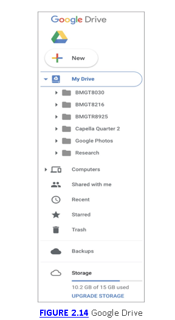

Por supuesto, existen desventajas al utilizar un proveedor de almacenamiento en la nube, como podría decirle cualquiera de las celebridades involucradas en el compromiso y el robo de sus fotos personales de un proveedor de almacenamiento en la nube. Para recopilar una gran cantidad de datos a la vez, no es necesario comprometer muchos sistemas. Todo lo que un atacante debe hacer es comprometer al proveedor de almacenamiento. Esto requiere que el proveedor se asegure de que existan controles adecuados para evitar que usuarios no autorizados accedan. También se espera que el proveedor evite la fuga de datos. Esto podría significar que un usuario autorizado obtenga acceso inadvertido a archivos para los que no debería estar autorizado.
### Infraestructura como un servicio
Las empresas pueden gastar mucho dinero en el hardware necesario para mantener todos los servicios que necesitan simplemente para mantenerse operativos y eficientes. Los sistemas de hardware no sólo son costosos cuando se suman todos los costos de hardware, sino que la infraestructura necesaria para soportar el hardware (energía, espacio, redes, sistemas de enfriamiento, extinción de incendios) es muy costosa. Tenga en cuenta que las mejores prácticas a menudo sugieren el aislamiento de procesos, lo que significa que los sistemas no necesariamente ejecutan múltiples aplicaciones. En cambio, el servidor de correo electrónico obtiene su propio hardware, el servidor web obtiene su propio hardware, y así sucesivamente. Todos estos costos se suman.

Si bien la virtualización ha existido desde la década de 1980, en realidad solo ha sido en la última década que el hardware se ha vuelto lo suficientemente robusto y el software ha evolucionado para poder soportar la ejecución de varios sistemas virtuales sobre una sola pieza de hardware. La virtualización del consumidor existe desde hace mucho tiempo, pero las empresas no han podido hacer un uso efectivo de ese software porque están tratando de administrar tal vez cientos de sistemas. Muchos hipervisores más pequeños son más difíciles de gestionar a escala. Era necesario tener las capacidades de gestión para operar tantas máquinas virtuales (VM).

Los proveedores de nube como Amazon, Google y Microsoft hacen un uso extensivo de las máquinas virtuales para brindar a sus usuarios la capacidad de ejecutar sistemas en hardware que es propiedad del proveedor y es mantenido por él. Esto tiene el potencial de hacer que la infraestructura sea mucho más rentable para las empresas. La empresa que necesita el sistema no tiene que pagar los costos de hardware ni ninguno de los otros costos que conlleva tener hardware disponible. Además, las empresas, en particular las pequeñas o medianas, probablemente no puedan permitirse una administración de energía de alto nivel con redundancia y tolerancia a fallas o redes de alto nivel, o refrigeración o extinción de incendios. Es posible que ni siquiera puedan encontrar personas altamente capacitadas a las que puedan permitirse pagar para mantener todos los sistemas. El uso de estos proveedores puede ayudar a compartir los costos entre todas las personas que utilizan los servicios.

Ciertamente, en comparación con adquirir un sistema de hardware y luego aprovisionarlo, configurar una instancia con un proveedor de nube casi no lleva tiempo. Si necesita un sistema de infraestructura, vaya al portal de su proveedor de informática y seleccione el sistema operativo que desea y luego el tamaño del hardware: tamaño de memoria y espacio en disco. La Figura 2.15 muestra una pequeña muestra de sistemas que están disponibles con Amazon Web Services (AWS) utilizando su Elastic Compute Cloud (EC2). Hay múltiples distribuciones de Linux y diferentes versiones de Windows disponibles.

Por supuesto, Amazon no es la única empresa que hace esto. Hay varios otros proveedores que ofrecen el mismo tipo de servicio, incluidos Microsoft, Google y Digital Ocean. Con este enfoque, podría poner en marcha un conjunto de sistemas de infraestructura para admitir una aplicación web completa en una tarde. También puede obtener una solución de seguridad completa con políticas que impidan que los adversarios obtengan acceso no autorizado.

Si bien los proveedores hacen todo lo posible para ayudar a mantener a sus clientes protegidos, todo se reduce al aprovisionamiento correcto por parte del cliente. Microsoft, por ejemplo, tiene grupos de seguridad de red que permiten al cliente crear reglas para permitir y no permitir el tráfico hacia los sistemas virtuales. El cliente podría fácilmente crear malas reglas, y realmente no hay nada que Microsoft pueda hacer para evitar que ese cliente se dispare en sus resultados.

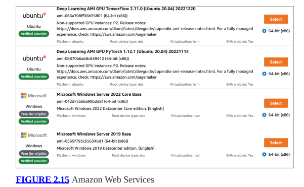

La Figura 2.16 muestra una pequeña colección de algunas de las aplicaciones que están disponibles en el mercado de Amazon Web Services. Luego de seleccionar una de estas aplicaciones, según lo que se necesita, se inicia la máquina virtual con el sistema operativo necesario y la aplicación ya está instalada. Además de las disponibles en el mercado, puede crear sus propias imágenes, almacenadas como Amazon Machine Images (AMI). Esto puede ser necesario si una empresa tiene su propia aplicación, desarrollada internamente, que necesita ejecutarse. Una vez que hay una AMI, se pueden activar varias instancias de esa imagen según sea necesario.

Microsoft también tiene un mercado con su servicio Azure. La Figura 2.17 muestra una lista de categorías en las que hay imágenes disponibles, así como una lista de servidores de bases de datos que puede seleccionar para crear una instancia. Además de todas las soluciones proporcionadas por Microsoft, existe una gran cantidad de proveedores que ofrecen sus propias soluciones. En la lista de categorías, puedes ver Seguridad, por ejemplo. Algunas de las posibilidades son imágenes virtuales de soluciones que normalmente pueden considerarse dispositivos de hardware. Se pueden seleccionar cortafuegos, equilibradores de carga, protección contra denegación de servicio y otras funciones de seguridad.

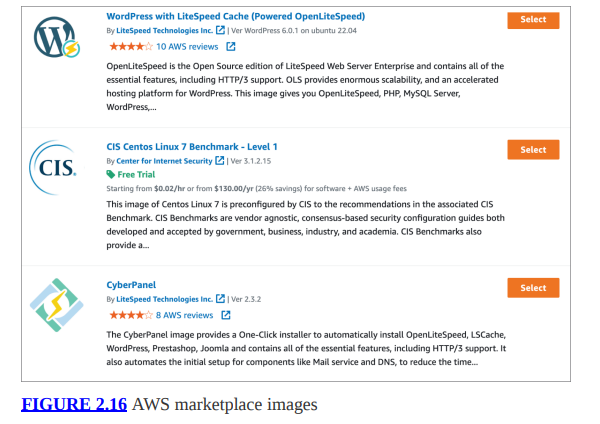

Con PaaS, puede crear rápidamente una red virtual completa con todos los dispositivos virtuales necesarios para respaldar el servicio o la aplicación. Si es necesario, los sistemas dentro de la red empresarial se pueden integrar con los del proveedor de la nube.

Los protocolos de acceso normales se utilizan comúnmente para acceder a los dispositivos virtuales, como SSH y el Protocolo de escritorio remoto (RDP). Esto significa que estos servicios estarían expuestos al mundo exterior, aunque se pueden crear reglas de acceso para limitar el acceso a direcciones de origen específicas. Sin embargo, de forma predeterminada, los servicios pueden estar expuestos al mundo exterior, lo que significa que están disponibles para ser atacados. Sin embargo, el abordaje dentro del entorno puede no ser estático. Esto significa que cada vez que los sistemas se ponen en línea, es posible que obtengan una dirección externa diferente. Es posible que exista traducción de direcciones de red (NAT), que reenvía mensajes destinados a la dirección IP externa a una dirección privada dentro de la solución.
### Software como servicio
Las aplicaciones nativas que se ejecutan en su escritorio ya no siempre son necesarias. Nuevamente, es posible que no esté vinculado a un sistema específico con un software que tenga licencia solo para ese sistema. En cambio, muchas empresas ofrecen sus aplicaciones en la nube, lo que significa que han desarrollado sus aplicaciones para que se ejecuten dentro de un navegador web. Es posible que se haya topado con estos servicios si ha utilizado Google Docs u Office Online, solo como un par de ejemplos. Hay una gran cantidad de software disponible a través de una interfaz web. En algunos casos, como en el caso de Google y Microsoft, ya se ofrece almacenamiento como servicio, por lo que todos los documentos que cree se almacenan allí. Sin embargo, el software de terceros también puede interactuar con estas soluciones de almacenamiento.

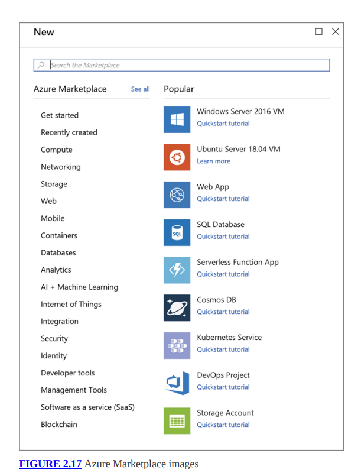

Por ejemplo, algunos de los diagramas de red de este capítulo se realizaron utilizando draw.io, una aplicación web que realiza diagramas. Algunos de los otros diagramas se realizaron usando Visio Online. También existen soluciones como Smartsheet, que genera hojas de cálculo y planificación de proyectos en línea. También se puede acceder a la gestión de relaciones con el cliente (CRM) completamente a través de una interfaz web. Esto hace que la entrega de la solución sea mucho más rápida y sencilla para la empresa de software, sin mencionar que es mucho más rápida y sencilla para el consumidor. En muchos casos, puedes empezar sin ningún coste inicial, dependiendo de lo que estés buscando y de la frecuencia con la que lo vayas a utilizar.

Desde el punto de vista de la seguridad, este tipo de solución y entrega en realidad tiene el potencial de mejorar enormemente el proceso de reparación de vulnerabilidades. Cuando se descubre una vulnerabilidad en una aplicación web, se puede resolver, probar e implementar sin ningún trabajo por parte del usuario final. Esto elimina la necesidad de actualizaciones automáticas de las aplicaciones nativas implementadas en los sistemas de los usuarios. Debido a que las aplicaciones no siempre se actualizan cuando se ejecutan en el sistema de un usuario final, las personas no ejecutan software obsoleto y lleno de vulnerabilidades.

Sin embargo, sí significa que los datos potencialmente confidenciales se almacenan en un servicio de terceros. También significa que los datos se transmiten desde el navegador web al proveedor de servicios a través de Internet. La mayoría de los sitios admiten SSL/TLS, por lo que la comunicación estaría cifrada, pero ha habido vulnerabilidades en SSL que han provocado la exposición de la información. Esto no pretende arrojar dudas sobre SSL/TLS de ninguna manera. Simplemente vale la pena tener en cuenta que los datos que se transmiten a través de redes tienen el potencial de ser capturados y analizados.
### Internet de las Cosas
Si no tiene varios de estos dispositivos en casa, probablemente los haya visto. Los ejemplos extremos son cosas como refrigeradores, tostadoras y máquinas de café. Más allá de eso, sin embargo, están los dispositivos de automatización del hogar, grabadoras de vídeo digitales y descodificadores de cable/satélite. Cualquiera de estos dispositivos que tenga software integrado y que además tenga acceso a la red se considera parte del Internet de las cosas (IoT). Esencialmente, los dispositivos informáticos de uso general, como las computadoras o los teléfonos inteligentes, no serían IoT porque tienen dispositivos tradicionales de entrada/salida como una pantalla y un teclado, incluso si el teclado es virtual. Muchos de estos dispositivos ejecutan una pequeña implementación integrada de Linux. Otros utilizan otros sistemas operativos integrados.

Una razón para mencionar esto aquí, con las soluciones en la nube, es que los proveedores de la nube respaldan estos dispositivos ofreciendo centros de comunicación. Microsoft Azure tiene un centro de IoT al que conectar estos dispositivos. Hay un par de razones para esto. Uno de ellos es adquirir y almacenar datos de los dispositivos. Luego se pueden utilizar otras aplicaciones, como bases de datos y sistemas de aprendizaje automático, con los datos adquiridos para su procesamiento y análisis. Amazon tiene una oferta similar.

Además de adquirir datos de estos dispositivos simples, el concentrador se puede utilizar para administrar dispositivos. Los comandos podrían enviarse a los dispositivos desde estos centros centrales. Se pueden utilizar protocolos comunes como HTTP para comunicarse con los dispositivos. También puede haber otros protocolos, como el transporte de telemetría de colas de mensajes (MQTT). Esto se usaría para habilitar la mensajería entre dispositivos. Los protocolos de mensajería como MQTT pueden utilizar un modelo de publicación/suscripción para que múltiples dispositivos obtengan acceso a un bus de mensajería.

Estas ofertas de servicios de los proveedores de la nube brindan a todas las empresas, incluidas las nuevas, la capacidad de crear una infraestructura y una aplicación para respaldar los dispositivos que desean fabricar sin una gran inversión inicial. Ya se está cuidando toda la infraestructura, con una implementación muy sólida.

Este es otro concepto cada vez más importante y, como tal, también tiene una sección mucho más grande en el Capítulo 15 para cubrir diferentes tipos de servicios que se consideran IoT, así como formas de atacar este tipo de dispositivos.
# Resumen
Los sistemas informáticos en red han cambiado fundamentalmente la forma en que hacemos negocios, trabajamos y vivimos. Todo ha sucedido en muy poco tiempo. Las redes informáticas también han proporcionado medios fáciles para que personas y empresas sean atacadas de forma remota. Han cambiado la forma en que operan algunas organizaciones criminales. Proporcionan una manera fácil de perpetrar fraude y robo. Es por todo esto, y también porque gran parte de lo que hablaremos en los próximos capítulos se basa en redes, que puede resultar realmente útil comprender los fundamentos de las redes de computadoras.

Los marcos conceptuales pueden ayudar a comprender cómo se produce la comunicación entre sistemas y aplicaciones. Hay dos marcos o modelos a los que comúnmente se hace referencia. El primero es el modelo OSI. Tiene siete capas: física, enlace de datos, red, transporte, sesión, presentación y aplicación. Cada sistema que está en una red tiene una funcionalidad que se puede asignar a cada una de esas capas. Una cosa a tener en cuenta al pensar en estos modelos es que una capa de un sistema se comunica con la capa correspondiente del sistema con el que se comunica. La capa de Red en el mensaje enviado es manejada por la capa de Red en el lado receptor, por ejemplo.

El otro modelo, quizás pensado como arquitectura, es TCP/IP. A esto a veces se le llama modelo DARPA porque la ARPAnet donde se desarrolló el conjunto de protocolos fue financiada por DARPA. A diferencia de OSI, que se desarrolló enteramente conceptualmente, TCP/IP describe un diseño conforme a obra. En lugar de siete capas como en OSI, TCP/IP tiene cuatro capas, aunque esas cuatro capas abarcan el mismo conjunto de funcionalidades. TCP/IP incluye las capas de Enlace, Internet, Transporte y Aplicación. La capa de enlace de la arquitectura TCP/IP abarca las capas física y de enlace de datos del modelo OSI, mientras que la capa de aplicación abarca las capas de sesión, presentación y aplicación del modelo OSI.

A menudo es más fácil ver los diseños de red conceptualmente que físicamente. Hay topologías que se utilizan comúnmente. Una red de bus tiene un único cable troncal al que se conecta todo. Una red en estrella tiene un dispositivo de acceso central como un conmutador o concentrador y todos los dispositivos se conectan a él. En realidad, una red en anillo está conectada, comúnmente, como una estrella, pero se comporta como un anillo donde los mensajes viajan alrededor del anillo en busca de los sistemas. También existen redes en malla, donde hay conexiones directas de un dispositivo a otro. En una red de malla completa, cada dispositivo tiene una conexión con todos los demás dispositivos de la red. También verás muchas redes híbridas. Un híbrido común es el bus en estrella, donde los dispositivos de acceso central, como un interruptor, están conectados entre sí a través de un bus.

Internet funciona con el paquete TCP/IP y la mayoría de las empresas también utilizan TCP/IP hoy en día. Al observar las comunicaciones del sistema, encontrará protocolos como Ethernet que se encargan de conectar puntos finales como computadoras de escritorio a la red. La comunicación Ethernet se produce mediante el uso de direcciones MAC. Cualquier dispositivo en una red local que quiera comunicarse con otro dispositivo en la misma red local lo hará usando la dirección MAC.

En la capa de Red o Internet está la IP. IP es un protocolo de entrega de mejor esfuerzo, lo que significa que el protocolo tiene mecanismos que ayudan a garantizar que los mensajes (llamados paquetes, que es la PDU en esta capa) puedan llegar desde el origen hasta el destino. Estos mecanismos se expresan en una serie de campos de encabezado como las direcciones IP de origen y destino y el campo de identificación de IP, en caso de que sea necesario fragmentar los paquetes.
TCP y UDP están en la capa de transporte. Proporcionan puertos para permitir la multiplexación, lo que significa que varias aplicaciones pueden hacer uso de la funcionalidad de la red al mismo tiempo escuchando en un puerto diferente al puerto en el que escucha otra aplicación. TCP, cuya PDU se llama segmento, utiliza un protocolo de enlace de tres vías y también números de secuencia para garantizar la entrega de mensajes en el orden correcto. TCP utiliza un modelo orientado a la conexión. UDP, por otro lado, cuya PDU es un datagrama, es un protocolo poco confiable y sin conexión. No es necesario reconocer ni responder a los datagramas UDP.

Se hace referencia a redes de diferentes tamaños de diferentes maneras. Una LAN sería una red contenida dentro de un área geográfica pequeña como un piso, un edificio o un campus. Un MAN es más grande que una LAN y cubre quizás una ciudad entera, pero más pequeño que una WAN. Una WAN cubre un área geográfica grande, como Estados Unidos. Esto puede ser utilizado por una empresa muy grande que conecte todas sus oficinas. La red de un proveedor de servicios también se denominaría WAN.

La computación en la nube la utilizan a menudo tanto particulares como empresas. Puede utilizar almacenamiento en la nube como Google Drive, OneDrive de Microsoft o Dropbox. También puede crear una red de infraestructura empresarial completa utilizando IaaS. Esto está disponible en empresas como Google, Amazon y Microsoft, que ofrecen máquinas virtuales que se pueden aprovisionar y activar muy rápidamente. Las empresas pueden hacer uso de estos servicios para brindar servicios fuera de sus redes internas. Se pueden utilizar como un rápido respaldo a la infraestructura existente. Además, las pequeñas empresas emergentes no tienen que invertir mucho capital en sistemas. Pueden pagar por lo que utilizan cuando desarrollan aplicaciones orientadas a la red, como servicios web.

Las empresas también pueden utilizar estos proveedores de nube para admitir y administrar dispositivos integrados como termostatos, abridores de puertas de garaje, DVR y otros dispositivos similares. Amazon y Microsoft tienen sistemas de soporte de IoT. Se pueden utilizar para registrar, administrar y comunicarse con una amplia variedad de dispositivos conectados a redes domésticas y comerciales de todo el mundo.