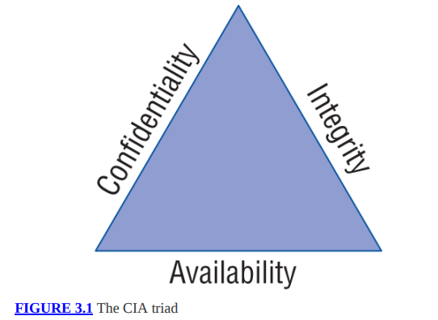
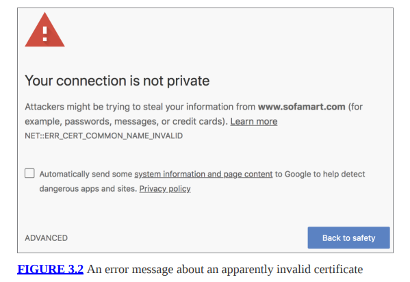
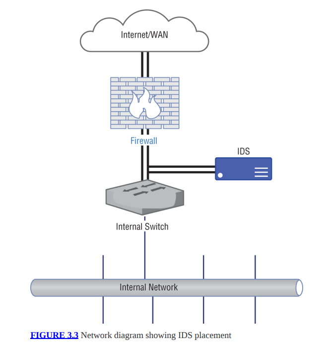
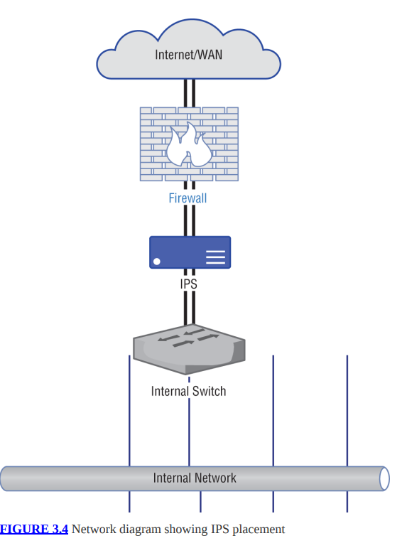
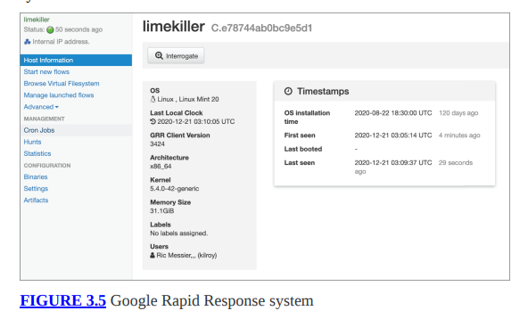
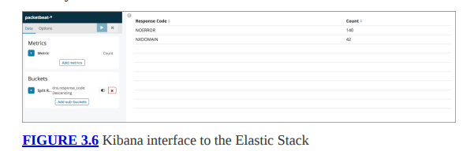
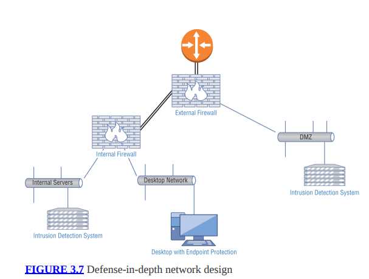
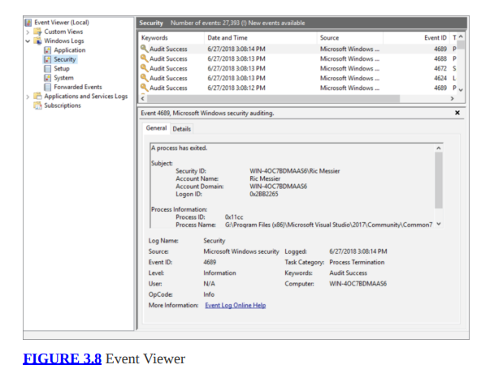
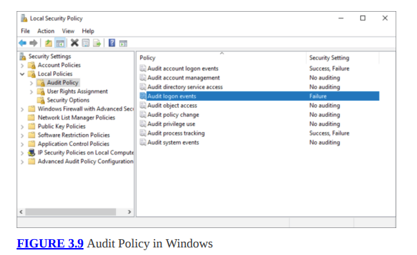

# Fundamentos de seguridad

Las organizaciones generalmente gastan mucho tiempo y dinero en defensas y mitigaciones contra ataques. Hay algunos conceptos fundamentales que intervienen en la planificación e implementación de estas defensas. En este capítulo, cubriremos algunos de los temas que ayudan a los profesionales de la seguridad a tomar decisiones sobre la mejor manera de proteger las empresas. Parte de esto es fundamental, en el sentido de que es posible que no lo encuentre específicamente en el examen CEH, pero es necesario cubrirlo para poder desarrollarlo. Al final del capítulo, habrás superado los conceptos básicos y habremos empezado a hablar sobre mecanismos defensivos duros. Te encontrarás con muchos de estos si actúas como un hacker ético.

En primer lugar, es necesario comprender qué se entiende por seguridad de la información: qué eventos caen dentro del grupo de seguridad. Estas ideas se conocen comúnmente como la tríada o la tríada de la CIA. Es un concepto esencial para las personas que poseen una certificación de Profesional Certificado en Seguridad de Sistemas de Información (CISSP), que es una certificación que cubre toda la gama de temas de seguridad de la información. La tríada de la CIA es una buena base para comprender muchas otras cosas sobre la seguridad de la información.
Además de saber contra qué se está protegiendo, necesita saber qué se está protegiendo. Realizar evaluaciones de riesgos ayudará con eso. Identificar los riesgos potenciales y las pérdidas potenciales asociadas puede ayudar a tomar decisiones sobre dónde gastar los recursos limitados: presupuesto, personal, gastos de capital, etc. También ayudará a los profesionales de seguridad a determinar qué políticas necesitan implementar para guiar las acciones de los empleados en general y, más específicamente, del personal de tecnología de la información. De las políticas fluyen las normas y procedimientos. Todos se consideran esenciales para determinar cómo una empresa aborda la protección de sus activos de información.

Una vez que haya implementado sus políticas, se pueden tomar decisiones sobre la mejor manera de proteger los recursos de información. Más allá de la dotación de personal, existe tecnología que se puede aprovechar. Hay varios dispositivos que se pueden colocar en una red para ayudar con la protección de la información. Estos están destinados no sólo a mantener alejados a los atacantes, sino también a proporcionar información que pueda usarse para identificar intrusiones, incluida la ruta que un atacante pudo haber tomado para obtener acceso a redes y sistemas. También puede haber elementos colocados en la red que puedan detectar automáticamente un intento de intrusión y luego bloquearlo.

La tecnología por sí sola no proporciona protección. Es importante dónde se ubican estos elementos y dispositivos, y esas decisiones se toman basándose en ideas como defensa en profundidad y defensa en amplitud. Estas ideas ayudan a definir una arquitectura de seguridad completa. Además de los dispositivos de seguridad, existen mecanismos a nivel de sistema que pueden resultar muy útiles para proporcionar más contexto a la información proporcionada por los firewalls y los sistemas de detección de intrusos. Todos estos elementos y decisiones juntos son necesarios para crear una defensa completa de la empresa.

### La tríada
La tríada es un conjunto de tres atributos o propiedades que definen qué es la seguridad. Los tres elementos son confidencialidad, integridad y disponibilidad. Cada una de estas propiedades debe tenerse en cuenta al desarrollar planes de seguridad. Cada uno de ellos, en distintos grados de importancia, será esencial en la planificación de las defensas. No todas las defensas incorporarán cada una de las tres propiedades en la misma medida. Por ejemplo, algunas defensas afectan sólo a una propiedad. Desde una perspectiva de ataque, un evaluador o adversario buscaría comprometer uno de estos elementos dentro de una organización. Comúnmente verá estos tres elementos denominados la tríada de la CIA. Esto no debe confundirse de ninguna manera con la Agencia Central de Inteligencia.

La figura 3.1 muestra los tres elementos representados como un triángulo, como suele representarse la tríada. Una razón por la que se muestra de esa manera es que en un triángulo equilátero, todos los lados tienen la misma longitud. Tienen el mismo valor o peso, lo que pretende demostrar que ninguna de las propiedades de la tríada es más importante que cualquiera de las otras propiedades. Todos tienen el mismo valor cuando se trata de la postura general de seguridad de una organización. Diferentes situaciones resaltarán diferentes elementos, pero cuando se trata de la seguridad general de una organización, se considera que cada uno tiene el mismo peso para tener un enfoque bien equilibrado.



Otra cosa que se te puede ocurrir al mirar la figura es que si alguno de los lados se elimina o se ve comprometido, ya no es un triángulo. Lo mismo ocurre cuando se trata de seguridad de la información. Si alguna de estas propiedades se elimina o se ve comprometida, la seguridad de su organización también se verá comprometida. Se necesitan todas estas propiedades para garantizar que usted y su información estén protegidos.
### Confidencialidad
Quizás deberíamos volver al jardín de infantes para esto, aunque es posible que tenga recuerdos o experiencias más recientes que apliquen. Siempre hay secretos cuando eres joven, y parece que siempre se comparten en tonos muy conspirativos y susurrados en el mismo borde del patio de la escuela. Esperas que cuando compartes un secreto con tu amigo, ese secreto permanezca entre tú y tu amigo. Imagínate, después de todo, si le dijeras a tu amigo que realmente te gusta la persona que se sienta detrás de ti en clase y tu amigo se lo dijera. Eso sería mortificante, aunque el nivel de mortificación probablemente estaría en relación inversa con su edad.

Cuando tu amigo comparte tu secreto, suponiendo que lo haga, ha violado tu confianza. El secreto que has compartido con ellos ya no es confidencial. No sabrás si puedes seguir confiando en tu amigo. Uno de los desafíos es que es posible que hayas compartido tu secreto con dos amigos. Luego te enteras del secreto por otra persona. No sabes sin investigar más qué amigo pudo haber sido el indicado para decírselo. Lo único que sabes es que se ha violado la confidencialidad.

En el mundo digital, la confidencialidad todavía significa guardar secretos, por lo que allí no cambia mucho. Sin embargo, esto abarca muchos aspectos diferentes. Significa asegurarse de que nadie tenga acceso no autorizado a la información. Esto puede significar usar contraseñas seguras en sus cuentas de usuario para asegurarse de que los atacantes no puedan ingresar. Puede significar mantener cierta información fuera de línea para que no se pueda acceder a ella de forma remota. Sin embargo, normalmente una forma sencilla de lograr la confidencialidad es mediante el uso de cifrado.

Cuando hablamos de confidencialidad aquí, deberíamos pensar en ella en dos dimensiones: estática y dinámica. Estático protegería los datos que se consideran "en reposo", lo que significa que no se están moviendo. Probablemente esté almacenado en el disco y no esté siendo utilizado ni manipulado. El segundo tipo, dinámico, es cuando los datos se están moviendo o “en movimiento”. Esto se refiere a datos cuando se envían de un lugar a otro. Esto puede incluir que su navegador web solicite y luego recupere información de un servidor web. A medida que los datos se transmiten, están en movimiento. Es esta transmisión la que la hace dinámica y no necesariamente que se altere, aunque los datos que se envían de un lugar a otro definitivamente podrían sufrir alteraciones a través de la interacción con el usuario y la aplicación.

Cuando utilizamos cifrado para la comunicación basada en web, se utilizan los protocolos Secure Sockets Layer/Transport Layer Security (SSL/TLS). Si bien TLS ha reemplazado a SSL desde hace mucho tiempo, a veces todavía se lo conoce como SSL/TLS. Sin embargo, independientemente de cómo se le llame, es un conjunto de mecanismos para cifrar datos. Tanto SSL como TLS especifican cómo generar claves de cifrado a partir de datos conocidos, así como algunos datos parciales que se transmiten de un lado al otro.

Dado que los datos cifrados no se pueden leer sin una clave, la confidencialidad de los datos está protegida. Esto no quiere decir que el cifrado garantice la confidencialidad. Si un atacante puede obtener la clave de alguna manera, podrá descifrar los datos. Si los datos son descifrados por alguien que no debería haberlos visto, la confidencialidad, por supuesto, se ha visto comprometida. Los ataques contra los mecanismos de cifrado (cifrados, algoritmos de intercambio de claves, etc.) también pueden comprometer la confidencialidad. Un ataque exitoso contra el cifrado (y ha habido ataques exitosos contra varios métodos y estándares de cifrado) conducirá a que se descifre el texto cifrado.
### Integridad
Además de que los datos sean confidenciales, generalmente también esperamos que sean los mismos desde el momento en que los enviamos hasta el momento en que los recibimos.
Además, si almacenamos los datos, esperamos que estén intactos cuando los recuperemos. Este es un concepto llamado integridad. La integridad de los datos es importante. Puede verse comprometido de diferentes maneras. En primer lugar, los datos pueden corromperse. Puede dañarse en tránsito. Puede estar dañado en el disco o en la memoria. Hay todo tipo de razones por las que los datos se corrompen. Hace muchos años, comencé a recibir una gran cantidad de datos corruptos en mi disco. Reemplacé el disco y todavía tengo muchos datos dañados. Al final resultó que tenía mala memoria. La mala memoria estaba provocando que los datos que se escribían en el disco se corrompieran. Se producen componentes defectuosos en un sistema informático y esos componentes defectuosos pueden provocar la pérdida o corrupción de datos.

A veces también ocurren errores. Quizás tengas dos documentos en alto y estés trabajando en ellos al mismo tiempo. Uno de ellos es un documento borrador con notas para el documento real. Por error sobrescribes una sección del documento real, pensando que estás en el documento borrador, y luego, como no confías en el guardado automático, guardas el documento en el que estás trabajando. Esto podría considerarse una pérdida de integridad de datos porque partes importantes del documento en el que está trabajando han sido modificados. Si no tienes una copia de seguridad para reemplazar los datos, es posible que no puedas recuperar el original, y puede que ni siquiera notes el error hasta que el documento haya sido enviado por la oficina con el texto que contiene el error en ello. De repente, se comparte información que de alguna manera es incorrecta.

Un ataque de intermediario es una forma que tiene un atacante de comprometer la integridad. El atacante intercepta los datos en tránsito, los altera y los envía. Cuando navega a un sitio web que utiliza cifrado, se utiliza un certificado para proporcionar claves, lo que significa que el certificado contiene claves utilizadas para el cifrado y descifrado. Cuando un certificado contiene un nombre diferente al nombre de host que se está visitando, su navegador generará un error, como puede ver en la Figura 3.2.



Lo que dice el certificado, aunque no aparece en el error, es que pertenece a www.furniturerow.com. Sin embargo, el sitio web visitado fue www.sofamart.com. Si no sabía que la empresa Furniture Row era propietaria de Sofa Mart, podría empezar a preguntarse si estaba siendo secuestrado de alguna manera. Un ataque en esta situación puede haber dado lugar a que un atacante recopile información de su sesión, algo que usted no habría esperado porque creía que la sesión estaba cifrada. Peor aún, la información que obtuvo podría haber sido alterada mientras que el atacante obtuvo la información real. Hay muchos casos en los que ese puede ser un escenario realista.

Resulta que la integridad es muy compleja. Hay muchísimos casos en los que se puede violar la integridad y sólo hemos arañado la superficie. La integridad no se trata sólo del contenido de los datos. También puede ser la integridad de la fuente de la información. Imagínese escribir una carta y agregarle una firma digitalmente para que parezca haber sido escrita por otra persona. Cuando empiezas a pensar en la integridad, es posible que se te ocurran muchos ejemplos.
### Disponibilidad
Esta es quizás la propiedad más fácil de entender y una de las más comúnmente comprometidas. Todo se reduce a si la información o los servicios están disponibles para el usuario cuando se espera que lo estén. Al igual que con las otras propiedades, este puede ser un caso de errores y no necesariamente maliciosos. Si guardara información en un disco externo, luego fuera a algún lugar (trabajo, en el sitio con un cliente) y se olvidara de traer el disco, los archivos en ese disco no estarían disponibles. No sería malicioso, pero seguiría siendo una falla de disponibilidad ya que no podrías acceder a lo que necesitas cuando lo necesitas. No has perdido los datos. Todavía está intacto. Simplemente no está donde lo necesitas cuando necesitas que esté allí. Eso es una violación de la disponibilidad.

Las configuraciones incorrectas pueden provocar problemas de disponibilidad. Realizar un cambio en la configuración de un servicio sin probar el cambio puede provocar que el servicio no vuelva a funcionar. En producción, esto puede resultar muy problemático, especialmente si no está claro que el servicio falló. Algunos servicios parecerán haberse reiniciado cuando en realidad la configuración provocó que fallara el inicio del servicio. Incluso si pasa un corto período de tiempo antes de que se revierta el cambio, existe la posibilidad de que los usuarios del servicio no puedan realizar las funciones que esperan.

Recientemente, estuve leyendo sobre un caso de un clúster en el que seis de los siete dispositivos se actualizaron limpiamente mientras que el séptimo dispositivo todavía tenía el código anterior. Debido a que había algunas incompatibilidades con la comunicación entre el código antiguo y el código más nuevo, todos los dispositivos entraron en un bucle defectuoso, excluyendo todas las solicitudes legítimas.

Los ataques maliciosos también son comunes. Un ataque de denegación de servicio (DoS) niega el acceso a un servicio, lo que se traduce en que el servicio no está disponible para el tráfico legítimo. Los atacantes pueden saturar el servicio con muchas solicitudes, lo que dificulta que el servicio responda. Una solicitud legítima tendría dificultades para superar el ruido e incluso si la solicitud se aprobara, es posible que el servicio no pueda responder. Los ataques DoS han sido comunes durante décadas, aunque el cambio en el ancho de banda disponible y otros cambios tecnológicos significa que los ataques han tenido que cambiar junto con los aumentos de tecnología y ancho de banda.
### Hexada Parkeriana
No todo el mundo cree que tres propiedades sean suficientes para abarcar toda la seguridad de la información. En 1998, Donn Parker amplió las tres propiedades iniciales añadiendo tres más. Estos no se consideran estándar porque existe cierto debate sobre si es necesario separar las propiedades adicionales. Las tres propiedades adicionales que Parker considera necesarias son las siguientes:
**Posesión (o control)** Si le hubiera entregado por error el disco externo mencionado anteriormente a un amigo, pensando que le estaba devolviendo el disco, el disco estaría bajo su control. Si el amigo nunca conectó el disco para verlo, los datos que contiene no estarían sujetos a una violación de la confidencialidad. Sin embargo, el hecho de que la unidad ya no esté bajo su control significa que no está disponible para usted, lo que significa una pérdida de disponibilidad. Ésta es una de las razones por las que esta propiedad no está incluida en la tríada principal, aunque puede ser una distinción importante.

**Autenticidad** Esto a veces se denomina no repudio. La idea de autenticidad es que la fuente del dato o documento es lo que pretende ser. Por ejemplo, cuando firma digitalmente un mensaje de correo electrónico, el destinatario puede estar seguro de que el mensaje se originó en usted porque el mensaje incluye su firma digital, que nadie más debería tener. Por supuesto, en realidad lo único que sabemos es que el mensaje fue firmado con su clave. Si le robaron o regalaron su llave, podría usarla sin usted. La autenticidad es asegurarse de que cuando se obtiene un dato, sin importar cuál sea, en realidad proviene de donde dice ser.

**Utilidad** Digamos que tienes el mismo disco externo del que hemos estado hablando. Han pasado muchos años y lleva mucho tiempo guardado en un cajón. Pero es sólo el impulso. No hay ningún cable porque se separaron. Ya no tienes el cable y, además, todas las interfaces de tu computadora han cambiado desde la última vez que la usaste. Ahora tienes datos, pero no se pueden utilizar. No tiene ninguna utilidad. Personalmente, tengo una vieja cinta de nueve pistas guardada en una tina en el sótano. Lo he tenido durante décadas. Es completamente inútil para mí porque no tengo una unidad de cinta o una computadora central para leerlo. Además, es probable que esté almacenado en EBCDIC y no en ASCII. Todo esto hace que los datos de esa cinta sean inútiles, a pesar de que están en mi posesión y técnicamente disponibles para mí.

Si bien estas propiedades plantean ideas específicas en las que es importante pensar, también se pueden encajar los escenarios en las tres propiedades que forman parte de la tríada de la CIA. Se podría decir que las situaciones de posesión y utilidad caen dentro de la disponibilidad, y la autenticidad podría ubicarse dentro de la integridad. Después de todo, si se dice que la fuente de un dato es una cosa cuando en realidad no lo es, la integridad de los datos no es válida. Lo que se obtiene con la hexada parkeriana son algunos casos específicos en lugar de los conceptos más amplios de la tríada de la CIA. Si le resulta más útil separarlos de los demás mientras piensa en lo que significa la seguridad y qué eventos están relacionados con la seguridad, la hexada puede resultarle más útil que la tríada.
### Garantía y riesgo de la información
En pocas palabras, el riesgo es la intersección de la pérdida y la probabilidad. Esta es una idea condensada y puede llevar mucho tiempo desentrañarla, especialmente si se tienen en cuenta los malentendidos comunes sobre lo que es el riesgo. Una versión más larga de este sentimiento se encuentra en la definición de riesgo en Dictionary.com, que dice que riesgo es "la exposición a la posibilidad de sufrir una lesión o pérdida". La posibilidad en la definición es la probabilidad, que es mensurable. La pérdida o lesión también es mensurable. Esto significa que podemos aplicar números al riesgo y no tiene por qué ser algo amorfo o vago.

A menudo, verá que se utiliza el término riesgo cuando lo que el hablante realmente quiere decir es oportunidad o probabilidad. Alguien puede decir que existe el riesgo de que ocurra algún evento. Lo que realmente se quiere decir es que existe una probabilidad de que ese evento ocurra y, presumiblemente, el evento podría percibirse como negativo. Las probabilidades se pueden calcular si se tienen suficientes datos. Una forma muy sencilla de calcular la probabilidad, que comúnmente se expresa como una razón, es dividir el número de eventos por el número de resultados.

Por ejemplo, ¿cuál es la probabilidad de que cualquier día de abril caiga en fin de semana? Abril tiene 30 días. Ese es el número de resultados. Como normalmente hay 8 días de fin de semana en un mes de 30 días, el número de eventos es 8. La probabilidad entonces es 8/30, u 8 sobre 30. Si quisieras, podrías reducir eso a 4 sobre 15, pero 8 de cada 30 dicen lo mismo, y es más claro ver de dónde vino la información. Si quisiera refinar eso, podría preguntar sobre un mes de abril específico para ver si, según cómo se alinearon los días, hubo más de 8 días de fin de semana ese año.

Las probabilidades de eventos de seguridad de la información son más difíciles de calcular. ¿Cuál es la probabilidad de que su empresa se vea afectada por un ataque de denegación de servicio distribuido (según el acrónimo que esté utilizando)? Según Imperva Incapsula, utilizando su Calculadora de costos de tiempo de inactividad de DDoS en línea, la probabilidad de que una empresa de 2.500 personas que se dedica al negocio del comercio electrónico sea afectada por un DDoS es del 36 por ciento. Son 36 eventos de 100 resultados. En este contexto, empezamos a volvernos muy amorfos. ¿Qué es un evento aquí? ¿Qué es un resultado? ¿Por cada 100 intentos de conexión a su red, 36 serán mensajes DDoS? Eso no tiene sentido. Como dije, calcular la probabilidad de riesgo es un desafío e incluso si lo hace, puede resultar difícil entender los resultados que obtiene.

La pérdida es quizás más fácil de cuantificar, aunque incluso en ese caso pueden surgir desafíos. Digamos que su negocio se ha visto comprometido y parte de su propiedad intelectual ha sido exfiltrada. Dado que la propiedad intelectual no ha desaparecido, lo que significa que todavía la tienes bajo tu control, ¿cuál es la pérdida tangible? Depende de quién lo tomó y para qué lo tomó. Si alguien en otro país lo tomó y su empresa no vende ningún producto allí, ¿hay una pérdida real?
Ciertamente, existen costos asociados con la limpieza. Sin embargo, incluso allí puede resultar un desafío. Muchos son costos blandos. Si no contrata a un contratista externo para que haga la limpieza por usted, está utilizando a su propia gente, a la que ya está pagando. Un contratista externo tendrá costos difíciles en forma de una factura que su empresa deberá pagar. Eso saldrá de su resultado final, por lo que, con seguridad, hay un número que se puede aplicar a la pérdida allí. ¿Cómo se calcula el costo de la limpieza si se trata de su propia gente? Ya los estás pagando, por lo que el costo está en acciones diferidas en otros proyectos.

Ahora sabemos que podemos obtener valores de pérdida y probabilidad. Podemos calcular el riesgo a partir de esos dos valores multiplicando la pérdida por la probabilidad. Terminas con $riesgo = probabilidad * pérdida. El signo de dólar se incluye allí para aclarar los términos y saber lo que significa el resultado final. El valor de riesgo con el que termina es en dólares. Este valor es más significativo de forma comparativa. Puede comparar el riesgo de diferentes eventos mediante una comparación cuantitativa si conoce el valor monetario de la pérdida y la probabilidad. Esto significa que no se está comparando sólo la pérdida y no sólo la probabilidad.

Puede resultar tentador pensar en el riesgo como una pérdida. Para algunos, un evento de alto riesgo es aquel en el que hay un resultado catastrófico. Así es como están conectados nuestros cerebros. Nuestros cerebros buscan cosas malas y tratan de evitarlas. Por eso, si le preguntara a alguien qué es un evento de alto riesgo en su vida, fuera de la seguridad de la información, es posible que le dé un ejemplo de un evento que puede resultar en la muerte, como conducir. No tienen en cuenta la probabilidad real de que ocurra un evento catastrófico. Sólo piensan en el resultado potencial en su forma más extrema. A esto se le llama catastrofizar. No es útil cuando intentamos evaluar el riesgo en un contexto de seguridad de la información.

El riesgo se utiliza como una forma de identificar lo que es importante. El objetivo de cualquier programa de seguridad de la información es proteger lo que es importante y valioso. Una forma de cuantificar lo que tiene valor es a través del número de pérdidas. Una mayor pérdida puede significar un mayor valor. Cuando calcula el valor del riesgo general, puede determinar dónde aplicar sus recursos. Si tiene un evento que tiene un valor de alto riesgo, probablemente sea una buena idea aplicar recursos para protegerse contra ese evento. Por supuesto, predecir todos los eventos posibles puede resultar un desafío. Esto es lo que dificulta la seguridad de la información: comprender los eventos, las probabilidades y los resultados de su organización y luego planificar la protección contra eventos negativos.

Cuando se trata de riesgo, hay otros conceptos que es importante considerar. La primera es la amenaza. Una amenaza es algo que tiene la posibilidad de incurrir en una violación de la confidencialidad, integridad o disponibilidad. El camino que puede tomar esta infracción se llama vulnerabilidad. Una vulnerabilidad es una debilidad en un sistema. Este puede ser su software, su configuración o cómo se organiza toda la solución de información. Cuando se activa la vulnerabilidad, se denomina exploit. Explotamos las vulnerabilidades, aunque no todas las vulnerabilidades pueden explotarse. Las condiciones de carrera son ejemplos de vulnerabilidades que quizás no se puedan explotar. Una revisión del código muestra que hay un problema y el resultado del problema podría resultar en corrupción de datos, por ejemplo. Sin embargo, debido a la velocidad a la que se ejecuta el programa, es esencialmente imposible sentarse entre las dos instrucciones para realizar el cambio. Ciertamente, no todas las vulnerabilidades pueden ser explotadas por todos. Un agente o actor de amenazas es una entidad, como una persona o un grupo, que puede instanciar una amenaza. El agente de amenaza es quien manifiesta una amenaza. El camino que sigue el agente de amenaza para explotar una vulnerabilidad se denomina vector de amenaza. Todos estos conceptos son importantes porque ayudan a comprender mejor dónde reside el riesgo. Una vez que haya identificado qué recursos le interesan, debe pensar en qué agentes de amenazas pueden interesarse por esos recursos. Esto puede ayudarle a identificar posibles vulnerabilidades. Una vez que sepa cuáles son sus vulnerabilidades y los posibles vectores de amenaza, puede empezar a pensar en cómo protegerse contra esas amenazas.

El aseguramiento de la información es la práctica de identificar los riesgos asociados con los activos de información y luego instituir controles para proteger mejor el activo o recurso. Un control es un medio para garantizar la confidencialidad, integridad o disponibilidad de un recurso de seguridad de la información. Estos controles pueden ser preventivos, detectivescos o correctivos. Estos son los objetivos o funciones de los controles. Un control preventivo es aquel que pretende evitar que algo malo suceda. Desafortunadamente, esto no siempre es posible, lo que significa que los controles de detección son útiles. Un control de detectives es aquel en el que se identifica una violación de la confidencialidad, la integridad o la disponibilidad para poder abordarla. Finalmente, un control correctivo es aquel que pretende limitar la cantidad de daño que se haya podido causar.

Los controles de seguridad acaban teniendo dos factores. Además de los controles que tienen objetivos, como se describió anteriormente, se clasificarán en uno de tres tipos diferentes. Un control puede ser técnico, administrativo o físico. Un control técnico es hardware o software que se ha implementado para brindar protección a los activos. Puede ser una solución de autenticación, un firewall, un antivirus o un administrador de eventos e incidentes de seguridad utilizado para alertar sobre algo malo que está sucediendo. Un control administrativo es una política, procedimiento o directriz que brinda orientación sobre cómo se deben implementar las protecciones. Finalmente, los controles físicos se utilizan para mantener a las personas alejadas de los activos de forma cinética, lo que significa que alguien no puede caminar hasta un edificio y simplemente entrar. Un control físico no habla de acceso lógico, como iniciar sesión en un servidor SSH de forma remota. Un control físico puede ser una cerradura de puerta o puede ser una cámara de televisión de circuito cerrado utilizada para observar actividades y detectar comportamientos no deseados.

La garantía de la información consiste en gestionar el riesgo. Esto significa no sólo identificar el riesgo y cómo categorizarlo, sino también tomar decisiones comerciales sobre cómo manejar el riesgo. Las empresas suelen manejar el riesgo de diferentes maneras, según el nivel de riesgo y su apetito por el riesgo, es decir, el nivel de riesgo con el que se sienten cómodas gestionando. Estas son las formas en que comúnmente se maneja el riesgo dentro de las empresas.

**Aceptación** La aceptación del riesgo es un proceso informado en el que la empresa comprende plenamente la naturaleza del riesgo, es decir, el impacto (la cantidad de dinero en que incurrirá el riesgo actualizado) y la probabilidad, y elige no hacer nada al respecto. Esto significa que si el riesgo se actualiza, la empresa será responsable de todas las pérdidas y costos asociados con él, así como de cualquier otro daño que pueda resultar. Este enfoque significa que no se hace nada más ante las circunstancias relacionadas con el riesgo identificado.

**Transferencia** La empresa puede optar por transferir el riesgo a otra entidad para que lo administre de alguna manera. Una forma común de implementar la transferencia de riesgos es contratar un seguro. Es muy probable que tenga un seguro de automóvil y de hogar para su automóvil y su casa (o tal vez un seguro de alquiler si está alquilando). Ha elegido transferir los riesgos asociados con esos activos a la compañía de seguros. Esto significa un intercambio en el caso de los seguros: usted puede transferirles el riesgo y ellos asumirán cualquier responsabilidad a cambio de dinero en forma de prima.

**Mitigación** La mitigación del riesgo consiste en implementar controles que reduzcan el riesgo. La reducción del riesgo puede ocurrir en los dos vectores que constituyen el riesgo: pérdida y probabilidad. Se puede implementar un control que reduzca la probabilidad de que se actualice un riesgo. Esto puede realizarse mediante la implementación de diferentes controles técnicos para, por ejemplo, restringir el acceso a un recurso a un número limitado de personas de ubicaciones específicas.

**Evitación** Las empresas pueden optar por no participar en la actividad que, para empezar, podría introducir riesgos. A esto se le llama evitar riesgos. Esta es una práctica legítima, aunque si una actividad es esencial para el negocio, es posible que no sea posible evitar riesgos. La empresa deberá elegir otro enfoque si pretende obtener el beneficio de la actividad propuesta.
### Políticas, estándares y procedimientos
Si bien nosotros, como profesionales de la seguridad de la información, a menudo podemos pensar que la seguridad por la seguridad es lo más importante, el hecho es que la seguridad es un facilitador de negocios, no un impulsor de negocios. Esto significa que la seguridad, en la mayoría de los casos, no contribuye al resultado final. La falta de seguridad o una debilidad en la seguridad pueden afectar el resultado final. Dado que la seguridad es un facilitador empresarial, la empresa establece los parámetros en torno a lo que es importante y los medios para proteger lo que es importante. Lo hace creando políticas. Una vez que se crean las políticas, se construyen estándares a partir de esas políticas. Lo más cercano a donde realmente se realiza el trabajo son los procedimientos. Estos se desarrollan debido a lo que dicen los estándares.
### Políticas de seguridad
Una política de seguridad es una declaración de intenciones con respecto a los recursos de una empresa. Define lo que una empresa considera seguridad: qué recursos deben protegerse, cómo deben utilizarse de manera adecuada, cómo se puede o se debe acceder a los recursos. Estas políticas son esenciales para un buen gobierno corporativo, ya que son líneas que traza la administración. Esto significa que hacer que la gerencia establezca el tono y la dirección no sólo es una buena idea, sino que también es necesaria. La gerencia y la junta directiva tienen una obligación hacia las partes interesadas en el negocio: los propietarios individuales o los accionistas.

Las políticas de seguridad no consisten sólo en definir recursos importantes, sino también en establecer expectativas de los empleados. Muchas organizaciones, por ejemplo, tienen una política de uso aceptable. Se trata de definir lo que los usuarios pueden y no pueden hacer. Cualquier violación de esta política por parte del empleado generalmente es causa de sanción o despido, dependiendo del alcance de la violación y el impacto en el negocio. Por supuesto, no todas las políticas tratan directamente de los usuarios y sus comportamientos. Puede haber otras políticas de seguridad que estén más dirigidas al personal de tecnología de la información o de seguridad de la información.

Al pensar en la política de seguridad, tenga en cuenta que los objetivos de sus políticas deben ser la confidencialidad, la integridad y la disponibilidad de los recursos de información. Estas son las propiedades que debe tener en cuenta una política de seguridad. Todos los recursos de información deben ser confidenciales, tener integridad y estar disponibles dentro de los parámetros definidos por la empresa. Esto no significa que todos los recursos de información deban ser siempre confidenciales, tener integridad y estar disponibles. Los diferentes activos de información tendrán diferentes niveles de confidencialidad y no toda la información tiene que estar disponible todo el tiempo. Esto también es parte del objetivo de la política de seguridad: ayudar a clasificar y priorizar los activos de información de la organización.

No todos los recursos de información son bits y bytes almacenados en sistemas informáticos. Un área que la política siempre debe tener en cuenta es cómo se deben manejar los recursos humanos. Puede que esto no siempre esté codificado en la política de seguridad de la información, pero los recursos humanos siempre deben ser un factor, especialmente cuando se trata de protección contra desastres naturales y otros eventos que pueden ser físicamente peligrosos además de afectar los activos de información.

Las políticas deben revisarse periódicamente. Tienen un nivel suficientemente alto como para no cambiar cada vez que hay un nuevo conjunto de tecnologías disponibles, pero sí deberían evolucionar con los cambios en el panorama de amenazas. A medida que los recursos de información cambian y los agentes de amenaza cambian, es posible que las políticas deban adaptarse para responder a esos cambios. Como se trata de un área de gobierno corporativo, cualquier cambio de política tendría que ser aprobado por cualquier estructura de gestión existente: propietarios de empresas, junta directiva, etc.

Tenga en cuenta que todas las políticas de seguridad son de alto nivel. No proporcionan detalles, como cómo se deben implementar las políticas. Si está analizando políticas de seguridad y está empezando a pensar en los impactos operativos y en cómo el administrador manejaría la política, está demasiado cerca del suelo y es hora de batir sus alas un poco más para obtener mucho más. más arriba. Además, está pensando conceptualmente en lo que debería ser a largo plazo en lugar de algo específico para un momento determinado. Esto significa que la tecnología y las soluciones no tienen cabida en la política. Otros elementos del programa de seguridad de la información se encargarán de esos aspectos.
### Estándares de seguridad
La política de seguridad está en la cima de la cadena alimentaria. También puede haber subpolíticas que desciendan de las políticas de seguridad de nivel superior. La subpolítica debe hacer referencia a la política general para que la política de alto nivel no se pierda. Sin embargo, por debajo del nivel de políticas se encuentran los estándares de seguridad. Un estándar es una dirección sobre cómo se deben implementar las políticas. El estándar comienza por el camino de cómo pasamos de las declaraciones de intención a la implementación, por lo que comenzamos a profundizar desde el alto nivel de la política.

Tomemos, por ejemplo, una política que establezca que todos los sistemas se mantendrán actualizados. Para acercarse a la implementación de esa política, es posible que tenga estándares relacionados con sistemas de escritorio, sistemas de servidor, dispositivos de red y cualquier dispositivo integrado. Los requisitos para cada uno de esos tipos de dispositivos pueden ser diferentes, por lo que los estándares para ellos pueden ser diferentes. Se puede esperar que los sistemas de escritorio reciban todas las actualizaciones a medida que llegan, con la expectativa de que cualquier posible interrupción pueda remediarse rápidamente en caso de que haya una interrupción en los escritorios de un puñado de usuarios.

Los servidores, por otro lado, estarían instalados para atender a los clientes y posiblemente tendrían un impacto en los ingresos. Dado que ese es el caso, el estándar puede ser diferente. El estándar, todavía centrado en cómo lograr el objetivo establecido en la política, puede decir que existe un proceso de garantía de calidad que es necesario antes de que se puedan implementar parches. El acuerdo de nivel de servicio (SLA) en esos sistemas de servidores puede ser completamente diferente en términos de interrupciones aceptables. El estándar para los sistemas de servidor puede ser diferente al de los sistemas de escritorio, pero ambos están escritos al servicio de la política de alto nivel de que los sistemas se mantengan actualizados. El estándar definiría todo lo que fuera vago (¿qué significa “actualizado”?) en la política para que sea relevante para el personal operativo.
Los estándares siguen siendo de alto nivel en el sentido de establecer requisitos sobre cómo se deben implementar las políticas. Estos requisitos aún deben implementarse. Eso nos lleva a otro paso.
### Procedimientos
Los procedimientos son la implementación real de la norma. Estos proporcionan orientación sobre cómo, específicamente, se logran los estándares a nivel granular. Esto se puede lograr con instrucciones paso a paso sobre lo que se debe hacer. Puede haber múltiples procedimientos para cada estándar, ya que puede haber múltiples organizaciones involucradas en la implementación del estándar.

Se puede ver que con una orientación de alto nivel como esa en una política, probablemente no sería necesario tocarla con frecuencia. Las políticas se revisan periódicamente, pero el plazo para cambiar las políticas se mediría en años, si las políticas están bien consideradas y bien escritas. Sin embargo, es posible que sea necesario actualizar las normas con más regularidad. Los cambios en los activos de información darían lugar a la actualización de las normas. Cualquier cambio en la tecnología dentro de la organización puede resultar en una actualización de los estándares. Es probable que los procedimientos cambien aún más regularmente.

A medida que las organizaciones de la empresa cambian o las responsabilidades cambian, los procedimientos cambiarán para adaptarse a ellas. Además, un buen procedimiento tendría circuitos de retroalimentación incorporados para que el procedimiento pudiera revisarse periódicamente para que sea más eficiente. Cualquier cambio en la automatización resultaría en cambios de procedimiento. A medida que avanzamos por cada capa desde la parte superior del programa de seguridad hasta el final, el resultado son actualizaciones más periódicas a medida que llegamos a pasos específicos de implementación y administración.
### Pautas
Es posible que no se encuentre con pautas cuando busque programas de seguridad. Las directrices no son estándares en el sentido de que pueden no ser requisitos. Más bien, son sugerencias sobre cómo se pueden implementar las políticas. Una guía puede proporcionar información sobre las mejores prácticas, con la esperanza de que las mejores prácticas sigan.
### Organizando tus protecciones
Por supuesto, hay muchas formas diferentes de pensar en la seguridad de la información. Desde una perspectiva de gobernanza, es necesario pensar en políticas, estándares y procedimientos. Sin embargo, una vez que tenga todo esto en su lugar, aún debe pensar en cómo proteger mejor sus activos, sin mencionar asegurarse de poder detectar cualquier intento de impactar negativamente esos activos, sin importar cuáles sean. Una forma de pensar en evaluar la protección de sus activos es revisando qué es más probable que hagan los atacantes. Si sabes qué acciones van a tomar los atacantes, podrías desarrollar no sólo protecciones sino también detecciones de esas acciones, lo que te ayudará a estar preparado. Si bien puede utilizar la cadena de ciberataque de Lockheed Martin o el ciclo de vida de ataque recomendado por FireEye Mandiant, otra forma de obtener aún más detalles es utilizar el marco MITRE ATT&CK.

MITRE Corporation desarrolló ATT&CK en 2013 para recopilar tácticas, técnicas y procedimientos (TTP) comunes utilizados por los atacantes. Desde el punto de vista de MITRE, los marcos existentes como la cadena de destrucción cibernética eran de un nivel demasiado alto y no eran aplicables a incidentes del mundo real. La idea detrás de ATT&CK es recopilar estos TTP de los adversarios, por lo que la colección siempre crece a medida que se identifican más TTP. Estos TTP se describen en detalle, de modo que se puedan desarrollar controles de protección y detección.

Si bien existen diferentes tipos de atacantes, incluidos los hacktivistas que pueden estar simplemente buscando llamar la atención del público, los más peligrosos son los que a veces se denominan amenazas persistentes avanzadas (APT). Se trata de atacantes que utilizan una gran cantidad de TTP para obtener acceso a un entorno empresarial y permanecer dentro del entorno el mayor tiempo posible. En algunos casos, estos atacantes pueden permanecer en el lugar durante años. Ha habido casos en la memoria reciente en los que se ha descubierto que los atacantes permanecieron en el lugar durante siete o diez años o más. Si bien es posible que haya algunos atacantes que podrían adoptar un enfoque de una sola vez, en el que se dirigen a usuarios individuales y simplemente quieren obtener lo que pueden y salir, lo que vemos cada vez más son estos atacantes APT. Vale la pena tener esto en cuenta al analizar las diferentes fases del marco ATT&CK.

El Marco ATT&CK se divide en las siguientes etapas. Es posible que descubra que estos no están necesariamente en el orden que puede seguir un atacante, ya que puede haber cierta superposición o incluso rebotar hacia adelante y hacia atrás. Además, algunos TTP encajarán aquí en diferentes categorías.

Reconocimiento El atacante está recopilando información sobre el objetivo en esta etapa. Es posible que estén buscando en fuentes abiertas donde los datos están disponibles gratuitamente. También pueden estar utilizando fuentes cerradas a las que tienen acceso. Además, es posible que estén realizando actividades de escaneo aquí. Esta etapa también incluye a los atacantes que utilizan técnicas de phishing para engañar a las víctimas para que proporcionen datos.

Desarrollo de recursos El atacante tiene que trabajar mucho para crear una infraestructura que utilizará para lanzar ataques. Esto puede incluir registrar nombres de dominio, crear cuentas, adquirir sistemas (probablemente comprometiendo a otras víctimas y utilizando su infraestructura informática). Es posible que también necesiten adquirir herramientas que ellos mismos no tienen. Esto podría ser alquilar o comprar un conjunto de herramientas que pueden estar disponibles a través de canales delictivos.

Acceso inicial El atacante aquí compromete los primeros sistemas. Pueden comprometer una aplicación o un sitio web público existente. Pueden utilizar phishing para instalar malware en un sistema de destino. En esta etapa están consiguiendo su punto de apoyo inicial en la organización. Cualquier técnica que les dé acceso, incluso si es tan simple como utilizar un conjunto de credenciales comprometidas, cae en esta etapa.

Ejecución Hay muchas técnicas que un atacante puede utilizar para ejecutar el código. El atacante no siempre tiene acceso interactivo directo al sistema, lo que significa que no puede simplemente hacer doble clic en un icono o ejecutar un programa de línea de comandos. Es posible que dependan de otras técnicas para ejecutar su código. Hay muchas formas de hacerlo, incluido el uso de tareas programadas, comunicación entre procesos, servicios del sistema o técnicas específicas del sistema operativo, como el uso del sistema Instrumental de administración de Windows (WMI).

Persistencia Con persistencia, el atacante intenta mantener un acceso constante al sistema que ha comprometido. Los sistemas se reinician, a veces se apagan y luego se reinician, o a veces los usuarios cierran sesión y luego vuelven a iniciarla. Esto significa que los programas que se están ejecutando dejarán de ejecutarse a menos que haya una manera de hacer que el programa se ejecute nuevamente. Como el atacante no está sentado físicamente frente al sistema, donde puede hacer lo que quiera, es necesario que tenga un medio para obtener acceso remoto.

Esto suele hacerse mediante el software que el atacante ha instalado en el sistema. Este software debe ejecutarse, probablemente cuando se inicia el sistema. Este es otro caso en el que los servicios del sistema son útiles, aunque las tareas programadas también lo son, al igual que las configuraciones del sistema y del usuario a través de técnicas como claves de registro en sistemas Windows. Los sistemas Linux pueden usar archivos de inicio como .bashrc para ejecutar programas cuando un usuario inicia sesión.

Escalada de privilegios Con la escalada de privilegios, los atacantes intentan obtener el mayor nivel de privilegios posible. La mayoría de los usuarios no tienen mucho acceso a sus sistemas. Pueden acceder a sus datos y ejecutar programas, pero no pueden hacer cosas útiles como instalar servicios del sistema o extraer memoria del sistema. Aquí es donde resulta útil obtener privilegios elevados adicionales. Pueden hacerlo inyectando código en un proceso existente que ya tiene privilegios administrativos. Es posible que obtengan un servicio para ejecutarse en el momento del arranque, ya que el proceso de arranque automáticamente tiene privilegios elevados. Existen muchos TTP para la escalada de privilegios, ya que a menudo es un paso necesario para que un atacante permanezca en el entorno y recopile datos, como credenciales, que necesita para realizar más movimientos.

Evasión de la defensa Los atacantes necesitarán superar muchos tipos diferentes de defensa. Ciertamente, las empresas, aunque también las personas, utilizan software en los sistemas para protegerse contra estos mismos atacantes. Puede ser antimalware o algún otro software de detección o prevención. Los atacantes necesitan ejecutar software de manera que no se consideren maliciosos o sospechosos. Esto puede ser el uso de una técnica de la vieja escuela, como el uso de un rootkit, donde al atacante se le puede proporcionar acceso remoto y al mismo tiempo ocultar todo el software que se está utilizando al usuario u otro software que lo esté buscando. Por lejos, esta es la etapa o categoría con más TTPs. Como ejemplo, la escalada de privilegios, una fase importante en el proceso de ataque, tiene 12 técnicas al momento de escribir este artículo, mientras que la evasión de defensa tiene 37.

Acceso a credenciales Las aplicaciones y sistemas normalmente requieren nombres de usuario y contraseñas para otorgar acceso. Los atacantes querrán intentar obtener estas credenciales para utilizarlas en otros lugares. Esto puede realizarse mediante el uso de un ataque de phishing enviando un correo electrónico a una víctima para que esa persona proporcione el nombre de usuario y la contraseña al atacante. Puede deberse a la eliminación de credenciales de la memoria, desde el sistema operativo pero también desde aplicaciones que pueden estar reteniendo credenciales. Los atacantes también pueden utilizar tácticas para lograr que la red entregue credenciales forzando la autenticación contra servidores de red que puedan proporcionar información al atacante.

Los Discovery Attackers probablemente no estarán satisfechos con tener acceso sólo a su sistema. Buscarán sistemas adicionales a los que tener acceso. Querrán ver a qué tiene acceso, desde sistemas hasta aplicaciones. Reunirán muchos detalles para ver a qué más pueden acceder dentro del entorno de destino.

Movimiento lateral Una de las razones para realizar un descubrimiento, además de ver a qué datos puede tener acceso y que pueden ser robados con fines de lucro, es determinar qué otros sistemas pueden ser atacados desde su sistema. El atacante puede hacer uso de usted y de cualquier cosa a la que tenga acceso su sistema. La idea aquí es comprometer muchos sistemas porque más sistemas significan más datos que podrían usarse o robarse. Esto puede deberse al uso de credenciales existentes que ya han sido robadas. Puede ser una explotación remota de otro sistema. Puede ser mediante el uso del correo electrónico de la víctima actual para contactar a otras víctimas potenciales.

Colección Al igual que el descubrimiento, la colección consiste en recopilar información. Esta puede ser información que podría usarse para atacar otros sistemas, o podría ser información que el atacante quiera robar (exfiltrar) para venderla o usarla en otro lugar. Una vez que un atacante comienza a recopilar datos, esto puede ser más visible que algunas de las otras etapas porque deja artefactos. Después de todo, mientras recopilan datos, esos datos deben almacenarse en algún lugar. Debido a que el atacante almacenará información temporalmente antes de la filtración, es posible que comiencen a aparecer archivos con nombres extraños u otras características distintivas en algunos lugares.

Comando y control Tenga en cuenta que los atacantes querrán mantener el acceso a los sistemas durante el mayor tiempo posible. Después de todo, si se han dirigido a su organización, usted tiene algo que ellos quieren. Es probable que continúe creando lo que ellos quieren, ya sea propiedad intelectual o información de clientes o nombres de usuario y contraseñas o datos de tarjetas de crédito. No tiene sentido desperdiciar una oportunidad entrando y luego saliendo. Esto significa que necesitan mantener el control remoto de todo el entorno. Esta etapa es donde configuran el acceso remoto a los sistemas del entorno. Pueden hacer uso de protocolos de uso común como el Protocolo de transferencia de hipertexto (HTTP) y abusar de él incorporando comandos entre el servidor que controlan y los sistemas de su entorno. También pueden hacer un mal uso de otros protocolos como el Sistema de nombres de dominio (DNS) o el Protocolo de mensajes de control de Internet (ICMP).

Exfiltración Incluso si continúan en el medio ambiente, querrán sacar los datos que han recopilado. Aquí es donde extraen los datos. Ellos, nuevamente, pueden hacer uso de protocolos comúnmente utilizados, ya que es menos probable que se sospeche de ellos. El objetivo siempre será evadir la detección lo mejor posible. Sin embargo, incluso cuando utilizan protocolos de uso común, puedes detectar la existencia del atacante siguiendo los TTP proporcionados en el marco. Si un atacante envía datos mediante DNS, por ejemplo, es probable que el tamaño del mensaje sea inusualmente grande, por lo que buscar esos mensajes inusualmente grandes puede permitirle detectar al atacante en acción.

Impacto Aquí es donde el atacante puede decidir quemar la casa, por así decirlo. Algunos atacantes obtendrán lo que quieren y luego lo derribarán todo cuando se vayan. Otros pueden hacer lo mismo si son atrapados. Mientras intenta sacarlos de su red y sistemas, están derribando todo lo que pueden al salir. Esto puede ser destrucción de datos, borrado de disco, cifrado de datos (lo que significa que los ataques de ransomware entrarían en esta categoría), ataques de denegación de servicio u otras acciones igualmente destructivas.

Los TTP a los que se hace referencia en la matriz, que puede encontrar en MITRE
sitio web (https://attack.mitre.org/matrices/enterprise/), se actualizan periódicamente a medida que se conocen más. Cada TTP tendrá detalles asociados y MITRE proporcionará medidas de mitigación para evitar que el ataque tenga éxito desde el principio. También puede obtener consejos sobre cómo determinar si el atacante está utilizando ese TTP.
### Tecnología de seguridad
Invariablemente, los programas de seguridad requieren cierta tecnología para implementarse. La cantidad de soluciones tecnológicas que se pueden utilizar dentro de una empresa continúa creciendo. La mejor manera de proteger una empresa ya no consiste en colocar un firewall frente a la red y considerarse protegido, incluso si alguna vez esa fuera la realidad que se pensaba que era. Hoy en día, los vectores de ataque han cambiado mucho respecto a lo que eran hace una década. Las soluciones técnicas actuales tienen múltiples niveles y no se centran exclusivamente en la prevención.

Hoy en día se supone que la prevención no es posible si la expectativa es que el 100 por ciento de los ataques serán repelidos. Como resultado, la detección es esencial. Incluso las soluciones de detección tienen múltiples capas debido a la cantidad de puntos de entrada a la red. Dado que la detección es un esfuerzo pasivo, debe ir seguido de uno activo. Esto puede ser una respuesta a incidentes, y la respuesta a incidentes puede requerir una recopilación automatizada de artefactos. Todos estos pueden requerir diferentes soluciones tecnológicas.
### Cortafuegos
El firewall es un dispositivo de seguridad tradicional en una red. Sin embargo, decir simplemente que existe un firewall no explica realmente lo que está sucediendo porque hay varios tipos de firewalls ejecutándose en la pila de la red. Un cortafuegos, en su significado original, era un muro que mantenía contenidos los incendios. Implementó un firewall para mantener los incendios contenidos en secciones de un edificio. Lo mismo ocurre con el cortafuegos de un coche. El compartimiento del motor es combustible, considerando la mezcla de combustible, oxígeno y electricidad que se encuentra allí. Los fabricantes de automóviles colocan un cortafuegos para contener cualquier incendio que pueda estallar y que no se propague al habitáculo. El término se adoptó a finales de la década de 1980 para aplicarse a la tecnología incipiente que se utilizaba para proteger las redes.
### Filtros de paquetes
En un nivel básico, un firewall es un filtro de paquetes. Muchos dispositivos ofrecen la capacidad de filtrar paquetes, lo que a veces se logra con listas de control de acceso. Los enrutadores y conmutadores suelen tener la capacidad de realizar filtrado de paquetes. Este filtrado de paquetes a veces se implementa en una lista de control de acceso. Los filtros de paquetes toman determinaciones sobre la disposición de los paquetes según el protocolo, los puertos y las direcciones. Los puertos y direcciones se pueden filtrar según el origen y el destino.

Los paquetes se pueden descartar, lo que significa que no se reenvían al destino y tampoco se envía ningún mensaje de respuesta al sistema de origen. También pueden ser rechazados, lo que significa que no se enviarán al destino, sino al dispositivo rechazador, si éste sigue las especificaciones del protocolo. enviará un mensaje de error ICMP al remitente indicando que el destino es inalcanzable. Este no es sólo un enfoque cortés, ya que las caídas generarán retransmisiones; Por lo general, también se considera el enfoque correcto desde el punto de vista del protocolo.

 Sin embargo, cuando se trata de seguridad del sistema, descartar mensajes puede tener más sentido. Si los mensajes simplemente se descartan, el sistema emisor no tiene claro qué sucedió. El sistema objetivo se encuentra esencialmente en un agujero negro.

Por supuesto, también se pueden aceptar paquetes. Esto puede hacerse como una cuestión de reglas o puede ser una política. Los filtros de paquetes pueden tener una política que gobierne el comportamiento del filtro. Esto significa que existe una regla general que se aplica a todo a menos que se apliquen excepciones. Una política de denegación predeterminada, la forma más segura de implementar un filtro de paquetes, descartará todo lo que no esté permitido explícitamente. También puede tener una política de aceptación predeterminada, lo que significa que todo está permitido a menos que algo esté explícitamente bloqueado.

Es posible que se haya topado con filtros de paquetes si ejecuta sistemas Linux. Si bien el firewall basado en host incluido en la mayoría de las distribuciones de Linux tiene otras capacidades, también puede funcionar como un filtro de paquetes básico. Puede establecer una política en diferentes cadenas con el firewall de iptables que se encuentra en el kernel de Linux. Como ejemplo, las siguientes líneas muestran la ejecución de iptables para establecer una política de denegación predeterminada en las cadenas INPUT, OUTPUT y FORWARD, que son colecciones de reglas aplicadas a flujos de mensajes específicos.

```
[iptables Policy Settings] 
iptables -P INPUT DROP 
iptables -P OUTPUT DROP 
iptables -P FORWARD DROP
```

El filtrado de paquetes es básico en su funcionalidad. Si bien estos filtros de paquetes pueden ser buenos para el tráfico entrante o incluso para evitar que los usuarios internos accedan a puertos o direcciones IP específicos, no son buenos para filtrado más complejo, como permitir el tráfico entrante que es una respuesta a mensajes que se originaron en el interior de la red. Para ello, necesitamos realizar un seguimiento de esas conexiones salientes, por lo que necesitamos algo más que un simple filtro de paquetes.
### Filtrado con estado
Poco después del desarrollo inicial de los filtros de paquetes llegó el desarrollo de los cortafuegos con estado. El primer firewall con estado se desarrolló a finales de la década de 1980, al igual que los filtros de paquetes. Estos son tipos de firewalls que deberíamos conocer bien porque, a estas alturas, ya llevan existiendo unas tres décadas. Sin embargo, esto no significa que estos filtros de estado hayan estado en uso todo este tiempo.

Un firewall con estado realiza un seguimiento del estado de los mensajes dentro de la conversación entre el cliente y el servidor. Esto significa que el firewall debe tener una tabla de estado, para que conozca todos los flujos de tráfico que lo atraviesan. En el caso del Protocolo de control de transmisión (TCP), es teóricamente más fácil ya que las banderas cuentan la historia del estado del flujo de tráfico. Un mensaje que solo tiene activado el indicador SYN es una conexión NUEVA. Permanece en este estado hasta que se completa el protocolo de enlace de tres vías. En ese punto, el estado del flujo pasa a ESTABLECERSE. En algunos casos, es posible que tenga flujos de mensajes RELACIONADOS. Por ejemplo, el Protocolo de transferencia de archivos (FTP) a veces originará conexiones desde el interior hacia el exterior, es decir, desde el servidor al cliente. En este caso, la conexión de servidor a cliente para transferir el archivo está relacionada con la conexión de control del cliente al servidor.

Incluso con TCP, las banderas no cuentan toda la historia. Después de todo, sería bastante fácil enviar mensajes con las banderas correctas configuradas para atravesar un firewall que solo miraba las banderas para determinar cuál es el estado de la comunicación. El Protocolo de datagramas de usuario (UDP) no tiene ningún estado inherente al protocolo. Esto hace que sea imposible mirar banderas o encabezados para inferir el estado. Sin embargo, los firewalls con estado no solo miran las banderas o encabezados. Realizan un seguimiento de todos los flujos de comunicación para no depender del protocolo. Observan los mensajes que entran y salen y los anotan junto con su direccionalidad para determinar cuál es el estado. Esto significa que el firewall sabe qué extremo es el cliente y cuál es el servidor.

Cuando tiene un firewall con estado, no solo puede tomar decisiones basadas en los puertos y direcciones, sino que también puede agregar el estado de una conexión. Por ejemplo, puede ver un par de reglas de iptables en la siguiente lista de códigos que permiten todas las conexiones NUEVAS o ESTABLECIDAS en el puerto 22, que es el puerto Secure Shell (SSH). Además, las conexiones que se establecen se permiten en la interfaz eth0. Con una política de denegación predeterminada, no se permitirán nuevas conexiones fuera de la interfaz.

```
[iptables State Rules]
iptables -A INPUT -i eth0 -p tcp --dport 22 -m state --state \ NEW,ESTABLISHED -j ACCEPT
iptables -A OUTPUT -o eth0 -p tcp --sport 22 -m state --state
ESTABLISHED \
-j ACCEPT
```

Esto nos lleva un poco más lejos en nuestras capacidades para tomar decisiones sobre qué paquetes permitir o rechazar en nuestras redes. Si bien no parece mucho, estas capacidades brindan un gran potencial para mantener alejadas a las personas malas.
### Inspección profunda de paquetes
Uno de los mayores problemas cuando se trata de firewalls es que permiten el paso de servicios conocidos. Un firewall permitirá conexiones a un servidor web. Esto significa que el tráfico de ataque al servidor web simplemente pasará a través del firewall. El tráfico de ataque que utiliza la aplicación contra sí mismo establecerá conexiones como cualquier otro cliente. Desde el punto de vista de los filtros de paquetes y el filtrado con estado, los mensajes pasarán. Por eso, necesitamos profundizar más. Simplemente mirar los encabezados del protocolo es insuficiente, porque todo se verá correcto y legal en los encabezados. Necesitamos comenzar a mirar las capas superiores de la pila.

Un firewall de inspección profunda de paquetes (DPI) mira más allá de los encabezados y analiza la carga útil del paquete. Con este enfoque, es más fácil identificar malware y otros ataques entrantes. Un firewall DPI requeriría firmas que debería buscar en el paquete para determinar si algo va a ser malicioso y poder bloquear el tráfico que ingresa a la red. Para hacer esto, el firewall debe analizar el mensaje completo antes de poder tomar decisiones. Esto significa que debe tener al menos el paquete completo, lo que significa que cualquier fragmentación en la capa IP debe llegar y volverse a ensamblar. En algunos casos, es posible que necesite toda la transmisión, ya sea UDP o TCP. Sin duda, esto significa una pequeña latencia en la llegada de mensajes.

Los filtros de paquetes y los firewalls con estado no necesitan volver a ensamblar nada, suponiendo que haya llegado el encabezado completo. Cualquier mensaje que no tenga el conjunto completo de encabezados IP y TCP/UDP probablemente sea un problema de todos modos, ya que tiene menos de 100 bytes. Fragmentar un mensaje en menos de 100 bytes podría ser el resultado de tráfico malicioso que intenta engañar a un firewall u otra solución de seguridad. Se pertenecen juntos. Sin embargo, mirar sólo los encabezados es limitante, especialmente porque hoy en día muchos ataques llegan a través de protocolos de capa superior. Un firewall DPI brinda la capacidad de inspeccionar esos protocolos de capa superior.

Sin embargo, una consideración a tener en cuenta es que el tráfico cifrado no se puede inspeccionar. El firewall no tendrá la clave para descifrar el mensaje y poder verlo. Cualquier enfoque de intermediario para el cifrado por parte del firewall viola las expectativas de extremo a extremo de la mayoría de las soluciones y usuarios de cifrado. Los encabezados, por supuesto, no están cifrados. Si lo fueran, ningún dispositivo intermedio sería capaz de determinar hacia dónde se dirigía algo. Esto significa que los filtros de paquetes y los firewalls con estado no se ven afectados por el cifrado. Los cortafuegos DPI, sin embargo, sí lo son. Esto significa que con el paso al cifrado en todas las conexiones basadas en web, los cortafuegos DPI no hacen mucho para proteger el servidor web.

### Cortafuegos de capa de aplicación
Existen firewalls de capa de aplicación además de los firewalls DPI. Si bien estos firewalls también inspeccionan el paquete, normalmente son específicos de un protocolo en particular. Por ejemplo, en redes de voz sobre IP (VoIP), se puede utilizar un dispositivo llamado controlador de borde de sesión (SBC). Este es un dispositivo que comprende los protocolos VoIP, comúnmente H.323 o el Protocolo de inicio de sesión (SIP). Como tal, no sólo puede tomar determinaciones sobre la validez de los mensajes, sino que también puede abrir orificios dinámicos para permitir el paso de los mensajes multimedia del Protocolo de transporte en tiempo real (RTP), ya que estarían en puertos y protocolos diferentes a los de los mensajes de señalización. sería.

Un SBC sería un ejemplo de firewall de capa de aplicación, ya que tiene la capacidad de tomar decisiones sobre permitir el paso del tráfico. Toma estas decisiones basándose en la comprensión del protocolo de la capa de aplicación y los flujos de estado comunes de ese protocolo.

Otro firewall de capa de aplicación común sería un firewall de aplicaciones web (WAF). El WAF utiliza un conjunto de reglas para detectar y bloquear solicitudes y respuestas. Dada la cantidad de ataques basados ​​en la web, mantenerse al día con estas reglas puede resultar un desafío. Si bien existen varios WAF comerciales, también existe ModSecurity, que es un módulo de código abierto que se puede utilizar con servidores web Apache. Las reglas pueden volverse complicadas y puede ver un ejemplo en la siguiente lista de códigos.

```mysql
[mod‐security Rule]
        SecRule RESPONSE_BODY "@rx (?i)(?:supplied argument is not a valid
MySQL|Column count doesn't match value count at row|mysql_fetch_array\(\)|on
MySQL result index|You have an error in your SQL syntax;|You have an error in
your SQL syntax near|MySQL server version for the right syntax to
use|\[MySQL\]\[ODBC|Column count doesn't match|Table '[^']+' doesn't
exist|SQL syntax.*MySQL|Warning.*mysql_.*|valid MySQL result|MySqlClient\.)"
\
				"capture,\
				setvar:'tx.msg=%{rule.msg}',\
				setvar:tx.outbound_anomaly_score=+%
{tx.critical_anomaly_score},\
				setvar:tx.sql_injection_score=+%
{tx.critical_anomaly_score},\              
				setvar:tx.anomaly_score=+% 
{tx.critical_anomaly_score},\
				setvar:tx.%{rule.id}-OWASP_CRS/LEAKAGE/ERRORS-
				{matched_var_name}=%{tx.0}"
```

La regla que ve busca en el cuerpo de la respuesta el mensaje que se encuentra después de @rx. Esto indica que lo que viene a continuación es una expresión regular. La expresión regular describe el mensaje con el que la regla busca coincidir. Si la regla coincide, la coincidencia de expresión regular se colocará en la colección de variables de transacción debido a la acción de captura. También habrá varias variables que se colocarán en la colección de variables de transacción.

Además de capturar información, que puede registrarse y consultarse más adelante o usarse para generar alertas, ModSecurity puede bloquear como acción. Esto evitará que el mensaje pase más allá del WAF. Lo que esto significa es que el WAF se encuentra frente al servidor web que se está protegiendo. A veces, un WAF como ModSecurity se implementa en el borde de la red como un proxy inverso, por lo que los clientes envían mensajes al proxy inverso, que maneja el mensaje en nombre del servidor, analizándolo en busca de posibles solicitudes incorrectas, antes de enviarlo a el servidor web real. Las respuestas también pasan por el proxy inverso.

Estos son sólo un par de ejemplos de firewalls de capa de aplicación. También pueden denominarse puertas de enlace de la capa de aplicación. Cualquier dispositivo que pueda tomar decisiones basadas en lo que sucede en el protocolo de la capa de aplicación y luego tener la capacidad de descartar el mensaje, independientemente del protocolo de la capa de aplicación, podría considerarse un firewall de la capa de aplicación.
### Gestión Unificada de Amenazas
A veces, un firewall por sí solo no es suficiente. Incluso en el caso de firewalls de capa de aplicación, aún es necesario proteger a los usuarios. Los usuarios suelen ser el punto más vulnerable de su red y, habitualmente, son blanco de ataques de ingeniería social y malware. Un dispositivo de gestión unificada de amenazas (UTM) es aquel que consolida muchas funciones de seguridad en un único sistema que puede colocarse en un único punto de la red. Este UTM reemplazaría el firewall, los dispositivos de detección de intrusiones y protección contra intrusiones, además de ofrecer protección antivirus.

Este tipo de enfoque tiene desventajas. Ahora tiene un único punto en su red donde se maneja toda su seguridad. Si este dispositivo falla por cualquier motivo, no cuenta con ningún respaldo. Si su firewall falla, por ejemplo, aún tendría sistemas de detección de intrusos para detectar cualquier cosa que haya pasado, si eso hubiera sucedido. Con UTM, usted tiene un lugar y debe funcionar todo el tiempo y estar configurado correctamente todo el tiempo.
### Sistema de deteccion de intrusos
Hay dos tipos diferentes de sistemas de detección de intrusos (IDS) que puedes encontrar. El primero es un IDS basado en host. Un IDS basado en host observa la actividad en un sistema local, como cambios en archivos críticos del sistema. También puede observar archivos de registro o auditar otros comportamientos del sistema. Uno de los desafíos con un IDS basado en host es que una vez que un atacante está en condiciones de activar un IDS basado en host, está en el sistema, lo que significa que puede darse cuenta de que el IDS está implementado y hacer planes en consecuencia.
El segundo tipo es un IDS de red. Cuando los firewalls tienen la capacidad de bloquear o permitir paquetes en el flujo de la red, un IDS de red puede tomar algunos de los mismos tipos de reglas y generar mensajes de registro. Una regla para un sistema de detección de intrusos generalmente puede basarse en cualquier capa de la pila de red. Siempre que pueda crear algún tipo de identificación para los mensajes que desea registrar o alertar, puede escribir una regla para un IDS. Al igual que con los firewalls, existen varias opciones comerciales. También hay algunas opciones de código abierto, uno de los nombres más importantes es Snort, que actualmente es propiedad de Cisco, pero todavía se ofrece acceso gratuito al programa y algunas reglas de la comunidad.

Un IDS de red vigila todo el tráfico de red que pasa por la interfaz de red. Esto significa que la ubicación es importante. Puede haber diferentes métodos de colocación, según el producto IDS que se utilice. Uno de estos enfoques es colocar los IDS conectados en paralelo en lugar de en serie en el mismo perímetro de la red para que se pueda observar todo el tráfico que ingresa a la red. La Figura 3.3 muestra un diagrama simplificado que utiliza este enfoque, con el IDS detrás del firewall pero no directamente en el flujo de tráfico. El tráfico se desvía al IDS para que pueda detectarlo sin estorbar ni provocar una falla en la red. Otro enfoque es colocar sensores en diferentes partes de la red para no tener un solo dispositivo. Este enfoque puede resultar especialmente útil si también intenta detectar posibles ataques internos.

\

Hace muchos años, los dispositivos IDS tenían problemas para mantenerse al día con todo el tráfico que llegaba a través de una red, ya que el dispositivo IDS tenía que mirar cada paquete y compararlo con tantas reglas como estuvieran configuradas. Esto ya no es así porque la potencia de procesamiento ha aumentado considerablemente, al igual que el rendimiento general del bus en los sistemas. Aun así, el uso de múltiples sensores en diferentes partes de la red puede permitir compartir la carga de procesamiento.

Podemos echar un vistazo a las reglas de Snort para ver qué puede hacer un IDS y cómo puede funcionar. Al igual que con las reglas WAF, se necesita algo de tiempo y esfuerzo para entender cómo escribir reglas, especialmente en los casos en los que lo que se intenta detectar es el contenido de los paquetes. En la siguiente lista de códigos, verá dos reglas de Snort que demuestran algo de lo que Snort puede hacer.

```
[Snort Rules]
alert tcp $EXTERNAL_NET any -> $SQL_SERVERS 7210 (msg:"SQL SAP MaxDB shell command injection attempt"; flow:to_server,established; content:"exec_sdbinfo"; fast_pattern:only; pcre:"/exec_sdbinfo\s+
[\x26\x3b\x7c\x3e\x3c]/i"; metadata:policy balanced-ips drop, policy max-detect-ips drop, policy security-ips drop; reference:bugtraq,27206; reference:cve,2008-0244; classtype:attempted-admin; sid:13356; rev:7;)
alert tcp $EXTERNAL_NET any -> $HOME_NET 21064 (msg:"SQL Ingres
Database uuid_from_char buffer overflow attempt"; flow:to_server,established; content:"uuid_from_char"; fast_pattern:only; pcre:"/uuid_from_char\s*?\(\s*?[\x22\x27] [^\x22\x27]{37}/smi"; metadata:policy balanced-ips drop, policy max-detect-ips drop, policy security-ips drop; reference:bugtraq,24585; reference:cve,2007-3338; reference:url,supportconnectw.ca.com/public/ca_common_docs/ingr esvuln_letter.asp;
reference:url,www.ngssoftware.com/advisories/high-riskvulnerability-in-ingres-stack-overflow; classtype:attemptedadmin; sid:12027; rev:11;)
```

Las reglas de Snort comienzan con una acción. Puede alertar, como se hace en ambas reglas, lo que genera un mensaje de alerta a lo que esté configurado para la salida. Sin embargo, además, puede registrar, descartar, rechazar y aprobar, junto con algunas otras acciones. Algunas de estas capacidades nos llevan más allá de la funcionalidad IDS tradicional, pero son acciones que Snort puede realizar en configuraciones de reglas. Después de la acción, configura los detalles sobre los encabezados. Esto incluye el protocolo sobre el que desea alertar. En nuestro caso, estamos alertando sobre un mensaje TCP, por lo que debemos especificar no solo una dirección de origen y destino sino también un puerto de origen y destino. La ‐> (flecha) indica la dirección del flujo.

Dentro del paréntesis están los detalles sobre la regla. El primero es el mensaje que se utilizará en el registro. Después de eso, encontrará detalles sobre el flujo. Snort sabe de qué lado está el cliente y cuál es el servidor, por lo que puedes indicar de qué lado debe venir el mensaje. Si bien ha especificado los puertos de origen y destino, esto es un poco más detallado. La parte importante viene a continuación, donde especificamos qué debe contener el paquete para cumplir con esta regla. También verá metadatos, como información de referencia. Esta información de referencia puede incluir detalles sobre una vulnerabilidad sobre la que se pretende alertar. Finalmente, las reglas tendrán un número de identificación de Snort (SID). Si bien esto es configurable, existen convenciones sobre los números que deben usarse para las reglas definidas por el usuario. Los valores hasta 999999 están reservados para el uso de reglas que vienen con la distribución de Snort. También puede especificar un número de revisión, para poder tener cierto control de versiones en los SID que utiliza.

Comúnmente, usaría alerta o registro en el caso de un IDS, ya que la intención de un IDS es solo detectar eventos. La alerta supone que alguien está prestando atención a lo que emite el IDS y tomando medidas en función de la alerta y una investigación posterior. Sin embargo, hay casos en los que es posible que desee que el propio IDS haga algo con lo que encontró.
### Sistemas de prevención de intrusiones
Un sistema de prevención de intrusiones (IPS) lleva un IDS un paso más allá. Como se señaló anteriormente, Snort tiene acciones que incluyen soltar y rechazar. Estas son acciones que están más allá de la capacidad del propio Snort. Snort monitorea el tráfico de la red y lo analiza para identificar paquetes que contienen contenido posiblemente malicioso, según lo identificado por las reglas. Para que Snort se ejecute como IPS, debe colocarse en línea, lo que significa que debe ser un dispositivo en el camino del tráfico que entra y sale de la red. Cualquier IPS tendría que configurarse de manera similar para poder bloquear cualquier tráfico de red. La Figura 3.4 es un diagrama de red simplificado que muestra la ubicación potencial de un IPS.



Con el IPS en el flujo, puede actuar como un firewall, tomando decisiones sobre si aceptar o rechazar paquetes cuando ingresan a la red. La diferencia entre un IPS y un firewall es que las "reglas del firewall" en un IPS serían dinámicas. En lugar de tener grandes reglas generales que bloqueen las direcciones IP al por mayor, el IPS tomaría decisiones basadas en el contenido del paquete. La regla estaría vigente mientras el paquete pase por el IPS, esencialmente una sola vez. La regla puede existir simplemente para manejar ese paquete en particular, o puede estar en uso durante un período más largo, pero las reglas son dinámicas y temporales por naturaleza. Además, mientras está en línea, el IPS puede optar por descartar el mensaje, es decir, simplemente descartarlo, o puede rechazarlo con un mensaje apropiado. Puede ser, por ejemplo, un mensaje de destino ICMP inalcanzable.

Incluso con un IPS donde se bloquean posibles ataques, se deben investigar los registros y las alertas. No todos los mensajes que coincidan con una regla IDS/IPS serán un ataque legítimo. En varios casos de ejecución de una instalación básica de Snort con las reglas de la comunidad, me encontré con alertas que indicaban mensajes SIP incorrectos, cuando en realidad el tráfico era HTTP a través del puerto 80, no SIP. Las reglas no son infalibles, por lo que es posible que capturen tráfico legítimo y, si está ejecutando un IPS, puede terminar bloqueando mensajes de clientes o socios.

Uno de los desafíos de un IDS o IPS es el volumen de registros que pueden crear. Este es un factor de la cantidad de reglas que tiene, qué tan bien están escritas y cuánto tráfico ingresa a su red, así como la ubicación de sus sensores. Las alertas son un desafío importante y puede requerir mucho trabajo ajustar las reglas para que sus analistas, o quien esté mirando las alertas, no se queden ciegos ante la pantalla, lo que significa que se acostumbran tanto a ver las mismas alertas una y otra vez. y encima terminan perdiendo uno que es legítimo: un conejo blanco en un campo de nieve/ruido blanco. Afortunadamente, existen soluciones que pueden ayudar con ese problema.
### Detección y respuesta de endpoints
Si bien es posible que esté familiarizado con el software antimalware, utilizado para detectar la existencia de virus y otro software malicioso en un sistema, es posible que esté menos familiarizado con este. La detección y respuesta de endpoints (EDR) es una clase de software que puede realizar una variedad de funciones que son útiles para el personal de operaciones de seguridad. Hay varias ofertas comerciales en el espacio EDR, y cada una de ellas puede proporcionar un conjunto diferente de funcionalidades, aunque habrá un conjunto básico de funciones que todas brindan.

Una función que pueden ofrecer es la antimalware. No todas las soluciones EDR ofrecerán este tipo de control preventivo. Un EDR que ofrezca antimalware puede centrarse no sólo en las firmas que serían típicas del antimalware sino también en las detecciones basadas en el comportamiento. Después de todo, los proveedores de esta solución EDR conocen los mismos TTP que publica MITRE, por lo que pueden buscar los TTP que se relacionarían con cómo se espera que se instale y ejecute el malware. Es posible que puedan evitar la ejecución de malware o al menos generar una alerta para indicar que se encontró un comportamiento sospechoso.

Las soluciones EDR también pueden detectar otros comportamientos maliciosos, lo que se puede realizar investigando los registros que están disponibles en el sistema. Sin embargo, la función más común que realizarán las herramientas EDR es poder evaluar sistemas de forma remota desde una consola central. Además, estas herramientas se pueden utilizar para retirar artefactos de los sistemas. Esto puede incluir detalles como listados de procesos, volcados de memoria, archivos o registros. La Figura 3.5 muestra la interfaz web de Google Rapid Response (GRR), que es una herramienta EDR de código abierto. No tiene tantas funciones como algunas de las herramientas comerciales disponibles, pero es gratuito y puede utilizarse para extraer datos fácilmente de sistemas remotos.



Tener la capacidad de capturar detalles rápidamente sin tener que ir al sistema de destino hace que la respuesta sea mucho más rápida. Sin embargo, los atacantes sí conocen estas herramientas y pueden simplemente optar por no ejecutarlas si detectan su existencia. También pueden recurrir a versiones más extremas de evasión para que al EDR le resulte mucho más difícil localizar al atacante y sus técnicas. Sin embargo, si necesita poder capturar muchos detalles sobre un sistema remoto para cualquier tipo de investigación, estas herramientas son invaluables.

Otra función que las herramientas EDR pueden ofrecer a menudo es el aislamiento. Si nota que un atacante ha obtenido acceso a un sistema, querrá evitar que pueda acceder a otros sistemas dentro del entorno. Sin embargo, no querrás que sepan que sabes que están ahí. Si saben que usted sabe que están allí, pueden esconderse y permanecer en el entorno mientras se mantienen alejados de sus miradas indiscretas hasta que usted deje de entrometerse, o pueden quemar todo solo para hacerle la vida más difícil a la empresa.

Una herramienta EDR puede realizar algo llamado aislamiento de host. Si bien esto se puede hacer dentro de la red, especialmente si tiene controles de firewall dentro de los segmentos de la red, puede ser más eficiente usar simplemente un control de software en el sistema local donde se ha visto al atacante. El atacante conserva el acceso al sistema, pero no puede acceder a ningún otro sistema. Esto se puede hacer mientras se completa el alcance completo de la investigación, tratando de descubrir en qué lugar del entorno se encuentra el atacante.
### Información de seguridad y gestión de eventos
Una buena práctica desde el punto de vista tanto de la administración como de la seguridad del sistema es el registro del sistema. Los registros son útiles para diagnosticar problemas en el sistema y la red. También pueden ayudar en la investigación de un problema potencial. Los investigadores forenses y el personal de respuesta a incidentes los considerarán de gran valor. Si alguna vez ha tenido que solucionar problemas de un sistema o aplicación que falló sin tener ningún registro que revisar, comprenderá el valor de los registros. Sin embargo, aumentar todos los registros al máximo tampoco es la respuesta. Los registros consumen espacio en disco, aunque el espacio en disco suele ser económico hoy en día. También consumen potencia de procesamiento, y un mayor registro puede hacer que sea más difícil encontrar problemas porque tienes que leer enormes volúmenes de texto para encontrar una entrada que te ayude. Después de todo, no siempre sabrás qué texto buscar.

Aquí es donde un buen sistema de gestión de registros puede resultar útil. En el caso de incidentes de seguridad, estos sistemas de gestión de registros también pueden incluir herramientas de búsqueda y correlación. Si bien existen muchas soluciones de administración de registros, muchas organizaciones están migrando a algo llamado administración de eventos e información de seguridad (SIEM). Sin embargo, el software SIEM no es simplemente una solución de gestión de registros. No puedes simplemente tirar todos tus registros en él y seguir adelante. El software SIEM se utiliza para correlacionar y analizar alertas de seguridad. También le brindará la capacidad de visualizar mejor sus datos. Como ejemplo, en la Figura 3.6, puede ver códigos de respuesta DNS en Kibana, que forma parte del Elastic Stack (Elasticsearch, Logstash y Kibana), anteriormente conocido como ELK Stack.



El Elastic Stack es una buena plataforma para incorporar grandes cantidades de datos de múltiples fuentes. Esto puede incluir datos de registro así como datos de paquetes. Lo que ve en la Figura 3.6 es una lista de las respuestas de DNS que han visto los sistemas que informan a esta instalación de Elastic Stack. Al igual que otros productos SIEM, Elastic Stack ofrece muchas capacidades de búsqueda. También proporcionará una gran cantidad de opciones de visualización en función de los datos que se le proporcionen.

Un centro de operaciones de seguridad (SOC) a menudo se construirá alrededor de sistemas de monitoreo, incluido un sistema SIEM que se puede utilizar para correlacionar datos de varias fuentes diferentes. La ventaja de utilizar SIEM es poder reunir una gran cantidad de datos para poder obtener una imagen más amplia de lo que sucede en la red. Esto le ayudará a ver tendencias y ataques más importantes. Ver un ataque de forma aislada puede hacer que usted se concentre en el ataque que está observando, en lugar de reconocer que hay varios otros sistemas que también están siendo atacados. Un único sistema no necesariamente le proporciona el punto de entrada.

Tener puntos de datos puede ayudar a garantizar que existan los controles adecuados para proteger los activos de información. Sin embargo, los datos son sólo un punto de partida. Aún necesitas poder interpretarlo y entender qué hacer con lo que tienes. Una estrategia es importante. Pueden ser políticas y procedimientos, así como un plan tecnológico. Es posible que también quieras tener una filosofía sobre cómo vas a implementar todo lo que tienes.
### Estar preparado
La tecnología está muy bien. Sin embargo, la tecnología por sí sola es insuficiente para proteger una red. Se ha dicho que la única computadora (y, por extensión, red) segura es aquella a la que se le han cortado todos los cables e, idealmente, se ha llenado de cemento y se ha dejado caer al fondo del océano. Si desea hacer algo con una computadora, se está exponiendo a la posibilidad de que esa computadora se infecte o se vea comprometida. La seguridad proviene de la planificación y la preparación. Para estar preparado, debe asegurarse de haber pensado en las implicaciones de sus acciones, así como en cómo está implementando las soluciones que tenga implementadas.

La implementación de soluciones de seguridad requiere comprender dónde están sus recursos; no se trata solo de activos de información. También son sus activos tecnológicos. Quizás lo más importante sea su capital humano. La tecnología por sí sola no será suficiente. Puede ocuparse de los aspectos tecnológicos con un enfoque de defensa en profundidad del diseño y la arquitectura de seguridad. Sin embargo, un enfoque de defensa amplia requiere seres humanos.

Como se mencionó anteriormente, tener registros es realmente importante cuando se trata de responder a eventos de seguridad. Si bien es bueno tener una solución SIEM, incluso si la tienes, necesitas datos para alimentarla. Puede obtener esos datos asegurándose de iniciar sesión en sus sistemas. Además, la información contable es útil para tener un rastro de actividad para rastrear comportamientos.
### Defensa en profundidad
La defensa en profundidad es un enfoque en capas para el diseño de redes. Cada vez que escucho el término defensa en profundidad, pienso en Minas Tirith en los libros de El Señor de los Anillos. Minas Tirith es una ciudad con siete murallas concéntricas. Dentro del séptimo muro se encuentra la Ciudadela. Si un invasor de alguna manera logra traspasar una de las paredes, la gente vuelve a caer en el siguiente anillo hasta, si es necesario, terminar dentro de la pared final. Lo ideal es que los invasores se rindan o sean derrotados mientras intentan atravesar siete enormes muros. Sin embargo, como se descubre en el libro El regreso del rey, ni siquiera siete muros son siempre suficientes para la defensa de la ciudad.

La razón por la que me viene a la mente Minas Tirith, en caso de que no esté claro, es porque es un ejemplo de defensa en profundidad. Utilizando un enfoque de defensa en profundidad, se diseñaría una red en capas con múltiples puertas de enlace de seguridad para controlar el acceso entre capas. Uno de los objetivos de un enfoque de defensa en profundidad es retrasar al atacante o adversario. El objetivo no es necesariamente impedir que el adversario entre. Es para causar retrasos. Lo ideal es también crear artefactos a lo largo del camino. Cuando se utiliza una estrategia de defensa en profundidad, a medida que un adversario se mueve a través de las capas de la red, deja rastros. Estos rastros pueden ser detectados por herramientas de análisis automatizadas o por el personal de operaciones. La esperanza es que se produzca la detección, lo que lleve a detener el ataque, antes de que el adversario llegue a información realmente confidencial.

La defensa en profundidad es un concepto militar que ha sido adaptado para otros usos. Uno de ellos, por supuesto, es la seguridad de la información. Una cosa que notará que obtiene de un enfoque como el de una ciudad con múltiples murallas es la redundancia. El segundo muro es redundante con respecto al primero. El tercero es redundante para el segundo (y por extensión para el primero), y así sucesivamente. Esto no significa necesariamente que sigas colocando los mismos controles espalda con espalda en todas partes. Un mejor enfoque es proporcionar controles redundantes en múltiples áreas.

La primera área de controles a considerar es la física. Esto significa garantizar que personas no autorizadas no puedan obtener acceso físico a un sistema. Cualquier persona con acceso físico a un sistema tiene el potencial de iniciar sesión en el sistema; por ejemplo, es posible que ya haya un usuario que haya iniciado sesión y, si el sistema no está bloqueado, cualquiera podría convertirse en el usuario que inició sesión. Es posible que el atacante pueda iniciar desde una unidad externa y cambiar la contraseña o crear otro usuario. Hay algunas formas en que un atacante puede obtener acceso a un sistema si tiene control físico del mismo.

La segunda área de controles es técnica. De esto es de lo que he estado hablando: cortafuegos, sistemas de detección de intrusos, SIEM y otras tecnologías de seguridad. Pero no es sólo eso. Pueden ser controles de software o de configuración, como políticas de contraseñas, que requieren contraseñas complejas. Un antivirus u otra protección de punto final también sería un control técnico. Cualquier hardware o software que esté implementado para evitar el uso no autorizado sería un control técnico.

Finalmente, están los controles administrativos. Estas son las políticas, estándares y procedimientos. Esto puede incluir políticas o prácticas como estándares de contratación, verificación de antecedentes y políticas de manejo de datos. Estos controles administrativos marcan la pauta de cómo se protege la organización y son esenciales.

La Figura 3.7 muestra un ejemplo de cómo se podrían implementar algunos elementos de un enfoque de defensa en profundidad. Puedes ver en el punto de entrada a la red que hay un firewall. El firewall tiene entonces dos redes separadas que salen de él. La primera es una zona desmilitarizada, que es donde residen servidores que no son de confianza pero que aún forman parte de la red corporativa. Aquí es donde puede colocar servidores con acceso a Internet, como web o correo electrónico. El otro lado del firewall es donde puede colocar servidores internos como Active Directory o servidores de archivos. Este tipo de segmentación de la red suele ser parte de una estrategia de defensa en profundidad.



Un segundo firewall protege la red interna de la red del servidor y viceversa. Finalmente, contamos con detección de intrusiones y protección de terminales. Lo que no se muestra en este diagrama son los procedimientos y políticas que existen en la empresa. No sólo tenemos varios niveles en la red que un atacante tendría que atravesar, sino que también tenemos diferentes puntos de detección y protección. Por supuesto, hay mucho más que el diseño de la red, la tecnología y las políticas y procedimientos.
### Defensa en amplitud
Desde hace varios años existe una especie de debate entre las ventajas de la defensa en profundidad frente a las de la defensa en amplitud. ¿Es suficiente una defensa en profundidad o es necesario que las organizaciones implementen una defensa en amplitud? Por supuesto, el desafío de la defensa en amplitud es que rara vez se explica muy bien. Si busca explicaciones de la defensa en amplitud, encontrará muchos fundamentos de por qué la defensa en amplitud es algo bueno y por qué la defensa en profundidad en sí misma es insuficiente para que una estrategia moderna implemente soluciones de seguridad dentro de una organización. El problema es que cuando se puede encontrar una definición de lo que es defensa en amplitud, es muy vaga.

Mi comprensión de la defensa en amplitud a lo largo de los años ha sido que es todo el entorno lo que falta en la defensa en profundidad. La defensa en profundidad no tiene en cuenta todos los factores humanos. La defensa en amplitud pretende dar una mirada más holística a la organización desde una perspectiva de riesgo. La organización debe evaluar el riesgo y adoptar una mirada sistémica sobre cómo mitigar cualquier riesgo, teniendo en cuenta las amenazas a las que la organización espera estar expuesta. Para evaluar completamente el riesgo y analizar de manera integral las posibles soluciones, una organización necesita tener datos.

Quizás una manera de pensarlo es que la defensa en profundidad en realidad tiene que ver con la prevención. Sin embargo, la prevención no es del todo realista. Esto es especialmente cierto en una era en la que los viejos ataques técnicos de explotación de vulnerabilidades en los servicios de escucha expuestos al mundo exterior ya no son los vectores preferidos. En cambio, perseguir al usuario es más productivo, por lo que los ataques de ingeniería social y una gran cantidad de malware son más comunes. Como resultado, el mejor enfoque en materia de seguridad no es centrarse principalmente en la prevención, sino asumir que en algún momento sufrirán una infracción y prepararse para una respuesta.

Para estar preparado para una respuesta, necesita muchos datos históricos y de detección. Además, necesita un equipo de respuesta a incidentes cuyos miembros sepan cuáles son sus funciones. También necesita mucha comunicación entre diferentes equipos. Los miembros del equipo de seguridad no siempre son las mejores personas para realizar todo el trabajo de respuesta a los acontecimientos. Esto significa que es esencial romper algunos de los silos tradicionales.

Una tendencia creciente en el espacio de la tecnología de la información (TI) es la colaboración entre los equipos de desarrollo y los equipos de operaciones, comúnmente conocida como DevOps. Las empresas que tienen una visión aún más progresista también se están asegurando de que la seguridad se fusione en el camino. Lo que obtienes es algo que a menudo se llama DevSecOps. Estos enfoques se centran no sólo en el trabajo en equipo y la comunicación asociada necesaria, sino también en la automatización. La automatización de las compilaciones, las pruebas y la implementación elimina gran parte del factor humano, lo que ayuda a evitar configuraciones erróneas u otros errores.

Puede ver que la defensa en amplitud puede ser una idea muy complicada que puede resultar difícil de implementar por completo una vez que comienza a pensar en dónde puede inyectar conversaciones de seguridad en su organización. Sin embargo, en última instancia, el objetivo de una defensa amplia es estar mejor posicionado no solo para proteger a la organización sino también para responder a los ataques, es decir, para responder a una infracción con el objetivo de restaurar las operaciones comerciales lo más rápido posible.

### Arquitectura de red defendible
Otro enfoque a considerar al montar una red es utilizar una arquitectura de red defendible. Esto no excluye ni la defensa en profundidad ni la defensa en amplitud. En cambio, se centra en construir su red de una manera que pueda monitorear y controlar más fácilmente. Tenga en cuenta que una de las técnicas que utilizará un atacante es moverse lateralmente (de un sistema a otro) dentro de un entorno de red. Esto significa que una vez que hayan comprometido un sistema, intentarán pasar a otro sistema. Dado que es más fácil ver los sistemas en la red local, pueden apuntar a esos sistemas por un tiempo hasta que obtengan información adicional sobre otros sistemas en otras redes.

Los atacantes generalmente no tienen una visión general de toda la red empresarial, a menos que se encuentren a través de un diagrama de red. Si crea una red que tiene firewalls en los puntos de entrada/salida de la red, un enfoque común utilizado para segmentar la red, tiene la capacidad de monitorear todo el tráfico que entra y sale de la red. También tiene la capacidad de crear un punto de estrangulamiento, lo que significa que si sospecha que un atacante está en un segmento de la red, puede restringir todo el acceso a otros segmentos de la red.

Tener este tipo de controles de bloqueo y monitoreo le permite realizar un mejor seguimiento y control sobre lo que está haciendo un atacante, si lo detecta en una etapa avanzada del ciclo de vida del ataque y se ha instalado al menos en un pequeño grado. Es posible que no les haya bloqueado el acceso inicial, pero debería tener la capacidad de vigilarlos y restringir el acceso adicional mientras obtiene el alcance completo de su infiltración en su entorno.
### Inicio sesión
Una idea que ha surgido en varios lugares a lo largo del camino es la tala. Esto no es sólo el registro del sistema sino también el registro de la aplicación. Más allá de eso, no se trata sólo de iniciar sesión en sistemas (de escritorio o de servidor), sino también en equipos de red como enrutadores y conmutadores y, ciertamente, firewalls. Incluso en los casos en los que esté ejecutando un IDS en la red, es posible que no siempre desee alertar, porque puede haber algunos eventos a los que no considere necesario realizar un seguimiento. Sin embargo, puede ser útil conocer el hecho de que ocurrió el evento una vez que se haya producido una infracción. No se puede subestimar la importancia de contar con datos históricos.

Muchos sistemas, incluidos los sistemas tipo Unix y los dispositivos de red, admitirán el protocolo syslog. Este es un protocolo de registro que comenzó como el mecanismo de registro para el servidor sendmail del Protocolo simple de transferencia de correo (SMTP). A lo largo de los años desde la década de 1980, cuando syslog se implementó por primera vez en sendmail, se ha convertido en la solución de registro estándar en sistemas tipo Unix, y el protocolo se ha documentado en RFC 3164, más tarde estandarizado en RFC 5424. Syslog no sólo tiene una fácil Para comprender la sintaxis en la creación y lectura de mensajes, también se puede utilizar para el registro remoto y local.

Debido a que syslog puede admitir el registro remoto, se puede utilizar como un host de registro centralizado. Este hecho es quizás especialmente importante a la hora de prepararse para la respuesta a incidentes. Un método común para borrar tus pistas es borrar los registros. Cualquier atacante que obtenga acceso a un sistema puede borrar los registros locales, pero si se transmiten fuera del sistema, se conservan para su uso posterior, a menos que el atacante pueda comprometer el host de registro central.

Puede ver un ejemplo de mensajes syslog en la siguiente lista de códigos.

Cada mensaje comienza con la fecha, seguida del nombre del host de origen. Después de eso está el proceso que creó el registro, incluido el número de identificación del proceso. Finalmente se muestra el mensaje que generó el proceso.

```
[syslog Messages]
Jun 26 10:27:16 boardinghouse kernel: [923361.001444] vmbr0: port 3(tap210i0) entered forwarding state
Jun 26 10:27:17 boardinghouse pvedaemon[10864]: <root@pam> end task
UPID:boardinghouse:000034F1:0580EE23:5B326963:qmstart:210:root@ pam: OK
Jun 26 10:27:42 boardinghouse pvedaemon[9338]: <root@pam> starting task
UPID:boardinghouse:00003552:0580F8B5:5B32697E:vncproxy:210:root
@pam:
Jun 26 10:32:09 boardinghouse pvedaemon[9338]: <root@pam> end task
UPID:boardinghouse:00003552:0580F8B5:5B32697E:vncproxy:210:root
@pam: OK
```

El estándar syslog define funciones para categorizar mensajes para que puedan enrutarse a diferentes ubicaciones. Cualquier mensaje relacionado con la autenticación, por ejemplo, se puede guardar en un solo archivo, lejos de otros tipos de mensajes. Cada instalación se puede enrutar a un archivo diferente o incluso a un sistema diferente, si desea que algunos mensajes de registro se almacenen localmente y otros se almacenen centralmente. En algunas implementaciones de syslog, puede almacenar tanto de forma local como remota. Esto proporciona registros locales y registros remotos que funcionan como copias de seguridad.

Más allá de las instalaciones, syslog define la gravedad. Esto significa que las aplicaciones pueden determinar el nivel de un evento, incluido el informativo, el de depuración, el de advertencia y el de error. Al igual que con las instalaciones, la gravedad se puede redirigir a diferentes ubicaciones.

Por supuesto, no todos los sistemas son similares a Unix. Los sistemas Windows son muy comunes, tanto en el escritorio como en el servidor. En los sistemas Windows, los mensajes de registro se envían al subsistema de eventos de forma predeterminada. En lugar de los mensajes basados ​​en texto que utiliza syslog, el subsistema de eventos utiliza un sistema de almacenamiento binario. Por supuesto, una ventaja de la forma en que el subsistema de eventos almacena datos es que se pueden consultar, como si fuera una base de datos. Si bien no es tan fácil analizar mensajes, el hecho de que puedas consultarlos significa que puedes devolver fácilmente mensajes relacionados con una sola consulta.

El subsistema de eventos de Windows también tiene una gran cantidad de datos. Además de las diferentes categorías, como sistema, seguridad y aplicación, existen ID de eventos. Un ID de evento puede identificar todas las entradas que son iguales. La búsqueda del ID del evento puede brindarle cada instancia de un evento en particular, que puede ocurrir en múltiples procesos. La Figura 3.8 muestra un evento único del Visor de eventos de Windows donde puede ver el ID del evento. También puede ver otra información que viene con cada evento en el Visor de eventos.



En ambos casos, los desarrolladores de aplicaciones pueden hacer uso de la funcionalidad de registro proporcionada por el sistema. En el lado de Unix, cualquier desarrollador puede escribir en syslog y el servicio syslog se encargará de escribir los registros según la definición en el archivo de configuración. Esto elimina la responsabilidad de desarrollar esquemas de registro de los desarrolladores y también garantiza un lugar único al que acudir para los mensajes de registro. Lo mismo ocurre en los sistemas Windows. Cualquier desarrollador de aplicaciones puede hacer uso del subsistema de eventos y usarlo para escribir mensajes de registro. La aplicación puede incluso tener su propio archivo de registro y Windows dividirá los registros en ubicaciones separadas. Si ingresara a la aplicación Visor de eventos, podría ver todas las entradas del registro de eventos y las diferentes categorías en las que se encuentran los registros de eventos. Normalmente verá una lista de todas las aplicaciones que Windows está registrando. Cualquier aplicación podría tener su propia entrada en esa lista para mantener los registros separados del sistema mientras todavía está registrado en la misma ubicación que todos los demás registros.
### Auditoría
Los registros son importantes y generalmente confiamos en los desarrolladores de aplicaciones para implementar el registro e, idealmente, el registro configurable, es decir, diferentes niveles de mensajes de registro. Ser capaz de aumentar el registro a un nivel detallado puede facilitar mucho la resolución de problemas. Lo mismo ocurre con el sistema operativo. Aquí es donde la auditoría puede entrar en juego. Tanto los sistemas tipo Unix como los sistemas Windows ofrecen la capacidad de habilitar y configurar la auditoría. Por supuesto, la definición de auditoría es diferente en los dos sistemas.

En los sistemas Windows, la auditoría es una función de seguridad. Se relaciona con el éxito o el fracaso de los eventos del sistema. Esto puede incluir el éxito o el fracaso de los inicios de sesión, por ejemplo, o el acceso a archivos en el sistema. La Figura 3.9 muestra la configuración de la política de auditoría dentro de la aplicación Política de seguridad local. Se puede registrar el éxito o el fracaso de cada categoría de la política. Sin embargo, esto no es una cosa o la otra. Puede registrar tanto el éxito como el fracaso. Si se activan los eventos de auditoría, aparecerán en el registro de seguridad en el Visor de eventos de Windows.

En el lado de Linux, existe una infraestructura de auditoría completamente diferente. Usando el programa auditctl, las políticas de auditoría se pueden administrar en un sistema Linux. El subsistema de auditoría del kernel de Linux se puede utilizar para observar la actividad de archivos y directorios. Se puede utilizar para monitorear la ejecución de la aplicación. Quizás lo más importante es que también se puede utilizar para monitorear llamadas al sistema. Cualquier llamada al sistema utilizada por cualquier programa del sistema se puede monitorear y registrar. El subsistema de auditoría suele tener su propio conjunto de registros. En la siguiente lista de códigos se muestra un ejemplo de algunas de las entradas de registro de audit.log en un sistema CentOS Linux.

```
[audit.log Sample Output]

type=USER_LOGIN msg=audit(1530130008.763:341): pid=9711 uid=0 auid=0 ses=30 msg='op=login id=0 exe="/usr/sbin/sshd" hostname=binkley.lan addr=192.168.86.49 terminal=/dev/pts/0 res=success'

type=USER_START msg=audit(1530130008.765:342): pid=9711 uid=0 auid=0 ses=30 msg='op=login id=0 exe="/usr/sbin/sshd" hostname=binkley.lan addr=192.168.86.49 terminal=/dev/pts/0 res=success' type=CONFIG_CHANGE msg=audit(1530130271.424:353):

auid=4294967295 ses=4294967295 op=add_rule key=(null) list=4 res=1

type=SERVICE_START msg=audit(1530130271.424:354): pid=1 uid=0 auid=4294967295 ses=4294967295 msg='unit=auditd comm="systemd" exe="/usr/lib/systemd/systemd" hostname=? addr=? terminal=? res=success'

type=SYSCALL msg=audit(1530130283.962:355): arch=c000003e syscall=59 success=yes exit=0 a0=106e000 a1=1063a90 a2=10637e0 a3=7ffec3721e70 items=2 ppid=9711 pid=9908 auid=0 uid=0 gid=0 euid=0 suid=0 fsuid=0 egid=0 sgid=0 fsgid=0 tty=pts0 ses=30 comm="cat" exe="/usr/bin/cat" key=(null)

type=EXECVE msg=audit(1530130283.962:355): argc=2 a0="cat" a1="audit.log"

type=CWD msg=audit(1530130283.962:355): cwd="/var/log/audit" type=PATH msg=audit(1530130283.962:355): item=0 name="/usr/bin/cat" inode=2799 dev=fd:00 mode=0100755 ouid=0 ogid=0 rdev=00:00 objtype=NORMAL cap_fp=0000000000000000 cap_fi=0000000000000000 cap_fe=0 cap_fver=0 type=PATH msg=audit(1530130283.962:355): item=1 name="/lib64/ld-linux-x86-64.so.2" inode=33559249 dev=fd:00 mode=0100755 ouid=0 ogid=0 rdev=00:00 objtype=NORMAL cap_fp=0000000000000000 cap_fi=0000000000000000 cap_fe=0 cap_fver=0 type=PROCTITLE msg=audit(1530130283.962:355): proctitle=6361740061756469742E6C6F67
```



Cada entrada proporciona detalles sobre el tipo de entrada, lo que indica lo que ha detectado el subsistema de auditoría. Por ejemplo, la primera entrada indica que un usuario ha iniciado sesión. Puede ver en los detalles que la dirección desde la que provino la conexión es 192.168.86.49, que el ejecutable es /usr/sbin/sshd y que el resultado fue exitoso. . Otras entradas indican acciones de archivos, ejecuciones de programas y cambios de configuración.

Al igual que con la auditoría en Windows, es necesario configurar la auditoría en Linux. Para ello, cree reglas que utilice el demonio de auditoría. Puede realizar los cambios directamente en los archivos de configuración o puede agregar las reglas en la línea de comando usando el comando auditctl. Esto implementa cambios directamente y es lo que se llama a medida que se acerca el sistema de auditoría. Lo que se incluye en el archivo de configuración son los parámetros de la línea de comandos que se pasarían a auditctl.
# Resumen
Hay algunos conceptos esenciales en seguridad de la información que debemos dejar atrás. Las primeras son las tres propiedades elementales de la seguridad de la información: confidencialidad, integridad y disponibilidad. La confidencialidad es la necesidad de mantener en secreto la información secreta. Integridad significa garantizar que los datos no cambien cuando no se espera que cambien. Finalmente, disponibilidad significa que la información, incluidos los servicios, está disponible cuando se espera que esté disponible. Más allá de la tríada, como se conoce a la confidencialidad, la integridad y la disponibilidad, está la hexada parkeriana, que añade utilidad, autenticidad y posesión o control.

Hay elementos tecnológicos que se implementan comúnmente. Uno que verá en casi todas partes es un firewall. Sin embargo, los firewalls tienen múltiples áreas de funcionalidad. El firewall más básico es el filtrado de paquetes, lo que significa que se pueden tomar decisiones basadas en los encabezados de los paquetes. Los cortafuegos con estado tienen en cuenta el estado de la conexión a la hora de tomar decisiones sobre permitir o bloquear el tráfico. Los firewalls de inspección profunda de paquetes pueden observar la carga útil de datos para determinar si deben bloquearse los mensajes. Finalmente, los dispositivos de gestión unificada de amenazas, que algunos llaman firewalls de próxima generación, pueden llevar la funcionalidad del firewall a un nuevo nivel agregando también antivirus. El antivirus busca malware en el flujo de red en lugar de esperar hasta llegar al punto final.
Las puertas de enlace de la capa de aplicación también son una variación de un firewall. Estos son dispositivos que conocen los protocolos de la capa de aplicación y pueden tomar decisiones sobre los paquetes en función de si el tráfico coincide con los puntos finales permitidos y si el flujo es correcto según el protocolo.

La tecnología por sí sola no es suficiente. Una estrategia de defensa en profundidad aplica capas no sólo a la ubicación de la tecnología sino también a las políticas, procedimientos y estándares que se requieren para guiar las funciones de seguridad. La defensa en amplitud añade una visión más amplia a la defensa en profundidad con mucho entorno adicional en toda la organización. Esto puede incluir capacitación en concientización, detección, preparación para la respuesta y otras capacidades que van más allá de la simple prevención de ataques.

La preparación para los ataques es esencial en las empresas de hoy. Ciertamente existen planes, políticas y equipos de respuesta a incidentes. Sin embargo, desde un punto de vista tecnológico, el registro y la auditoría pueden resultar muy útiles a la hora de responder. El registro puede ser un registro del sistema o un registro de aplicaciones, donde hay un rastro de acciones que han sido determinadas por el programador. Cuando se trata de auditoría, las capacidades de auditoría de Windows incluyen registros de éxito o error para el acceso a archivos, usuarios u otros objetos del sistema. En el lado de Linux, se pueden escribir reglas de auditoría para monitorear archivos y directorios, así como llamadas al sistema.