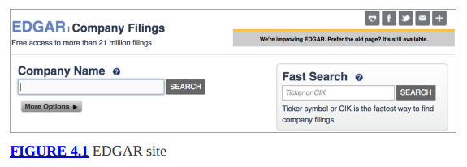

# Huella y reconocimiento

Se cree comúnmente que los atacantes hacen mucho trabajo por adelantado antes de lanzar ataques. Tienen una idea de cuán grande es la superficie de ataque y dónde están sus objetivos. Esto puede requerir mucho trabajo, utilizando muchas herramientas y conjuntos de habilidades diferentes. El proceso de obtener el tamaño y el alcance del objetivo se llama huella; en otras palabras, el atacante, o usted, el hacker ético, está tratando de detectar la huella de la organización objetivo. Cuando se trata de piratería ética, es posible que cuente con ayuda del objetivo, quien lo habría contratado para sus servicios. Es posible que le proporcionen algunos puntos de apoyo para tener una idea del alcance y la escala de lo que debería estar haciendo. Sin embargo, es posible que estés empezando a ciegas y tengas que conseguir tus propios puntos de apoyo.

Sin embargo, hay muchos lugares donde usted, como hacker ético, puede obtener información sobre sus objetivos. Inteligencia de código abierto es el término que describe la identificación de información sobre su objetivo utilizando fuentes disponibles gratuitamente. Hay otros lugares donde puede adquirir información de formas distintas a las legales y, por supuesto, puede infiltrarse directamente en las ubicaciones físicas de una empresa para obtener información que pueda utilizar contra su objetivo.

Eso es potencialmente ilegal y definitivamente no es de código abierto.

El objetivo aquí es adquirir los datos que necesita sin avisar a su objetivo de que lo está haciendo. Es por eso que puede utilizar fuentes de terceros para adquirir la información que necesita. También puede recopilar muchos detalles interactuando con los servicios en el objetivo de la forma esperada. Por ejemplo, puede visitar su sitio web solicitando páginas, tal como lo haría cualquier otro visitante de su sitio. Nada especial sobre lo que estás pidiendo o cómo lo estás pidiendo. Sin embargo, si sabe dónde buscar, puede recopilar mucha información sobre los sistemas y la tecnología que utiliza su objetivo.

Una fuente de muchos detalles sobre su objetivo es el Sistema de nombres de dominio (DNS). Esto no es algo en lo que mucha gente dedique tiempo a pensar. Cuando funciona, no tienes idea porque sucede silenciosamente en segundo plano. Sin embargo, hay una gran cantidad de datos almacenados en los servidores DNS sobre dominios e incluso bloques de direcciones IP. Estos datos se pueden extraer y usted puede obtener una mejor comprensión sobre su objetivo y sus sistemas y los bloques de direcciones IP que pueden estar asociados con su objetivo.

Puede resultar útil a medida que avanza en las diferentes etapas de una metodología de prueba para identificar coincidencias con el marco MITRE ATT&CK. Estamos de suerte en esta fase. El marco ATT&CK tiene una fase de reconocimiento y cubre el escaneo y la recopilación de información de diferentes fuentes sobre diferentes aspectos del objetivo. Si bien es común pensar que los atacantes buscan vulnerabilidades y sistemas de interés, es más probable que busquen objetivos humanos. Esto puede consistir en identificar empleados y direcciones de correo electrónico, pero también, quizás igual de importante, saber qué hacen esos empleados, lo que le indicará al atacante cuánto acceso tienen. Un mayor acceso significa que un atacante puede acceder a algo que se puede monetizar fácilmente.

A lo largo de este capítulo, repasaremos las fuentes de información sobre su objetivo, así como las herramientas que utilizaría para recopilar esa información. Si bien gran parte de esto es silencioso y hay al menos una herramienta que es completamente pasiva, también hay cierta investigación activa. Sin embargo, el primer punto de partida es cómo utilizar fuentes abiertas de datos para identificar un punto de partida para obtener información sobre su objetivo.
### Inteligencia de código abierto
Hay un par de razones por las que es posible que desee utilizar inteligencia de código abierto. La primera es que no se le ha proporcionado ningún detalle sobre su objetivo. Es posible que esté formando un verdadero equipo rojo contra la empresa y los sistemas objetivo. En ese caso, necesita localizar tanta información como sea posible para saber no solo cómo se ve su superficie de ataque sino también las posibles formas de ingresar. Además, puede encontrar mucha información sobre las personas dentro de una organización. Esto es especialmente útil porque los ataques de ingeniería social tienen buenas posibilidades de éxito. Tener contactos a los que acudir es fundamental.

La segunda razón es que las organizaciones no siempre son conscientes de la cantidad de información que filtran. Como se señaló anteriormente, los atacantes pueden encontrar puntos de apoyo, así como posibles objetivos humanos para ataques de ingeniería social. Si está trabajando mano a mano con la empresa para la que está realizando las pruebas (es decir, está haciendo pruebas de caja blanca), no necesita utilizar inteligencia de código abierto como punto de partida, pero aun así debe recopilar qué información es disponibles para el conocimiento de la empresa. Es posible que puedan limitar su exposición. Incluso si no hay nada que pueda retirarse, podrían trabajar en la concientización para que los empleados y la organización en su conjunto no filtren información innecesariamente.

Hay una serie de herramientas que se pueden utilizar para automatizar la recopilación de información y cubriremos su uso como parte del análisis de cómo recopilar inteligencia de código abierto sobre empresas y personas. También echaremos un vistazo a los sitios de redes sociales y algunas de las formas en que se pueden utilizar esos sitios web. Incluso en los casos en los que la configuración de privacidad está bloqueada, todavía se puede recopilar mucha información. También hay sitios que existen para ser públicos y definitivamente se pueden utilizar.
### Compañías
Hay varios puntos de partida cuando se trata de adquirir inteligencia de código abierto sobre su objetivo. La primera es observar la empresa en su conjunto. Querrá recopilar información sobre las ubicaciones que tiene la empresa. Hay casos en los que esto puede resultar fácil. Sin embargo, cada vez puede resultar más difícil. La razón por la que puede ser más difícil es que las empresas reconocen que cuanta más información proporcionen, más información se podrá utilizar en su contra. Entonces, a menos que las regulaciones les exijan proporcionar esa información, no la brindan. Existen algunos recursos que se pueden utilizar para recopilar información sobre empresas.

A veces, estos recursos se pueden utilizar para recopilar información que puede utilizarse para ataques de ingeniería social. En algunos casos, podrá recopilar detalles sobre la red de una empresa. Ambos tipos de información pueden resultar útiles. Los detalles sobre una empresa y su estructura organizativa y de gobierno pueden provenir de una base de datos mantenida por el gobierno de los EE. UU., en el caso de empresas registradas en los EE. UU. Los detalles sobre la red empresarial pueden provenir de bases de datos mantenidas por las organizaciones responsables del gobierno de la empresa. Internet.
### EDGAR
Las empresas públicas están obligadas a proporcionar información sobre sí mismas. Hay recursos que puede utilizar para buscar esa información. En el proceso, puede recopilar información sobre la estructura organizativa de una empresa. La estructura organizativa puede indicarle quién tiene qué puesto, de modo que cuando esté trabajando en el envío de mensajes de correo electrónico para recopilar información adicional más adelante, sepa de quién deberían ser. Puede seleccionar el titular de un puesto adecuado.

La Comisión de Bolsa y Valores (SEC) tiene una base de datos que almacena todas las presentaciones públicas asociadas con una empresa. El sistema de recopilación de Los datos electrónicos, análisis y recuperación (EDGAR) se puede utilizar para buscar archivos públicos, como el informe anual en el formulario 10-K. Además, los informes trimestrales, 10-Q, también se envían a EDGAR y se almacenan allí. Estos informes proporcionan detalles sobre las finanzas de una empresa. El 11-K, un formulario que incluye detalles sobre los planes de opciones sobre acciones de los empleados, también se presenta ante EDGAR. Acceder a EDGAR es tan fácil como acceder a EDGAR en el sitio web de la SEC. Puede ver el campo de búsqueda, parte de la página, en la Figura 4.1.



Uno de los formularios más útiles que puede encontrar en EDGAR es el Anexo 14A en el sitio de la SEC, que es una declaración de poder e incluirá el informe anual para los accionistas, que puede incluir mucha información útil para usted. Como ejemplo, la figura 4.2 muestra una sección muy pequeña del informe anual a los accionistas de Microsoft Corporation. Otras secciones que no se muestran incluyen Gobierno Corporativo en Microsoft, Junta Directiva y Asuntos del Comité de Auditoría. Si bien se trata de un nivel alto (lo que se incluye en estos informes será el mismo en todas las empresas públicas), es posible que algunas empresas presenten más detalles específicos que otras. Algunas empresas tendrán más que informar que otras. Por ejemplo, la tabla de contenido del informe de Microsoft muestra el total de páginas en los años 80. El informe de John Wiley & Sons muestra un recuento de páginas de alrededor de 50 páginas.

Son unas 30 páginas menos entre las dos empresas.


### Registradores de dominio
EDGAR es sólo para empresas públicas. No todas las empresas son públicas. No se obtiene el mismo nivel de conocimiento de una empresa privada que de una empresa pública. Sin embargo, EDGAR no es el único recurso que se puede utilizar para recopilar información sobre una empresa. Otra fuente de información, relacionada con la propia Internet, son los registradores de dominios. No obtendrá el mismo tipo de información de los registradores de dominios que de EDGAR, pero a veces sigue siendo una fuente de información decente. Para empezar, puede obtener la dirección de la que probablemente sea la sede de la empresa.

Sin embargo, esto no es una garantía. Como se mencionó, las empresas están comenzando a ocultar la información proporcionada a los registradores. La información está oculta detrás del registrador. Cuando solicite información, obtendrá lo que se le pidió al registrador que presente y no necesariamente los detalles reales. No hay nada que diga que a los registradores se les deba proporcionar direcciones reales, a menos que estén verificando una dirección de facturación en una tarjeta de crédito para realizar el pago. De hecho, ha habido ocasiones en las que he registrado dominios con números de teléfono falsos y direcciones incorrectas. Dado que los datos son públicos, es importante tener cuidado con lo que se comparte. Cualquiera puede extraer los registros de esta información y utilizarla para cualquier número de propósitos.

Sin embargo, antes de avanzar demasiado en este camino, probablemente le resulte útil comprender cómo se gobierna Internet en lo que respecta a dominios y direcciones. En primer lugar, está la Corporación para la Asignación de Nombres y Números de Internet (ICANN). Debajo de la ICANN se encuentra la Autoridad de Números Asignados de Internet (IANA), que es responsable de administrar las direcciones IP, puertos, protocolos y otros números esenciales asociados con el funcionamiento de Internet. Antes del establecimiento de ICANN en 1998, las funciones de la IANA estaban a cargo de un solo hombre, Jon Postel, quien también mantenía los documentos de solicitud de comentarios (RFC).

Además de ICANN, los responsables de los nombres y la numeración son los registradores de dominios. Estas organizaciones almacenan información sobre las direcciones de las que son responsables, así como sobre los contactos. Hubo un tiempo en el que el registro de un dominio y otros datos pasaban por una sola entidad. Sin embargo, ahora existen varias empresas que pueden realizar funciones de registrante. Si desea registrar un dominio, acuda a una empresa registradora como DomainMonger o GoDaddy. Luego se puede consultar a esas empresas para obtener detalles sobre los dominios.

Para obtener información del registro regional de Internet (RIR), deberá utilizar el programa whois. Este es un programa que se puede usar en la línea de comandos en la mayoría de los sistemas tipo Unix, incluidos Linux y macOS. También hay sitios web que tienen implementaciones de whois si no tienes a mano un sistema tipo Unix. Aquí puede ver una parte del resultado de una consulta whois.

```jason
whois Query of [](http://wiley.com/)[wile](http://wiley.com/)[y](http://wiley.com/)[.com](http://wiley.com/)

 $ whois wiley.com
 Domain Name: WILEY.COM
   Registry Domain ID: 936038_DOMAIN_COM-VRSN    Registrar WHOIS Server: whois.corporatedomains.com
   Registrar URL: http://cscdbs.com
   Updated Date: 2021-08-30T16:27:21Z
   Creation Date: 1994-10-12T04:00:00Z    Registry Expiry Date: 2023-10-11T04:00:00Z    Registrar: CSC Corporate Domains, Inc.
   Registrar IANA ID: 299
    Registrar Abuse Contact Email: domainabuse@cscglobal.com
    Registrar Abuse Contact Phone: 8887802723
    Domain Status: clientTransferProhibited https://icann.org/epp#clientTransferProhibited     Name Server: AUS-IBEXTDNS-01.WILEY.COM
    Name Server: CAR-IBEXTDNS-01.WILEY.COM
    DNSSEC: unsigned
    URL of the ICANN Whois Inaccuracy Complaint Form: https://www.icann.org/wicf/ 

 ←- SNIP →

 Domain Name: wiley.com
 Registry Domain ID: 936038_DOMAIN_COM-VRSN
 Registrar WHOIS Server: whois.corporatedomains.com
 Registrar URL: www.cscprotectsbrands.com
 Updated Date: 2021-08-30T12:27:21Z
 Creation Date: 1994-10-12T00:00:00Z
 Registrar Registration Expiration Date: 2023-10-11T04:00:00Z
 Registrar: CSC CORPORATE DOMAINS, INC.
 Sponsoring Registrar IANA ID: 299
 Registrar Abuse Contact Email: domainabuse@cscglobal.com
 Registrar Abuse Contact Phone: +1.8887802723  Domain Status: clientTransferProhibited http://www.icann.org/epp#clientTransferProhibited
 Registry Registrant ID:
 Registrant Name: Domain Administrator
 Registrant Organization: John Wiley & Sons, Inc
 Registrant Street: 111 River Street
 Registrant City: Hoboken
 Registrant State/Province: NJ
 Registrant Postal Code: 07030
 Registrant Country: US
 Registrant Phone: +1.3175723355
 Registrant Phone Ext:
 Registrant Fax: +1.3175724355
 Registrant Fax Ext:
 Registrant Email: domains@wiley.com  Registry Admin ID:
 Admin Name: Domain Administrator
 Admin Organization: John Wiley & Sons, Inc
 Admin Street: 111 River Street
Admin City: Hoboken
Admin State/Province: NJ
Admin Postal Code: 07030
Admin Country: US
Admin Phone: +1.3175723355 Admin Phone Ext:
Admin Fax: +1.3175724355 Admin Fax Ext:
 Admin Email: domains@wiley.com
 Registry Tech ID:
 Tech Name: Electronic Support Services
 Tech Organization: John Wiley & Sons Inc
 Tech Street: 111 River Street
 Tech City: Hoboken
 Tech State/Province: NJ
 Tech Postal Code: 07030
 Tech Country: US
 Tech Phone: +1.3175723100
 Tech Phone Ext:
 Tech Fax: +1.3175724355
 Tech Fax Ext:
 Tech Email: domains@wiley.com
 Name Server: car-ibextdns-01.wiley.com
 Name Server: aus-ibextdns-01.wiley.com
```

**DNSSEC:** unsigned Hay muchos resultados allí para revisar, y he recortado muchos de ellos para mantener la información realmente relevante. Primero, whois verifica con el servidor whois de la IANA para determinar con quién debe consultar acerca de este dominio específico. Puedes ver que esto sucede en la parte superior de la salida. La IANA indica que CSC Corporate Domains es el registrador de este dominio. Obtenemos los detalles sobre el registrador CSC Corporate Domains. Después de eso, y de eliminar mucha información, finalmente obtenemos los detalles sobre el dominio wiley.com. Lo que puede ver en el resultado es la dirección y el número de teléfono de la empresa. Además, obtiene información sobre algunos contactos de la empresa. Los registradores esperan un contacto administrativo y un contacto técnico.

Como se indicó anteriormente, no todos los dominios proporcionarán este nivel de detalle. Un ejemplo de un dominio que no incluye ningún dato de contacto es spamhaus.org. Aquí puede ver que la información de contacto muestra que los datos han sido redactados por razones de privacidad. Detalles sobre spamhaus.org

```jason
Domain Name: spamhaus.org
Registry Domain ID: 3438c67fd16d45eca26608d562bb3be6-LROR
Registrar WHOIS Server: http://whois.comlaude.com
Registrar URL: https://comlaude.com/whois
Updated Date: 2022-09-06T23:10:56Z
Creation Date: 1999-10-01T11:03:57Z
Registry Expiry Date: 2023-10-01T11:03:57Z
 Registrar: Nom-iq Ltd. dba COM LAUDE
 Registrar IANA ID: 470
 Registrar Abuse Contact Email: abuse@comlaude.com
 Registrar Abuse Contact Phone: +44.2074218250  Domain Status: clientDeleteProhibited https://icann.org/epp#clientDeleteProhibited  Domain Status: serverDeleteProhibited https://icann.org/epp#serverDeleteProhibited  Domain Status: serverTransferProhibited https://icann.org/epp#serverTransferProhibited  Domain Status: clientUpdateProhibited https://icann.org/epp#clientUpdateProhibited  Domain Status: serverUpdateProhibited https://icann.org/epp#serverUpdateProhibited  Registry Registrant ID: REDACTED FOR PRIVACY
 Registrant Name: REDACTED FOR PRIVACY
 Registrant Organization: Spamhaus IP Holdings SLU
 Registrant Street: REDACTED FOR PRIVACY
 Registrant City: REDACTED FOR PRIVACY
 Registrant State/Province:
 Registrant Postal Code: REDACTED FOR PRIVACY
 Registrant Country: AD
 Registrant Phone: REDACTED FOR PRIVACY
 Registrant Phone Ext: REDACTED FOR PRIVACY
 Registrant Fax: REDACTED FOR PRIVACY
 Registrant Fax Ext: REDACTED FOR PRIVACY
```

El uso de una estrategia como esta mantendrá la información privada y fuera del alcance de las mismas personas contra las que spamhaus.org busca protegerse. Los datos proporcionados se pueden utilizar para crear una lista de correo para spammers. También se puede utilizar para crear una lista de correo física para proveedores de correo basura tradicionales (a veces llamados empresas de marketing por correo).
### Registros regionales de Internet
Sin embargo, no toda la información útil se almacena en los registradores de dominios.

Hay otros datos que es importante conservar. Anteriormente hablamos de la IANA.

Si bien el servidor de la IANA proporcionó información sobre los registradores de dominios, su propósito ha sido durante mucho tiempo ser un centro de intercambio de direcciones para las direcciones. Esto incluye no sólo los números de puerto de servicios conocidos sino también las direcciones IP. La IANA, a alto nivel, posee todas las direcciones IP. Entrega esas direcciones IP, según las necesidades, a los RIR. Luego, los RIR los entregan a organizaciones que se encuentran dentro de su región geográfica.
Hay cinco RIR en todo el mundo. Tienen su sede en diferentes regiones geográficas y una organización consultaría el RIR donde se encuentran para cosas como direcciones IP. Los RIR y las áreas geográficas de las que son responsables se enumeran aquí:

**African Network Information Center (AfriNIC)**  Africa
**American Registry for Internet Numbers (ARIN)**   United States and Canada, as well as Antarctica and parts of the Caribbean
**Asia Pacific Network Information Centre (APNIC)**   Asia, Australia, New Zealand, and neighboring countries
**Latin America and Caribbean Network Information Centre (LACNIC)**   Latin America and parts of the Caribbean 
**Réseaux IP Européens Network Coordination Centre (RIPE NCC)**   Europe, Russia, Greenland, the Middle East, and parts of Central Asia

Todos estos RIR tienen sus propias bases de datos que se pueden consultar usando whois, tal como usamos whois para consultar información de los registradores de dominio. Normalmente, utilizaría whois contra los RIR para averiguar quién posee una dirección IP en particular. Por ejemplo, en el resultado anterior de wiley.com, parte del resultado indicaba qué servidores de nombres utiliza el dominio para resolver nombres de host en direcciones IP. Uno de esos servidores de nombres es car-ibextdns01.wiley.com. Con un esfuerzo mínimo (cubriremos DNS en la sección "Sistema de nombres de dominio" más adelante en este capítulo), podemos descubrir que el nombre de host car-ibextdns-01.wiley.com se resuelve en la dirección IP 63.97.119.2. Usando whois podemos saber a quién pertenece esa dirección IP. Puede ver los resultados de esa consulta en el siguiente código.

```
### whois Query for IP Address
 $ whois 63.97.119.2
 #
 # ARIN WHOIS data and services are subject to the Terms of Use
 # available at: https://www.arin.net/resources/registry/whois/tou/
 #
 # If you see inaccuracies in the results, please report at
 #
https://www.arin.net/resources/registry/whois/inaccuracy_report ing/
 #
 # Copyright 1997-2023, American Registry for Internet Numbers,
Ltd.
 #
 # start
 NetRange:       63.64.0.0 - 63.127.255.255
 CIDR:           63.64.0.0/10
 NetName:        UUNET63
 NetHandle:      NET-63-64-0-0-1
 Parent:         NET63 (NET-63-0-0-0-0)  NetType:        Direct Allocation
 OriginAS:
 Organization:   Verizon Business (MCICS)
 RegDate:        1999-01-22
 Updated:        2022-05-31
 Comment:        ADDRESSES WITHIN THIS BLOCK ARE NON-PORTABLE
 Ref:            https://rdap.arin.net/registry/ip/63.64.0.0
 OrgName:        Verizon Business
 OrgId:          MCICS
 Address:        22001 Loudoun County Pkwy
 City:           Ashburn
 StateProv:      VA
 PostalCode:     20147
 Country:        US
 RegDate:        2006-05-30
 Updated:        2022-10-11  Ref:            https://rdap.arin.net/registry/entity/MCICS

 <snip>
 NetRange:       63.97.118.0 - 63.97.119.255
 CIDR:           63.97.118.0/23
 NetName:        UU-63-97-118
 NetHandle:      NET-63-97-118-0-1
 Parent:         UUNET63 (NET-63-64-0-0-1)  NetType:        Reassigned
 OriginAS:
 Customer:       JOHN WILEY & SONS, INC. (C06398648)
 RegDate:        2017-03-21
 Updated:        2017-03-21  Comment:        Addresses within this block are non-portable.
 Ref:            https://rdap.arin.net/registry/ip/63.97.118.0
 CustName:       JOHN WILEY & SONS, INC.
 Address:        1649 W FRANKFORD RD
 City:           CARROLLTON
 StateProv:      TX
 PostalCode:     75007
 Country:        US
 RegDate:        2017-03-21
 Updated:        2017-03-21
 Ref:            https://rdap.arin.net/registry/entity/C06398648
```

Esto nos proporciona mucha información útil. Primero, aunque proporcionamos una única dirección IP, las direcciones se asignan en bloques. Lo primero que encontramos es que el bloque matriz fue asignado en 1999. Según el nombre del bloque, Verizon Business no era el propietario original, ya que se llama UUNET63 y UUNET es una red que Verizon obtuvo mediante adquisición a principios de la década de 2000. . Sin embargo, el bloque específico al que pertenece la dirección IP proporcionada es 63.197.118.0 – 63.197.119.255. Ese bloque, como era de esperar, pertenece a John Wiley & Sons. Puede ver que la dirección de John Wiley & Sons está en Carrollton, TX, lo que se alinea con el bloque que se está registrando en ARIN, que se muestra como el servidor whois utilizado en la primera parte del resultado. El negocio está ubicado en Estados Unidos, por lo que el registro regional correspondiente es ARIN.

Hemos aprendido un par de cosas sobre la empresa y las direcciones IP que le pertenecen. Además, puede ver que tenemos un contacto que surgió de la respuesta. Esto nos da un nombre y una dirección de correo electrónico. Si fuéramos a realizar pruebas con este negocio, podríamos hacer uso de esta información.
### Gente
Si bien los sistemas y las direcciones IP asociadas a ellos son buenos puntos de entrada para ataques técnicos (aquellos contra servicios que están disponibles), la información de contacto de las personas puede ser más útil. Hay otros lugares a los que podemos acudir para obtener listas de personas que pertenecen a una organización objetivo. Nuevamente, existen utilidades que podemos utilizar para ayudarnos a recopilar esta información. Uno de ellos es el Harvester. Este es un script que buscará en diferentes fuentes para localizar información de contacto en función de un nombre de dominio proporcionado al programa. En el siguiente código, puede ver el resultado de theHarvester ejecutado en el dominio wiley.com, utilizando Bing como fuente de búsqueda. DuckDuckGo es otra opción de búsqueda, pero no arrojó ningún resultado de personas en esta búsqueda, aunque sí arrojó un solo host. la salida de la cosechadora

```
$ 
 theHarvester -d wiley.com -b bing
 ************************************************************** *****
*        _   _                                            _           *
*        | |_| |__   ___    /\  /\__ _ _ ____   _____  ___| |_ ___ _ __  *
*        | __|  _ \ / _ \  / /_/ / _` | '__\ \ / / _ \/ __| __/ _ \ '__| *
*        | |_| | | |  __/ / __  / (_| | |   \ V /  __/\__ \ ||  __/ |  *
*        \__|_| |_|\___| \/ /_/ \__,_|_|    \_/ \___||___/\__\___|_|  *
*        *
*        theHarvester 4.2.0                                            *
*        Coded by Christian Martorella                                 *
*        Edge-Security Research                                        *
*        cmartorella@edge-security.com                                 *
*        *
 ************************************************************** *****

 [*] Target: wiley.com 
 Searching 0 results.
 [*] Searching Bing. 
 [*] No IPs found.
 [*] No emails found.
 [*] Hosts found: 18  ---------------------  access.wiley.com:63.97.118.255

 agupubs.onlinelibrary.wiley.com:162.159.129.87, 162.159.130.87  authorservices.wiley.com:108.138.128.128, 108.138.128.52, 108.138.128.31, 108.138.128.89
 bpspsychub.onlinelibrary.wiley.com:162.159.129.87, 162.159.130.87

 bpspubs.onlinelibrary.wiley.com:162.159.130.87, 162.159.129.87  car-access.wiley.com:63.97.118.255  careers.wiley.com:34.215.77.72, 52.36.83.75
 chemistry-europe.onlinelibrary.wiley.com:162.159.130.87, 162.159.129.87
 dev.store.wiley.com:104.18.28.249, 104.18.29.249
 ietresearch.onlinelibrary.wiley.com:162.159.129.87, 162.159.130.87
 newsroom.wiley.com:162.159.129.11, 162.159.130.11  nph.onlinelibrary.wiley.com:162.159.129.87, 162.159.130.87  onlinelibrary.wiley.com:162.159.130.87, 162.159.129.87  read.wiley.com:104.18.15.106, 104.18.14.106
 sid.onlinelibrary.wiley.com:162.159.130.87, 162.159.129.87  support.wiley.com:13.110.24.11, 13.110.24.10, 13.110.24.13  universityservices.wiley.com:23.185.0.2  www.wiley.com:104.18.17.99, 104.18.16.99
```